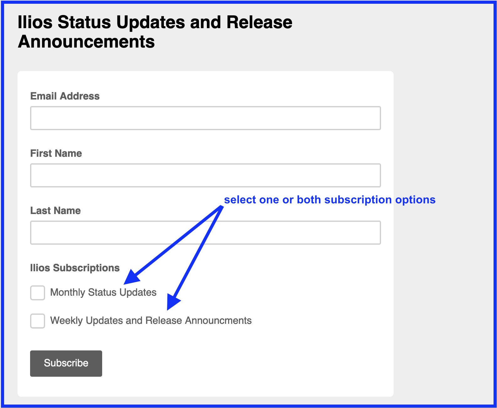
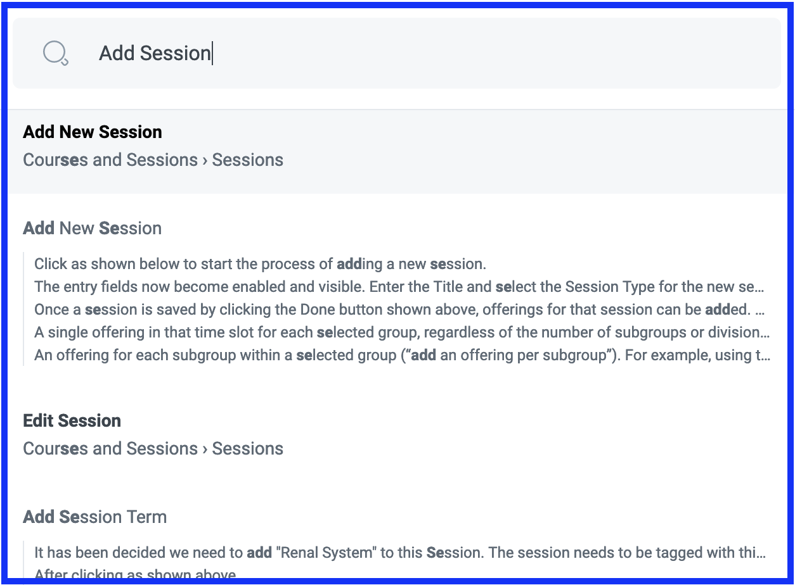
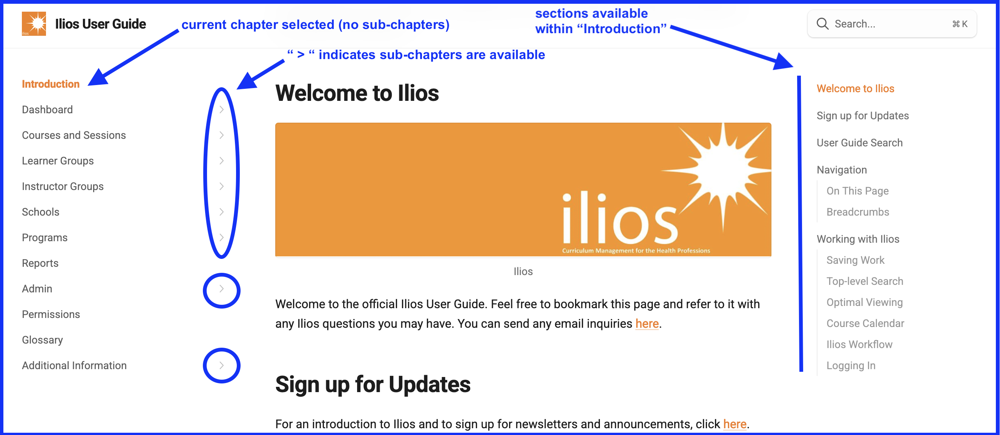
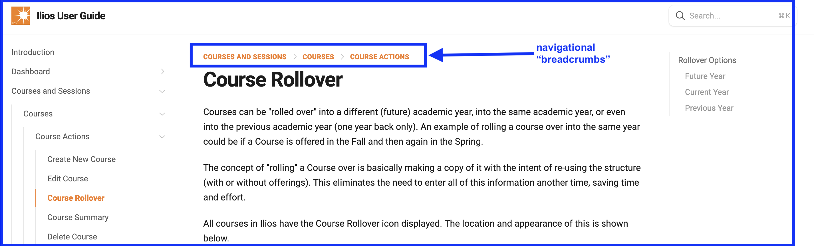

# Welcome to Ilios

Welcome to the official Ilios User Guide. Feel free to bookmark this page and refer to it with any Ilios questions you may have. You can send any email inquiries [here](mailto:support@iliosproject.org).

# Sign up for Updates

For an introduction to Ilios and to sign up for newsletters and announcements, click [here](https://www.iliosproject.org/about/). Once on that page, click "Status Reports" and then "join our mailing list". A form will appear requiring that you enter your email address and first and last name. A confirmation email message will be sent to the email address entered. This is required to confirm your subscription. We highly recommend subscribing to get the latest news. Subscription options are shown below.

# User Guide Search

To perform a quick search to find any Ilios topic you may be hoping to find, the search box in the upper right portion of the screen can be used for this. Before entering criteria, it appears as shown below. The search process used in searching the User Guide is similar to the [Global Search](https://iliosproject.gitbook.io/ilios-user-guide/dashboard/search) functionality in Ilios. The starting point is shown below.

---------

In the example shown above, the search term entered is "Add Session". You can see that many results were returned from that search. "Add New Session" is the first of the results returned. The others can located by scrolling down the page. The highest likelihood (best match) appears towards the top of the screen decreasing further down the page.

As the search criteria is further refined, the results returned will be fewer. The more specific the search criteria is, the fewer results you will have to scroll through to find what you want. They are sorted by best match. Click on any of the links to pull up the exact topic in detail.

## Utilize Search Results 

Clicking on any value returned by performing a search will route you to that location in the guide. To return to your previous location after navigating to a search result's location in the guide, the browser's back navigation button can be used. You can also press "enter" or "return" on your keyboard to navigate to the highlighted value.

An example is shown below with navigation options included.

<figure>
  
  <figcaption>
      
navigate to results after performing a user guide search

  </figcaption>
</figure>

## Cancel Search 

Using the escape (`esc`) key on your keyboard will cancel the search effort and close the search results window to return you to your previous location. 

# Contact Info 

Please contact us at [support@iliosproject.org](mailto:support@iliosproject.org) with any comments or suggestions you may have regarding this user guide or about Ilios functionality or implementation in general.

The user guide is configured to have high level chapters based on the flyout menu items in the application, to be followed by a quick guide explaining how to perform common tasks in Ilios.

# Navigation 

The User Guide can be navigated like most other websites. The back and forward browser buttons can be used along with many internal controls and links that are described in this guide.

## Browser Buttons

The back and forward navigation buttons in the User Guide can be used to navigate to the following or previous section in the guide.

## Page Links

All pages within the guide that have bookmarks added by the author will have clickable links in an area on the right side of the screen. An example of this is shown below.

## Breadcrumbs

Breadcrumbs are available in the User Guide just as they are in many locations within the Ilios application itself. If you are on the parent or root level of a page, or if a page does not have subsidiary pages, breadcrumbs won't appear since is no navigation flow to follow. 

In the following screenshot, I have navigated to the "Course Rollover" section of the guide, which is a sub page or chapter inside the "Courses" section, which in turn is a subsidiary of "Courses and Sessions". 

Breadcrumbs explained ...

* **COURSE ACTIONS:** navigates up one level to "Course Actions" page
* **COURSES:** navigates up two levels to "Courses" page 
* **COURSES AND SESSIONS:** navigates up three levels back to the root of "Courses and Sessions"

Breadcrumbs only appear at the top of pages that are subsidiary pages of higher level pages or chapters.

## Clickable Images

In this guide, if you wish to see any image in greater detail, simply click on the image. A magnifying glass icon (depends on browser) will appear allowing for this action to occur. This will open the image pop-up style on the browser window allowing for a much closer viewing experience of the selected (clicked upon) image.

When you hover over any image, the "plus" icon will be presented. The mouse's pointer becomes the "plus" icon. This is shown below. Click anywhere on the original image to zoom in for a closer view.

<figure>
  
  <figcaption>
      
Click to zoom in on image

  </figcaption>
</figure>

## Home Button 

This user guide (like Ilios itself) has a "home" button. You can be anywhere in the guide and get taken back to the beginning of the guide ([home](https://iliosproject.gitbook.io/ilios-user-guide)) by clicking the button shown below. 

<figure>
  
  <figcaption>
      
Click to return to starting point in user guide (Home)

  </figcaption>
</figure>

# Working with Ilios

One important thing to remember: **Ilios is a web application.**

This application is web-based, meaning it must be accessed through web-browsing interfaces. While it may be used on any current web browser including Microsoft's Edge, Ilios is optimized for use with Mozilla’s Firefox web browser 32 and above, as well as all webkit-based web browsers such as Google Chrome (ver. 30.x and above) Safari (for Mac), or Opera (ver. 10.x and above).

Stick with the most recent releases in any of the browsers listed above, and Ilios will perform as expected. It can also be used on mobile phone browsers and most tablets.

## Saving Work

Work processed in Ilios is presented and collected in real-time, but is only saved to the system when a save event occurs. Much of the saving activity can take place in real-time using inline editing or other user-friendly editing areas. When there is work that is unsaved, action buttons will become active and should be used to process the save event before navigating away. This guide explains when, where, and how to save your work.

## Top-level Search

Ilios is designed to provide as much information as possible in a single display page. Ilios screens (Courses, Sessions etc.) allow for real-time text searching on multiple fields to make it easy to find the information you need.

## Optimal Viewing

If your primary user role and view is that of an editor and content creator, it may be optimal to use a high-resolution display monitor in order to facilitate this complex view. This, and all other views such as Learner views, and other non-content creation views, are usable at lower resolution, and can be viewed on smart phones and other handheld devices. See [Mobile Devices](https://iliosproject.gitbook.io/ilios-user-guide/dashboard/mobile-devices) for more information.

## Course Calendar

Ilios is built explicitly on the concept of user-centric information, rather than course-centric information. What this means is that the default view for a user entering the system is not an individual course, but the aggregate of all courses with which they are associated. As a course developer/ director, the maintenance of a single course and its sessions and offerings can easily be performed by selecting “Courses and Sessions” from the Ilios Menu.

## Ilios Workflow

The Ilios workflow is based on a curriculum structure which incorporates several interconnected levels (displayed below starting with a school's highest level -- program):

* A deployment of Ilios may include multiple related schools or institutions.
* Every school or institution creates and owns specific programs of study.
* Each program is divided into specific academic years.
* Each course managed is associated with a specific program or programs, via those years.
* Each course is made up of a number of sessions, or units.
* Each session or unit is "offered" at a specific time and location, or given a specific due date. These "offerings" are expressed as events on the calendar display, which provides access to detail information for users of the system.
* When working in Ilios, each of the levels maintains its state and changes do not cascade up or down.  This is so work can be done on each level independently and is a result of our wanting to provide as much information as possible on one screen.

## Logging In

Ilios allows for either native or enterprise authentication. Whether your institution uses Shibboleth authentication, basic LDAP, or CAS, Ilios provides configuration for this. If not, you may either modify the configuration of the authentication files to meet the needs of your system, or implement the native Ilios username/password authentication system.
