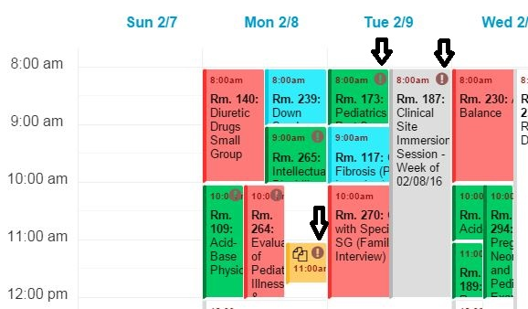

# Alert and Email Templates

## About

Ilios is set to notify selected parties when A\) they have upcoming teaching responsibilities, and B\) there are changes to the schedule or content of curriculum. For all published Calendar offerings, an email reminder is sent to the instructors responsible for that offering 7 days prior to its scheduled start date. The timing of this alert is modifiable in the configuration settings file.

If there is a change to curricular materials after their publication to the calendar, an email notice will be sent to the responsible parties identified by the configurable email list which is managed on a school-by-school basis within the Ilios system. Changes which trigger alerts include:

* Modification of Date or Time
* Modification of Location
* Modification of Instructors
* Modification of Content \(including Learning Materials\)
* Modification of Course Directors

Any number of email addresses for each school may be entered into the file for the receipt of change notices. If a school does not wish to send alerts for changes, the configuration may be turned off for that school by leaving the recipient email blank in the configuration file.

Please note: the title header of the email is auto-generated from the date of the change and the external ID for the course in question. It is therefore extremely important if you are using this feature to make certain that the external course ID is entered for all courses in your school. The development of an effective work practice around the assignment of, and consistent entry of the external course ID will be a tremendous aid to effective use of the alerts system.

## Calendar Icon Notification

For instructors and students, a visual alert icon on the calendar will appear when an item on the above list for a scheduled and published session has changed. The icon will remain visible for a set number of days \(the number of days may be set in the configurations file, and the default is 7\).

An example of this is shown below as an example \(indicated by the black arrows\).



## Customizing Email Templates

Ilios provides the ability to override email notification templates on an instance-wide as well as school-scoped basis.

This override mechanism is based on file naming conventions and file locations within the application's code base. It requires the customizer to have access to the application server itself.

## Order of Precedence

Ilios will attempt to load and render templates in the following order of precedence. The first matching template found will be used.

1. School-specific template \(custom\)
2. Application-wide template \(custom\)
3. Application-wide template \(default\)

## Anatomy of a Template File

Each file starts with a code comment listing all data points available for output. The rest of the file is the template text itself.

## Default Templates

By default, email templates are located under `<projectroot>/src/Ilios/CoreBundle/Resources/views/Email`.

At this point, the following templates are available:

* `offeringchangealert.text.twig` - the template for sending change alert notifications
* `teachingreminder.text.twig` - the template for sending teaching reminder notifications

These templates are implemented uses the [Twig](http://twig.sensiolabs.org/) templating framework. Please see the [Twig documentation](http://twig.sensiolabs.org/documentation) for further details on how to work with the framework.

## Overriding Templates application-wide

Custom templates _must_ be stored in the `<projectroot>/custom/email_templates` directory.

**Never override the templates in the default location themselves.**

1. Copy the template that you want to customize from its default location \(`<projectroot>/src/Ilios/CoreBundle/Resources/views/Email`\) into the `<projectroot>/custom/email_templates` directory. Keep the file name as-is.
2. Make the necessary changes to that template copy.

Example:

```bash
# overriding the teaching reminder template application-wide
cd <projectroot>
cp src/Ilios/CoreBundle/Resources/views/Email/teachingreminder.text.twig \
custom/email_templates/teachingreminder.text.twig
```

## Overriding Templates on a per-school Basis

1. Copy the template that you want to customize from its default location \(`<projectroot>/src/Ilios/CoreBundle/Resources/views/Email`\) into the `<projectroot>/custom/email_templates` directory. The file name must be prefixed with the school's template prefix, followed by an underscore \(`_`\).
2. Make the necessary changes to the template copy.

_Please note that template names are case-sensitive._

Example:

```bash
# overriding the teaching reminder template for the School of Medicine.
# The school's template prefix is "SOM".
cd <projectroot>
cp src/Ilios/CoreBundle/Resources/views/Email/teachingreminder.text.twig \
custom/email_templates/SOM_teachingreminder.text.twig
```

You can look up the template prefix of all schools in the application's database, please check the `template_prefix` column on the `school` table.

```sql
SELECT school_id, template_prefix, title FROM school;
```

## When Upgrading Ilios

Please review the default templates that you have customized for changes between Ilios revisions. You may then have to apply these changes to your custom templates accordingly.

