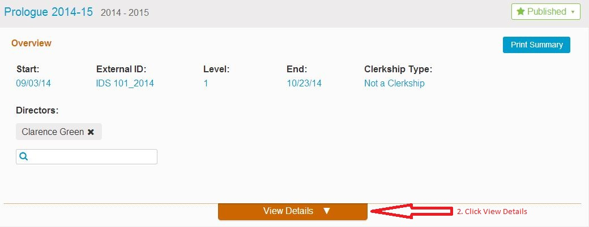

# Add MeSH to Course Objective

An example of adding a MeSH term to a Course Objective is shown below.

**1. Select the Course**

**2. Expand to see the Course Details**

**3. Select the Objective**

**4. Select the MeSH Term**

MeSH terms may be associated with Courses, Sessions, Learning Materials, and Learning Objectives \(at any level - Program Year, Course, or Session\).

To select a MeSH term from the thesaurus, type in the word or phrase you wish to find, and hit ‘enter’ using your keyboard. The results will display all related concepts, terms and topics, along with their associated descriptor and tree node codes; at the top will display a list of those which have previously been returned and used for similar searches. Clicking a term will add it to the MeSH vocabulary for your selected item. Click the green confirmation button once all terms have been added.

The current version of Ilios always has the latest version of the MeSH thesaurus loaded. Administrative tools are available to update the MeSH thesaurus in Ilios when desired via the Ilios MeSH parser \([https://github.com/ilios/mesh-parser](https://github.com/ilios/mesh-parser)\).

To learn more about MeSH, visit the [MeSH](http://www.nlm.nih.gov/mesh/) website.

