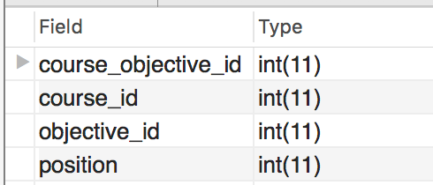
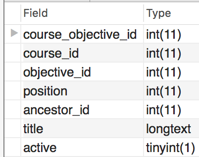

# SQL Queries \(API v2 vs v3\)

This page is here to highlight SQL query syntax differences illustrating the changes made to the Ilios database schema. This happens along with our switching of the API from the old version \(v2\) to the new version \(v3\).

The database schema you know and love will be available until the end of the year. We have made some changes to make retrieving data from Ilios easier, especially regarding Course, Session, and Program Year Objectives. There are other small changes, but the primary changes were made in the realm of Objectives.

The table `objective_x_objective` will be completely removed at the end of 2020. The parental Objective relationships contained therein will be available elsewhere and documented here.

## Course Objectives

#### Sample SQL Query

```text
/** This is for new and old syntaxes for retrieving Objective records 
from Ilios -- going to use a place holder for course_id [course_id]
any valid course ID can be used **/

/** new method - retrieve course objectives **/
/** only need to query one table `course_x_objective` **/
SELECT course_objective_id, 
title FROM course_x_objective WHERE course_id = [course_id];

/** old method - course objectives **/
SELECT o.objective_id, o.title FROM objective o 
JOIN course_x_objective cxo ON cxo.objective_id = o.objective_id
WHERE cxo.course_id = [course_id];
```

### Tables Affected - Course Objective Query

In the Course Objective query outlined above, it is important to note the changes that are taking place with the design of the `course_x_objective` table in particular.

**v2 Schema** \(old\) - `course_x_objective`



**v3 Schema** \(new\) - `course_x_objective`



Additional fields that are available in the new version of the database schema without having to join to other tables: `ancestor_id`, `title`, and `active`. **Title** is the big win here. Objectives are no longer stored in one location `objectives` and there is now no need to join to that table in order to retrieve Course Objectives.  


