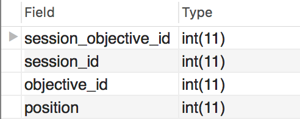
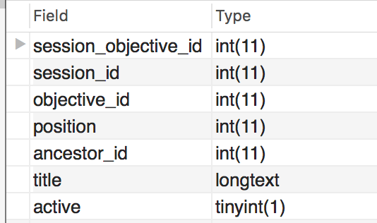

# SQL Queries \(API v2 vs v3\)

This page is here to highlight SQL query syntax differences illustrating the changes made to the Ilios database schema. This happens along with our switching of the API from the old version \(v2\) to the new version \(v3\).

The database schema you know and love will be available until the end of the year. We have made some changes to make retrieving data from Ilios easier, especially regarding Course, Session, and Program Year Objectives. There are other small changes, but the primary changes were made in the realm of Objectives.

The table `objective_x_objective` AND `objective` itself will be completely removed at the end of 2020. The parental Objective relationships contained therein will be available elsewhere and documented here.

## Course Objectives

#### Sample SQL Query

```text
/** This is for new and old syntaxes for retrieving Objective records 
from Ilios -- going to use a place holder for course_id [course_id]
any valid course ID can be used **/

/** new method - API v3 - retrieve course objectives **/
/** only need to query one table `course_x_objective` **/
SELECT course_objective_id, title 
  FROM course_x_objective 
WHERE course_id = [course_id];

/** old method - API v2 - course objectives **/
SELECT o.objective_id, o.title 
  FROM objective o 
  JOIN course_x_objective cxo 
    ON cxo.objective_id = o.objective_id
WHERE cxo.course_id = [course_id];
```

### Tables Affected - Course Objective Query

In the Course Objective query outlined above, it is important to note the changes that are taking place with the design of the `course_x_objective` table in particular.

**v2 Schema** \(old\) - `course_x_objective`


**v3 Schema** \(new\) - `course_x_objective`


Additional fields that are available in `course_x_objective`in the new version of the database schema without having to join to other tables: `ancestor_id`, `title`, and `active`. **Title** is the big win here. Objectives are no longer stored in one location `objectives` and there is now no need to join to that table in order to retrieve Course Objectives.

## Session Objectives

#### Sample SQL Query

```text
/** new method - API v3 - session objectives **/
/** still need to join to session table which contains course ID **/
SELECT sxo.objective_id, sxo.title 
  FROM session_x_objective sxo
  JOIN session s on s.session_id = sxo.session_id 
WHERE s.course_id = [course_id];

/** old method - API v2 - session objectves **/
SELECT o.objective_id, o.title 
  FROM objective o 
  JOIN session_x_objective sxo ON sxo.objective_id = o.objective_id
  JOIN session s ON s.session_id = sxo.session_id
WHERE s.course_id = [course_id];
```

### Tables Affected - Session Objective Query

In the Session Objective query outlined above, it is important to note the changes that are taking place with the design of the `session_x_objective` table in particular. The only reason a join to the `session` table was performed is that we were running our query passed upon the  `course_id` field as a parameter and that field is contained in the `session` table.

**v2 Schema** \(old\) - `session_x_objective`



**v3 Schema** \(new\) - `session_x_objective`



Additional fields that are available in `session_x_objective` in the new version of the database schema without having to join to other tables: `ancestor_id`, `title`, and `active`. **Title** is the big win here. Objectives are no longer stored in one location `objectives` and there is now no need to join to that table in order to retrieve Session Objectives.

This also makes it easier to deal with Parent Objectives as we will soon see. 

## Program Year Objectives

#### Sample SQL Query

```text
/** new method - API v3 - program year objectives **/
/** only one table needed in query - no joins required **/
SELECT objective_id, title, competency_id 
  FROM program_year_x_objective 
  WHERE program_year_id = [program_year_id];
/** need to provide program_year_id - [program_year_id] **/

/** old method - API v2 - program year objectives **/
/** two tables needed - one join **/
/** need to get the objective text from the `objective` table
    rather than get it directly from `program_year_x_objective` **/
SELECT o.objective_id, o.title, o.competency_id 
  FROM objective o 
  JOIN program_year_x_objective pyxo 
    ON pyxo.objective_id = o.objective_id
  JOIN program_year py on py.program_year_id = pyxo.program_year_id
WHERE py.program_year_id = [program_year_id];
/** need to provide program_year_id - [program_year_id] **/
```

## Session Objectives with Course Objectives

This next one will return all Session Objectives with their parent \(Course\) Objectives as well, whether this parentage has been established or not. In this case, the queries will be separated into their own code blocks with comments.

#### Sample SQL Query \(v2 - Old Schema\)

In the example below, we had to join to the `objective` table twice - once to return the Session Objectives and again to return the Course Objectives. The parent relationship between these two Objective levels is defined using the `objective_x_objective` table. The field `parent_objective_id` returns the ID values used to join to `objective` to retrieve the Objective details.

```text
/** Old method - all session objectives with course objectives 
    - parents or not **/
SELECT s.session_id AS 'Session ID', 
  s.title AS 'Session',
  o.title AS 'Session Objective', 
  oxo.parent_objective_id AS 'Course Objective ID',
  o2.title AS 'Course Objective'
FROM session s
  JOIN session_x_objective sxo ON sxo.session_id = s.session_id
  JOIN objective o ON o.objective_id = sxo.objective_id
  LEFT OUTER JOIN objective_x_objective oxo 
    ON oxo.objective_id = o.objective_id
  LEFT OUTER JOIN objective o2 
    ON o2.objective_id = oxo.parent_objective_id
WHERE s.course_id = [course_id];
```

#### Sample Query \(v3 - New Schema\)

In the example below, there is no need to join to either `objective` or `objective_x_objective`, both of which will be removed at the end of the year. Left outer joins are performed similarly in both versions of this query in order to return Session Objectives that are NOT linked to Course Objectives.

```text
/** New method - all session objectives wth course objectives
  - parents (or not) **/
SELECT s.session_id AS 'Session ID', 
  s.title AS 'Session', 
  sxo.title AS 'Session Objective',
  soxco.course_objective_id AS 'Course Objective ID',
  cxo.title AS 'Course Objective'
FROM session s 
  JOIN session_x_objective sxo ON sxo.session_id = s.session_id
  LEFT OUTER JOIN session_objective_x_course_objective soxco 
    ON soxco.session_objective_id = sxo.session_objective_id
  LEFT OUTER JOIN course_x_objective cxo 
    ON cxo.course_objective_id = soxco.course_objective_id
WHERE s.course_id = [course_id];
```


