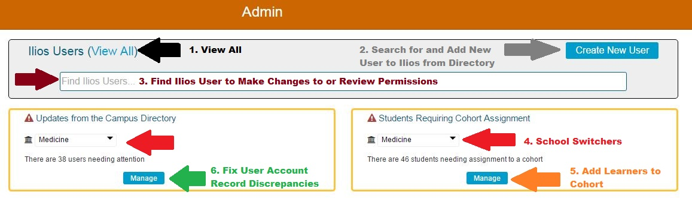

# Admin

The Admin screen can be accessed from the main Ilios flyout menu &gt;&gt; Admin.

This is what the screen looks like at a school that is hooked up to a Campus Directory \(such as LDAP\). The color-coded arrows point to access points for the various maintenance tasks that can be accomplished using the Admin Console.

Each of the above functional links are detailed in upcoming sections.

## 1. [View All](https://iliosproject.gitbook.io/ilios-user-guide/admin/view-all)

## 2. [Create New User](https://iliosproject.gitbook.io/ilios-user-guide/admin/create-new-user)

## 3. [School Permissions](https://iliosproject.gitbook.io/ilios-user-guide/admin/school-permissions)

## 4. [Maintain User Record](https://iliosproject.gitbook.io/ilios-user-guide/admin/maintain-user-record)

## 5. [Add Learners to Cohort](https://iliosproject.gitbook.io/ilios-user-guide/admin/add-learners-to-cohort)

## 6. [Fix User Account Discrepancies](https://iliosproject.gitbooks.io/ilios-user-guide/content/pages/admin/fix_user_account_discrepancies.html)

## 7. [User Account and Role Management](https://iliosproject.gitbook.io/ilios-user-guide/admin/user-account-and-role-management)

## 8. [Calendar Preview](https://iliosproject.gitbook.io/ilios-user-guide/admin/calendar-preview)

