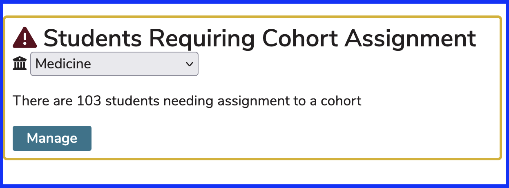
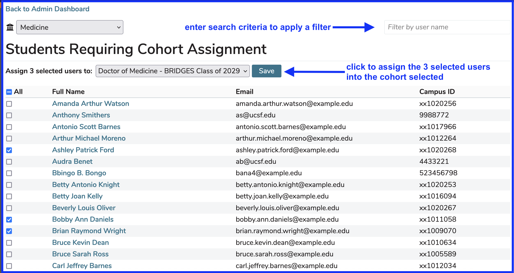
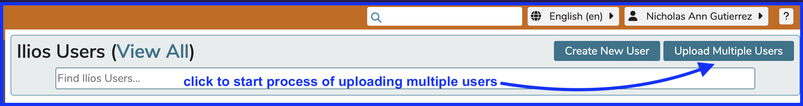
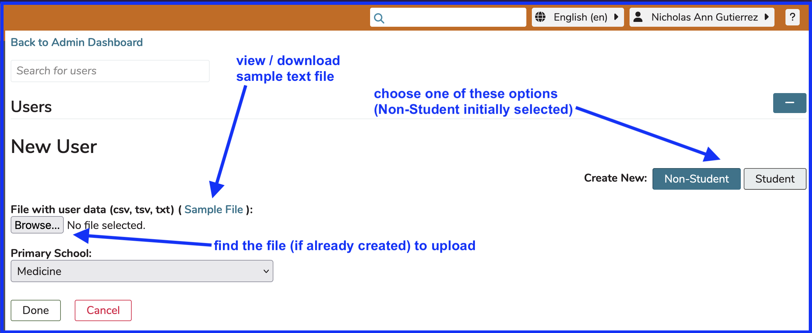
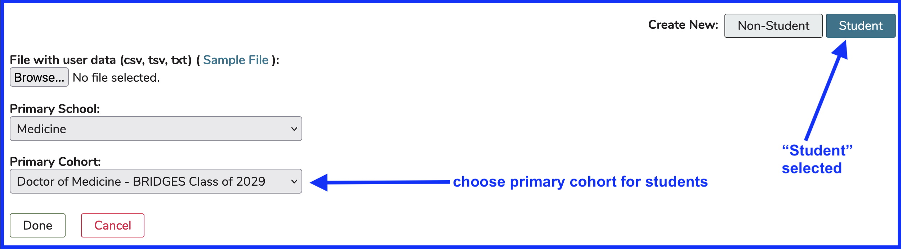
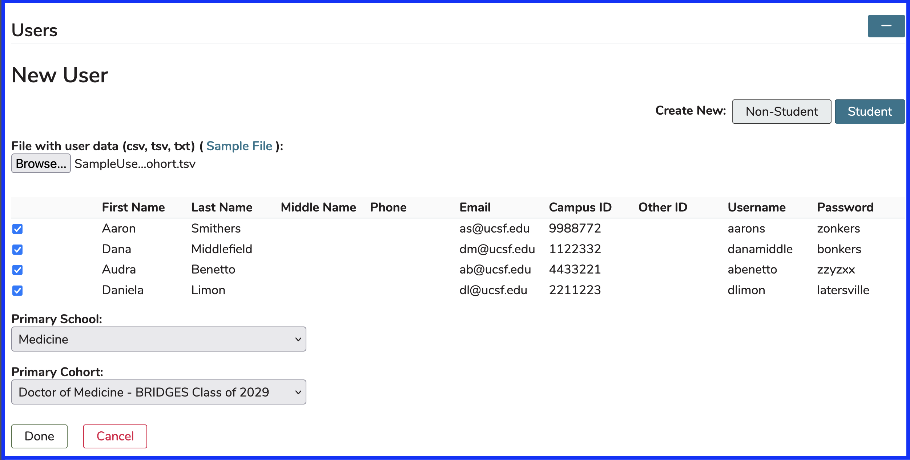

# Add Learners to Cohort

Learners who have been added to Ilios but have not been assigned into a Cohort can be added using the Admin Console.

To do this ...

* Pull up the Admin screen
* Click Manage

## Click to Manage

The screen now appears as shown below. It has been determined for three users to be added to the "Doctor of Medicine - BRIDGES Class of 2029" Cohort. Click the Save button to process this request.

## Assign Learners

Once added into the cohort, these students can be placed in learner groups for that cohort or assigned directly to offerings as individual learners. These learner groups get assigned to offerings. Student calendars will get populated by either of these actions provided course and session are both published.

## Create New User

Refer to [Create New User](https://iliosproject.gitbook.io/ilios-user-guide/admin/create-new-user) for adding users to a cohort from your school's directory. For institutions not using a directory, students can be added to a Cohort upon setting up the user Account.

## Upload Multiple Users

It is also possible to perform a bulk upload operation for students (learners) or non-learners to be added to Ilios. 

**IMPORTANT NOTE:** This is only available if your institution is not using a directory to populate Ilios with new learners or maintain passwords and logins - form-based authentication in other words. The "Upload Muliple Users" button will not appear if does not apply to your institution's configuration.

### Click to Start

This process is started by clicking as shown below.

These users can be learners who can be assigned to a cohort or non-learners who are added to the system initially with no advanced permissions. They can be assigned to any activity in Ilios, which of course can implicitly provide elevated access.

### Review Options

The screen changes to appear similar to what is show below. Initial options are shown with arrows indicating changes that can be applied.

Since the process of adding students using this bulk upload tool has an additional step, which will be shown here, select "Student" as shown below.

### Choose Cohort 

Now that "Student" has been selected, the primary cohort for these incoming students should be selected.

### Template Fields

Since this is assuming your institution is using form-based authentication and not a network configuration for logins, password is a required field for adding logins using this type of authentication. Below is a screen shot (configured in Excel) of a filled-out template file for user upload. If using a text editor, a comma-delimited format might be easier since commas are easy to review and verify for spacing issues. 

The fields used in the template are the following ...

* First Name - required
* Last Name - required
* Middle Name
* Phone
* Email
* Campus ID
* Other ID
* Username 
* Password - pass NULL if not applicable

If there is required information missing, the field in the preview view will be surrounded by a red border indicating something is wrong. The check box to the left will not be selected. The user cannot be added until the errors have been fixed.

**NOTE:** Since passwords can be passed using this method, there needs to be a system / procedure in place to ensure users update their passwords after logging in for the first time. The passwords are intended to be temporary. If a password will be set later by the administrator, the value NULL can be passed in the text file.

