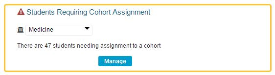
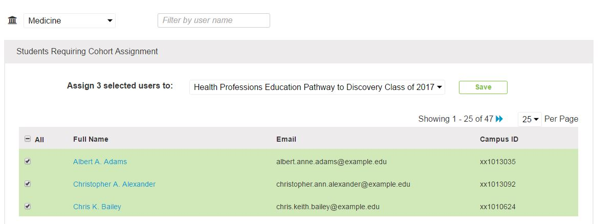

# Add Learners to Cohort

Learners who have not been added to a Cohort at all can be added using the Admin Console.

To do this ...

* Pull up the Admin screen
* Click Manage 

The screen now appears as shown below. Three users have been selected to be added to the "Health Professions Education Pathway to Discovery Class of 2017" Cohort. Click the Save button to process this request.

