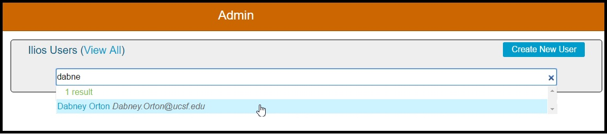
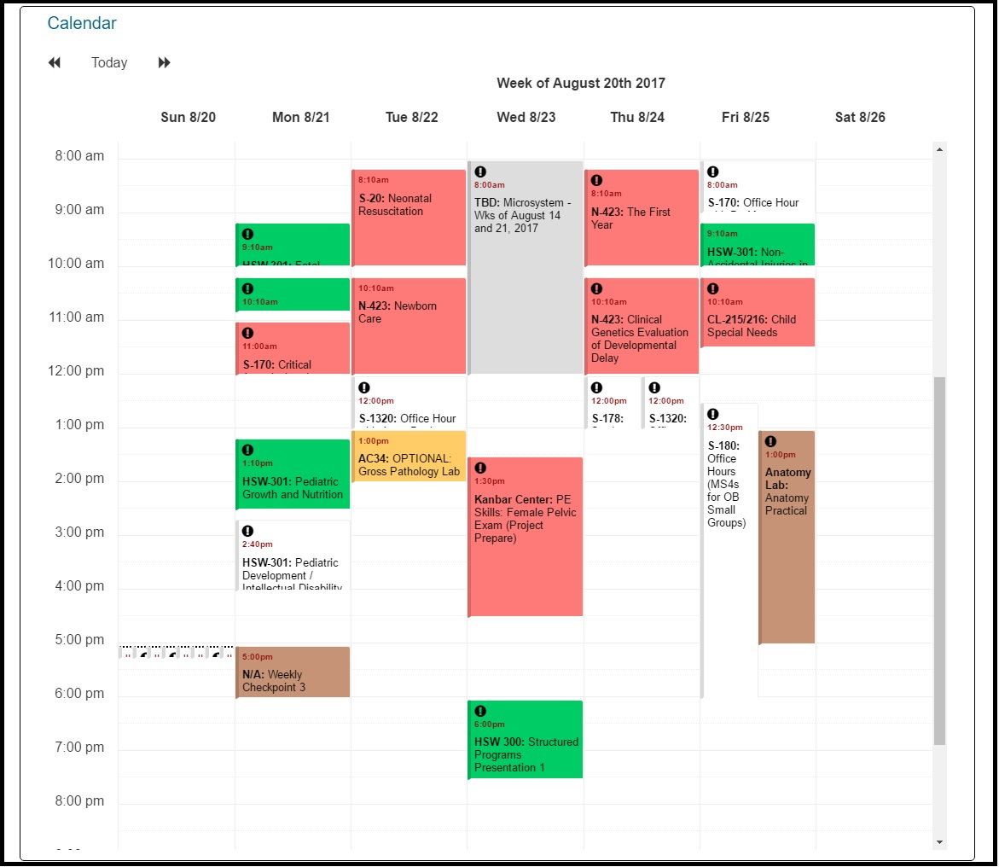
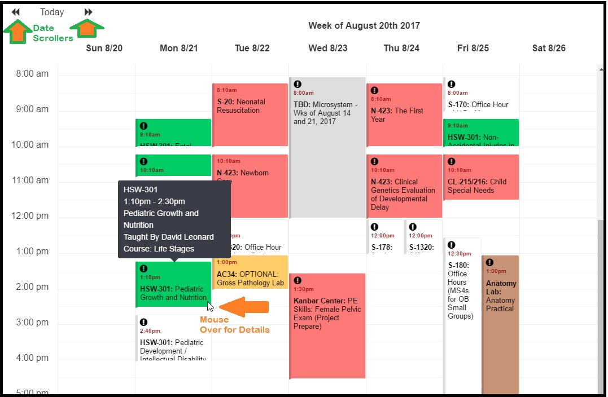

# Calendar Preview

This is an exciting new and very useful feature which presents a view of the weekly calendar of any user who can be retrieved in the Admin Console.

Only the weekly view is available; but you can scroll forward or backwards in time to any date to view the Learning and / or Teaching activities assigned to that Ilios user.

## Find User

The first step is to find a user whose schedule you would like to view. This process is shown briefly below and highlighted in other areas of the guide as well.

Once this user "Dabney Orton" has been selected, his calendar is shown right here on the Admin Console screen. Scroll down to the bottom to see it. Below an example is shown.

You can scroll using the forward and backward buttons to any week. Only week view is available at this time. Also, mousing over the events will produce a call out with the details of the event. It does NOT link to Event Detail like the Dashboard Calendar does.

