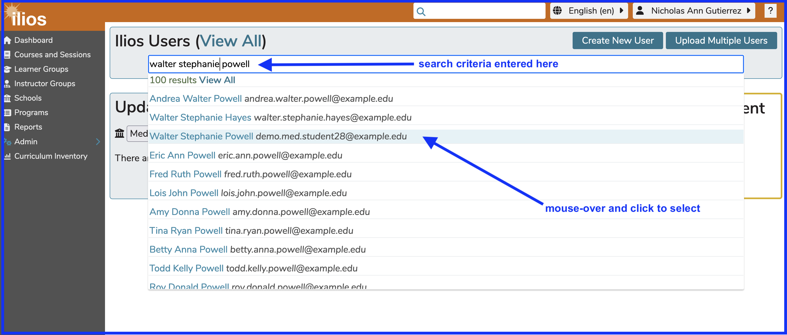

# Calendar Preview

This feature presents a view of the weekly calendar of any user who can be retrieved in the Admin Console.

Only the weekly view is available; but you can scroll forward or backwards in time to any date to view the Learning and / or Teaching activities assigned to that Ilios user.

**IMPORTANT NOTE**: If you have access to this screen, you will see "unpublished" offerings to which these users have been assigned. This is by design and can help sort out a student or teacher's schedule to see all offerings to which they are attached. This can help diagnose potential scheduling conflicts before the offerings have been published.

A close up of the "unpublished" icon is shown below.

The icon looks a bit blurry at that level. Here is what it looks like in regular size on the Admin Console profile calendar ...

## Find User

The first step is to find a user whose schedule you would like to view. This process is shown briefly below and highlighted in other areas of the guide as well.

### Select User

Once this user "Walter Stephanie Powell" has been selected, this individual's calendar can be displayed right here on the Admin Console screen. Click as shown below to get the calendar displayed. 

### Display Calendar

The intial setting in this view is "Hide Calendar". After clicking as shown below, the calendar for the selected user will be displayed. 

### Sample Calendar

You can scroll using the forward and backward buttons to any week. Only week view is available at this time. Also, mousing over the events will produce a call out with the details of the event. It does NOT link to Event Detail like the Dashboard Calendar does.

