The "Create New User" button is also available from the starting point of the Admin Console. The steps detailed in the previous section apply to adding a new user in this manner as well. The steps are the same.

# Add User from Directory

The starting point for searching the campus directory to potentially add users to Ilios is shown below. 

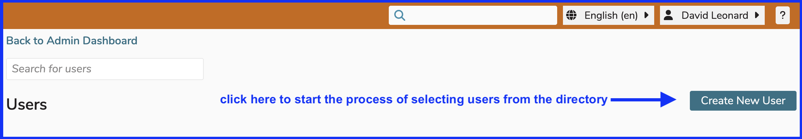

The screen appears as what is shown below (with real data redacted). This is the same as detailed the "View All" section. The screen and the functionality is the same as if clicking "View All" and then clicking "Create New User". Essentially if you are positive that it is not necessary to search existing Ilios users and that one or more new Ilios users need to be added from the campus directory, you can skip that step and go straight here.

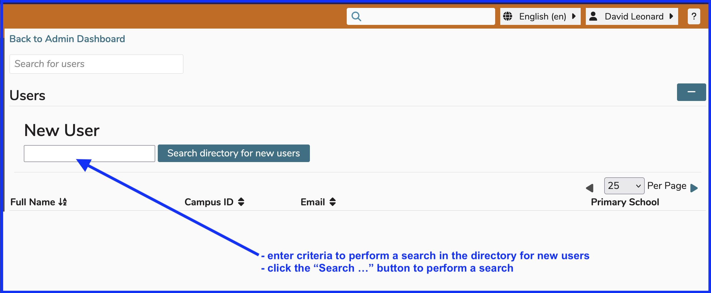

Enter search criteria and click "Search directory for new users". In the example below, a search for "Leonard D" was performed. The results are shown below with identifying data scrubbed since this is from the actual UCSF Campus Directory.

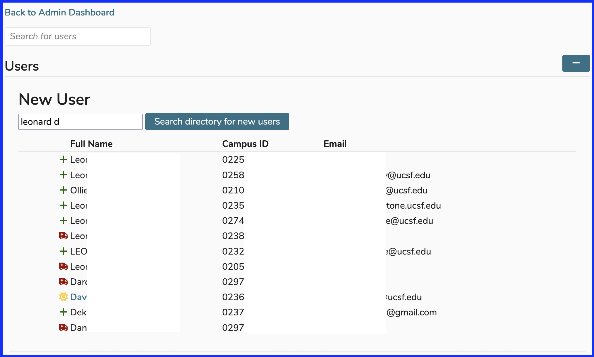

**Icons Explained**

- Ready and able to add to Ilios 

- Something is wrong or missing. User cannot be added to Ilios at this time. 
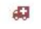

- Already in Ilios. User can only be added once. 

## Search to Add User

A search was performed for "Loomis".

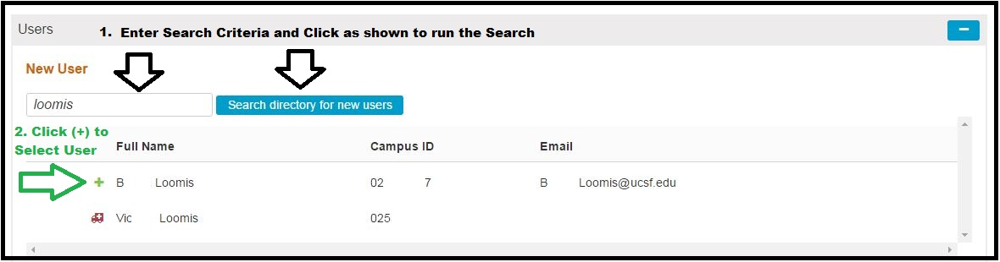

After clicking the (+) button as shown below, it is not necessary to select whether this new user is to be added as a Non-Student (Instructor) or Student. Roles can be added and updated later but it is helpful and powerful to make this initial distinction at this time. In both cases, Primary School should be selected now.

* **Add Non-Student (Instructor)**

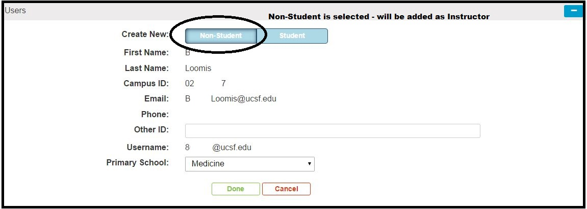

* **Add Student**

When a Student is added, the Primary Cohort should be selected at this time (as shown below).

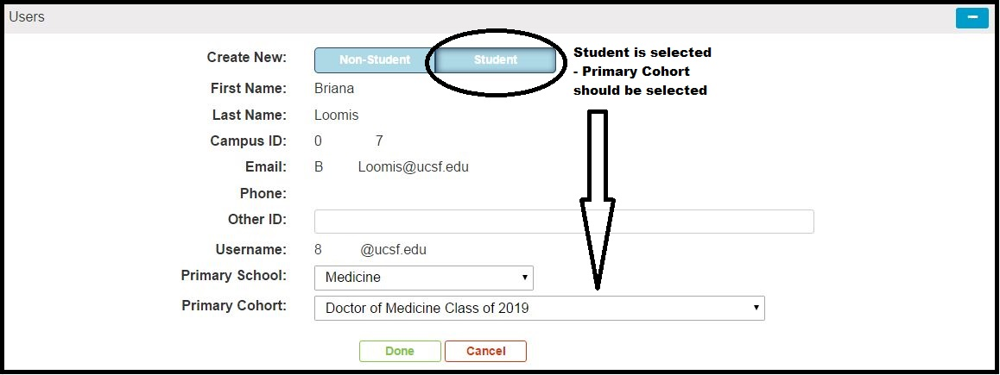

# Add User Manually

This refers to adding a user by typing and entering the user attributes manually, meaning not from a directory. If your institution is not hooked up to a directory, this is the process you would follow. This type of user management is referred to as "Form-based authentication", meaning the parameters for being allowed into the system are entered into a form by the user.

Click to start this process as shown below in Figure 1.

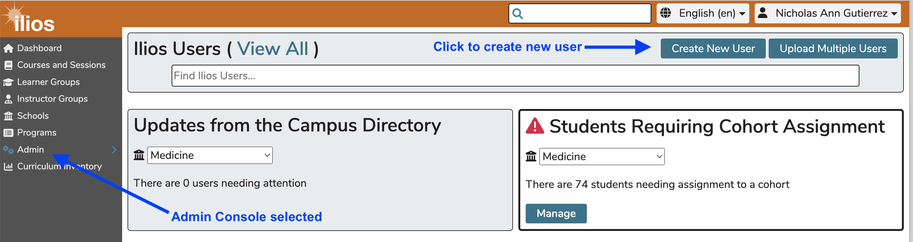

After clicking as shown above, the user attributes should be added. Just as with a directory-based user maintenance situation, a user can be added initially either a student or non-student. Students need to be added to a cohort when the record is being created.

## Non-student User

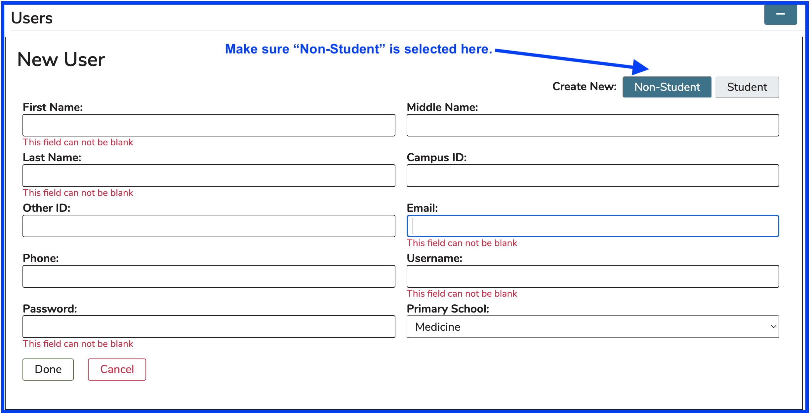

The error messages have been raised in the screen shot above to demonstrate which fields are required using form-based authentication.

**Required fields**

* First Name
* Last Name
* Email
* Username
* Password

**Optional Fields**

* Middle Name
* Campus ID
* Other ID
* Phone

Fill out as much information as applicable and click "Done" when this has been completed. A pre-save example of this is shown below in Figure 2.

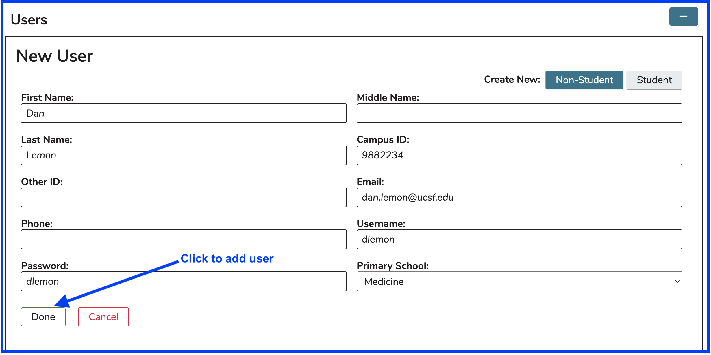

Click either of the "Edit" buttons will open up any and all fields that can be edited from here.

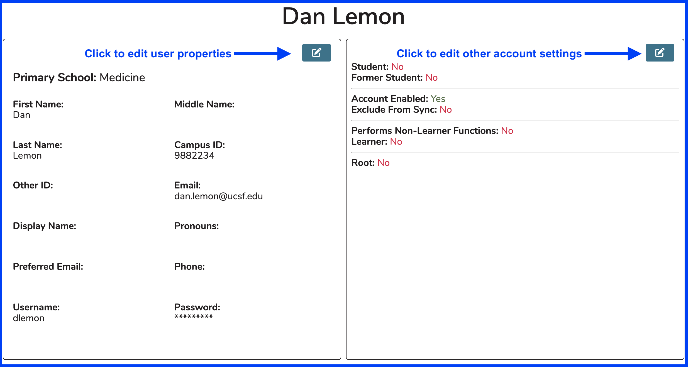

**User Property Edits**

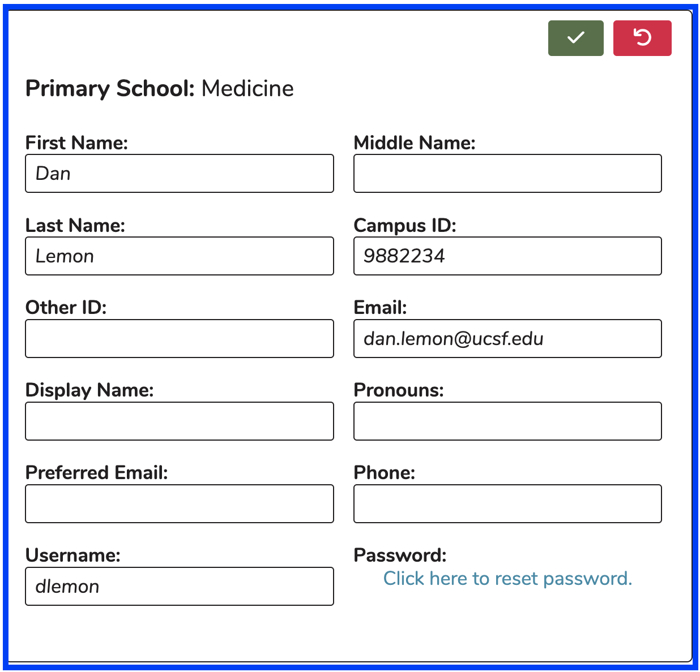

Once a form-based authentication user has been added to the system, modifications to the pertaining settings can be performed. **Pronouns** (he/him/his) (she/her/hers) (they/them/theirs) can be specified here as well as **Preferred Email**, which can be used if the user has another email account they would rather use to receive teaching reminders and other electronic communication. The user's **Password** can be reset here as well. Any of these fields may be modified here.

## Other Account Settings Edits

Clicking on the "edit" button activates several fields as shown below.

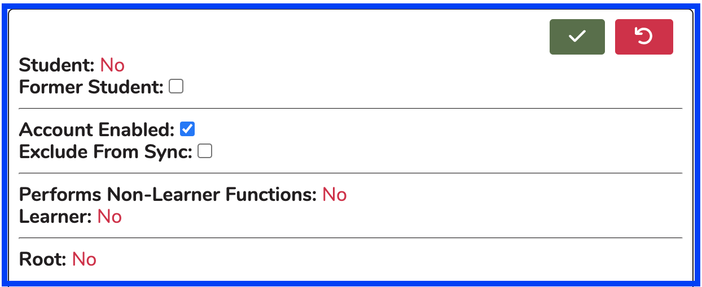

The **Student**, **Performs Non-Learner Functions**, and **Learner** flags are all set to "No" since this user was entered as a Non-Student. They can be added to one or more Cohorts however; and if this occurs, the **Student** flag would be set to "Yes". if the user is added to an offering manually but not included in a Cohort, the **Learner** flag would be set to "Yes" following this usage path as well. If the user is attached to an offering or ILM as an Instructor, the Performs Non-Learner Functions flag would be set to "Yes". These values cannot be manually modified here.

**Account Enabled**, and **Exclude From Sync** can all be specified here. These values determine whether the user can log in to Ilios "Account Entabled - no" at the current time or if their properties are exlcuded from any potential synchronization or cron jobs that are run automatically "Exclude From Sync - yes".

The process is very similar when adding or editing a student record in this manner with the exception that a Cohort must be selected at the time of adding the student.
