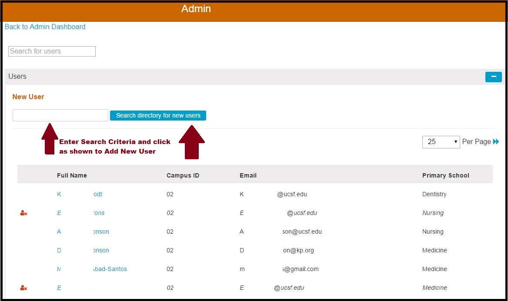

# Create New User

The "Create New User" button is also available from the starting point of the Admin Console. The steps detailed in the previous section apply to adding a new user in this manner as well. The steps are the same.

The screen appears as what is shown below \(with real data redacted\). This is the same as detailed the "View All" section. The screen and the functionality is the same as if clicking "View All" and then clicking "Create New User". Essentially if you are positive that no searching is required and that one or more Ilios users need to be added from the Campus Directory, you can skip that step and go straight here.

