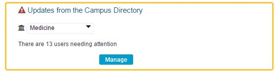
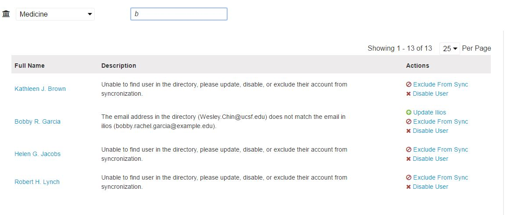
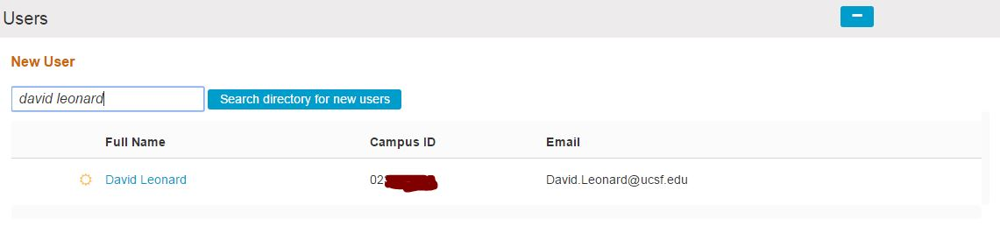
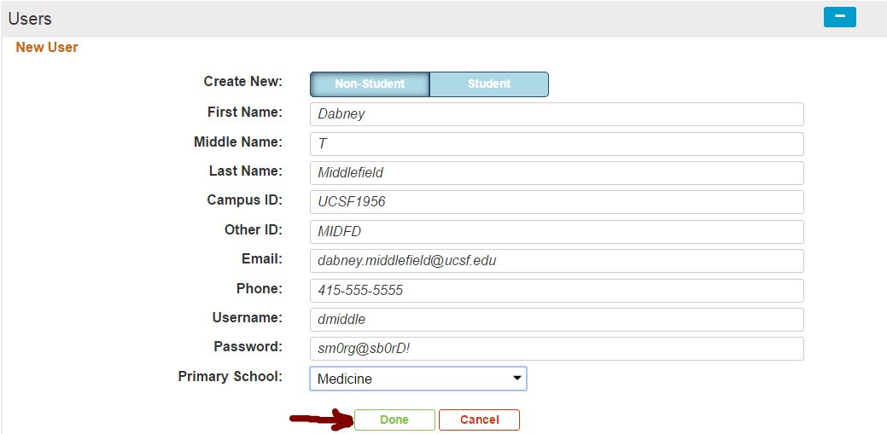

# Fix User Account Discrepancies

When the Campus Directory contains different information about one or more User Accounts than Ilios does \(or vice versa\), the following appears at the root of the Admin Console.

Click the `Manage` button to remedy or review this situation.

 The three actions that can be taken are shown above.

`Update Ilios`: Updates the data in Ilios to match what is being passed by the Campus Directory `Exclude From Sync`: Dismisses the suggested data update and makes it so the User record is no longer caught in this Admin Console Exception processing. `Disable User`: Disables the Account so the User will not be able to log in anymore.

### Existing Users

If a user who is already in the Ilios system is returned by a search this icon \(

\) is displayed. Users cannot be added to Ilios more than once. The system prevents this from occurring when linked to an external shibboleth or LDAP directory. You will be taken to the Admin screen for the record selected \(attempted to be entered\) in that case.

## Add Users Directly to Ilios

Your campus may wish to add users directly into Ilios. We have provided that as an option if there is no LDAP directory with which to sync.

The same steps are followed to start this process; except the screen appears as follows for non-directory Ilios campuses.

Enter any and all pertinent information into the available fields and click Done when ready to process the save event.

