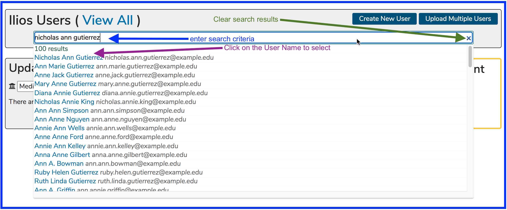
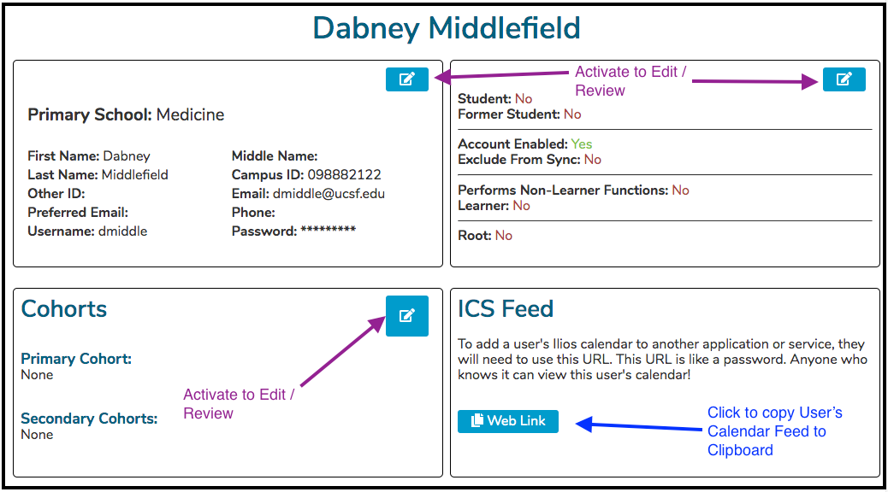
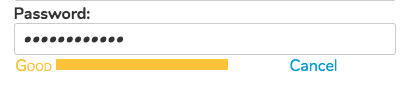
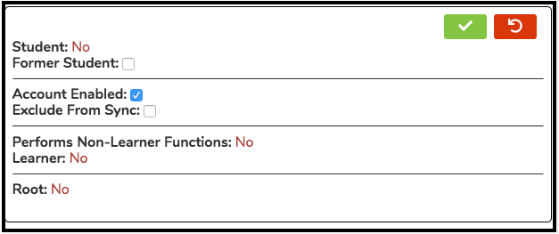
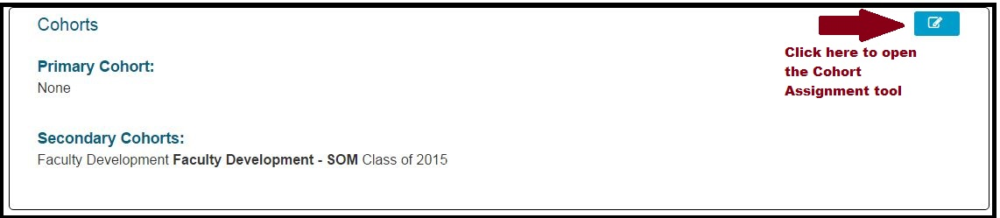
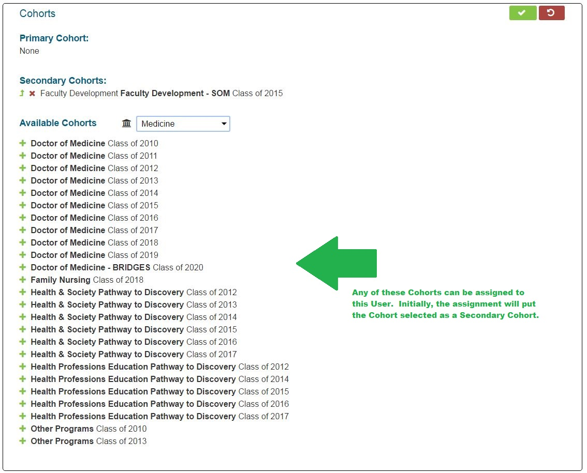

# Maintain User Record

With the advent of Ilios 3.0, more user record information modification and maintenance can be performed using the application than ever before.

### Search for and Find User Record to Modify

You can perform a search and select an existing Ilios user record to modify as shown below.

 Now that the user has been selected there are many useful utilities provided by the interface.

As indicated by the arrows in the screen shot below, there are three editing panels along with the calendar feed Web Link area. Each of these four areas are controlled or activated using the buttons indicated.

## Edit User Account Settings

Now the that user account has been selected for modification, many of the text fields can be modified. At UCSF, the Middle Name, Other ID, Phone, and Preferred Email fields can be modified manually. The other field values are brought in from the Campus Directory after clicking the Sync button.

#### Fields and Functionality Described

**First Name, Last Name, Campus ID, Username:** These values are either brought in from your campus directory \(LDAP or other\) or can be edited manually.

**Middle Name, Other ID, Preferred Email, Phone:** These values can be edited here. 

_**NOTE:**_ Teaching notifications will be sent to a the preferred email address entered here if one exists in the system.

**Password:** Only systems that are not set up to sync with a directory will have this link. This is used to reset a user's password. A utility to ensure password strength is included.

\*\*\*\*

## Edit User Role and Sync Options

In a similar manner to editing account properties, the editing of user roles and the inclusion \(or exclusion\) from the nightly synchronization process is easily accomplished here and detailed below.

 The permissions/fields that can be selected or un-selected \(meaning yes or no\) are ... 

#### Former Student \(Student Role\):

This gets flagged when a Student has graduated if a user directory is set up to sync with Ilios. It can be set manually if desired.

#### Account Enabled \(Any User\):

If this is not selected, the user will not be able to log in.

#### Exclude From Sync \(Any User\):

If you would prefer to keep the user account settings as they are \(alternate email address etc.\) and do not want to receive updates from the Campus Directory, this should be selected.

### Edit Primary and / or Secondary Cohort Assignments

After clicking as shown below, the Cohort Assignment tool becomes available for use.

**Icons Explained**

 - Adds the selected Cohort as a Secondary Cohort for this User. All Cohort additions are initially added as a Secondary Cohort.

### Primary Cohort Options ...

### Secondary Cohort Options ...

