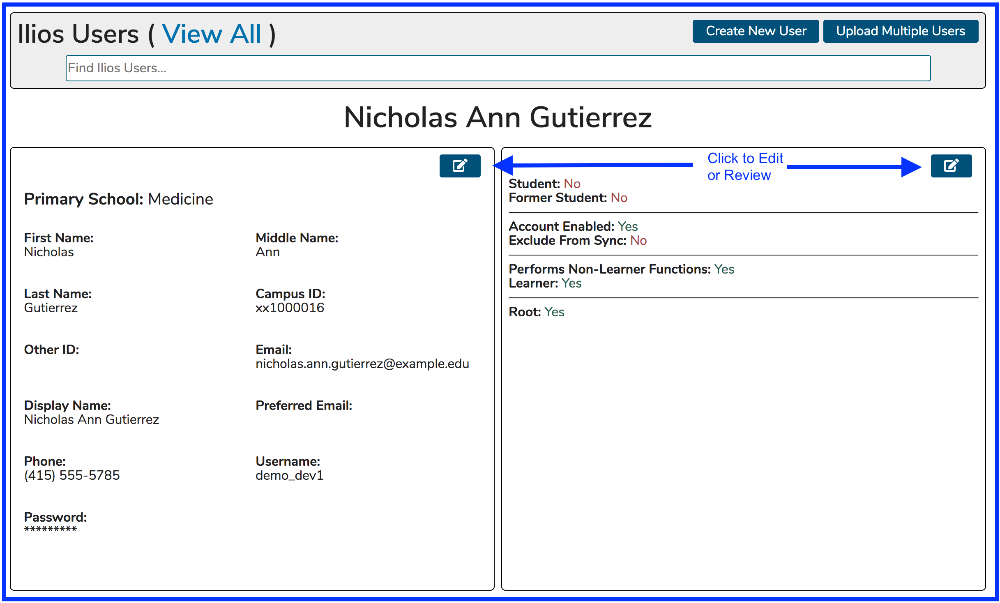
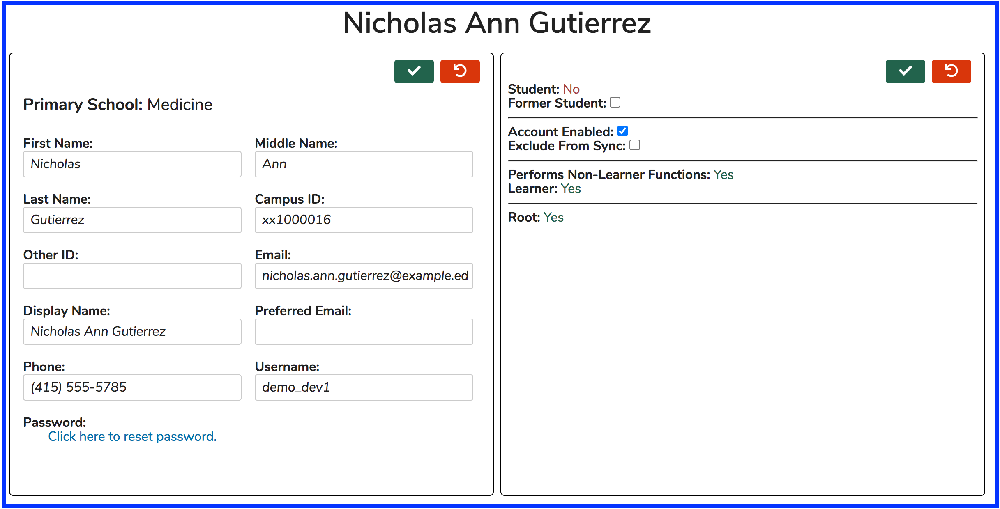
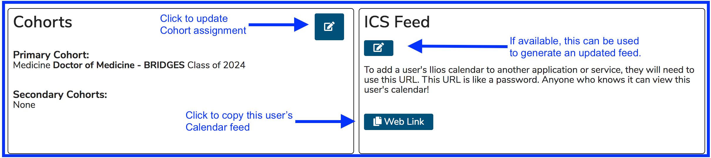
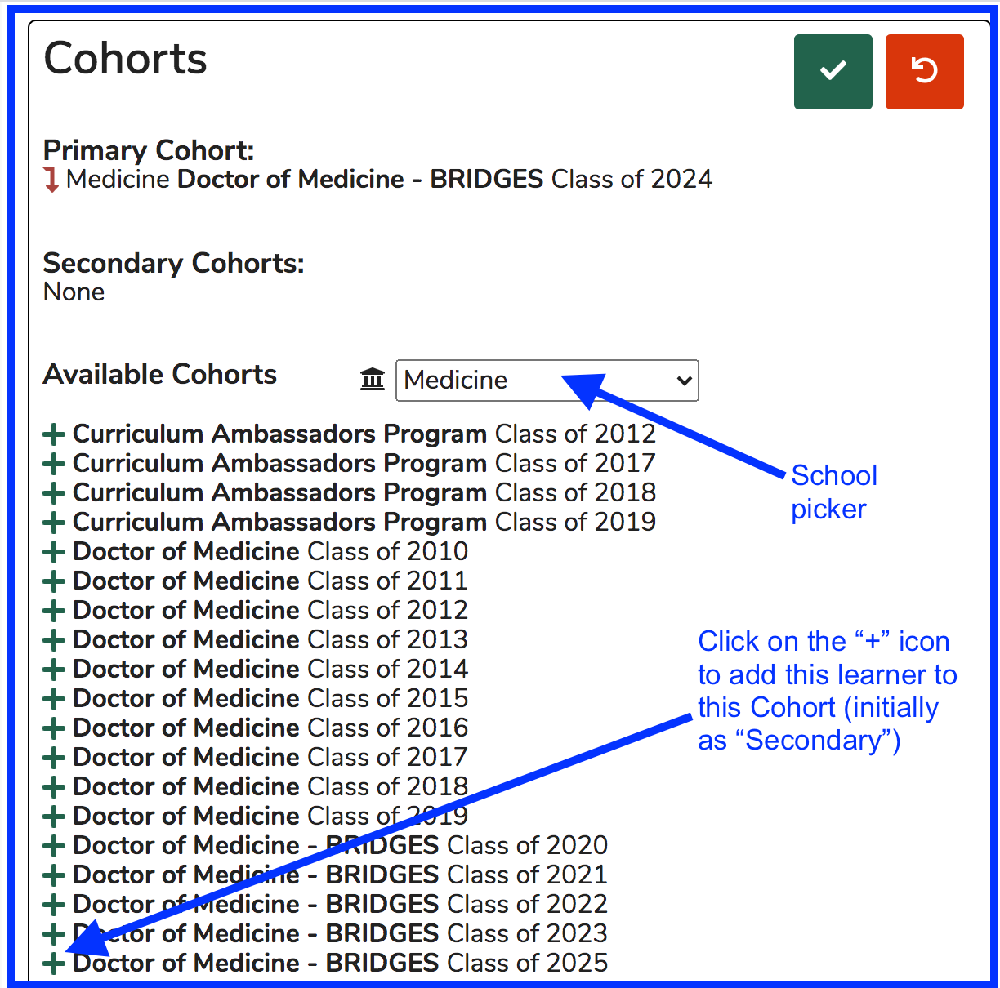
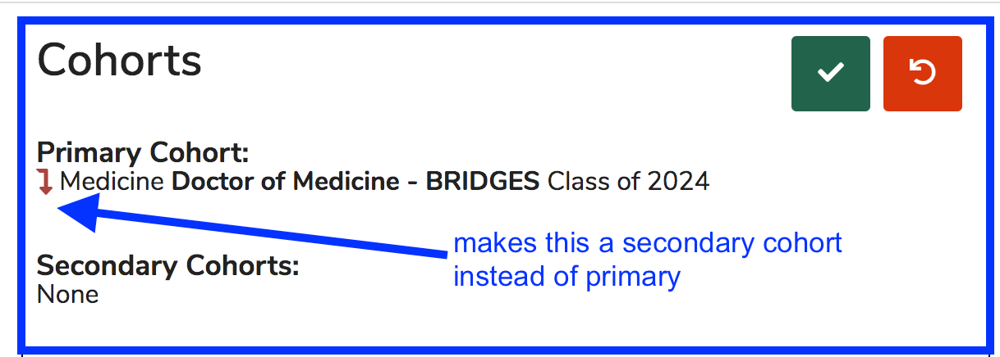
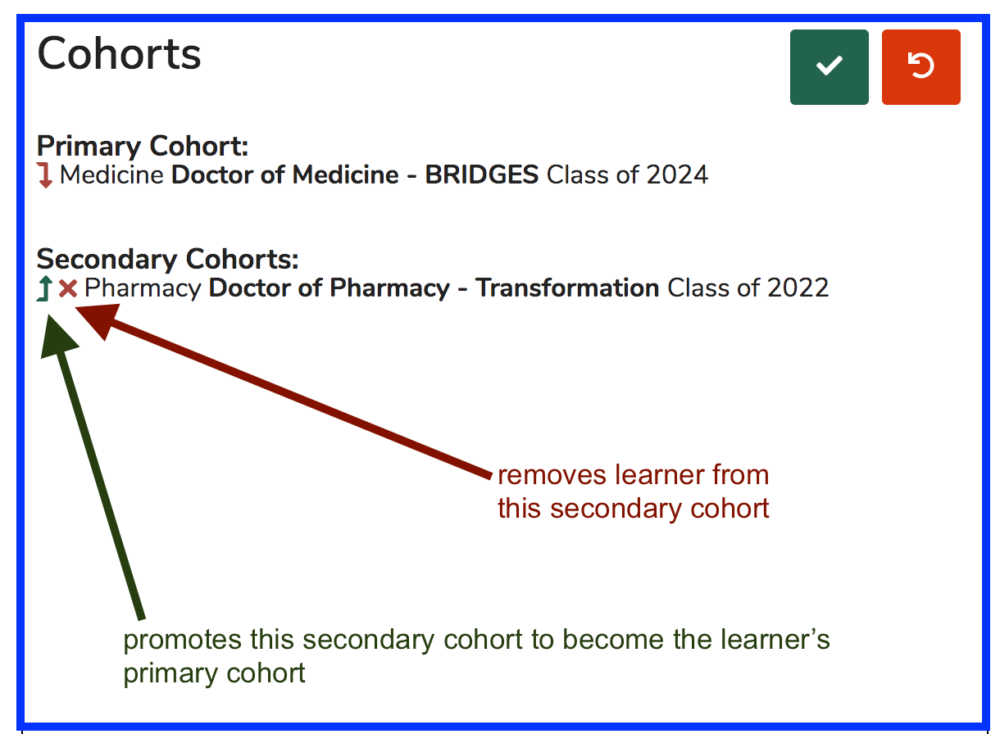

# Maintain User Record

With the advent of Ilios 3.0, more user record information modification and maintenance can be performed using the application than ever before.

### Search for and Find User Record to Modify

You can perform a search and select an existing Ilios user record to modify as shown below.

 Now that the user has been selected there are many useful utilities provided by the interface. Given the complexity of this screen, we will take it in portions. The top part of the screen is shown below once our user has been selected.

## Edit User Account Settings

Now the that user account has been selected for modification, many of the text fields can be modified. At UCSF, the Middle Name, Other ID, Phone, and Preferred Email fields can be modified manually. The other field values are brought in from the Campus Directory.

The example below shows the scenario when there is no Campus Directory. Any field can be modified. Save and Cancel buttons are provided in both panes. The panes have been activated as shown in the "User Admin - top portion" image above.

#### Fields and Functionality Described

**First Name, Last Name, Campus ID, Username:** These values are either brought in from your campus directory \(LDAP or other\) or can be edited manually.

**Middle Name, Other ID, Preferred Email, Phone:** These values can be edited here. 

_**NOTE:**_ Teaching notifications will be sent to a the preferred email address entered here if one exists in the system.

**Password:** Only systems that are not set up to sync with a directory will have this link. This is used to reset a user's password. A utility to ensure password strength is included.

\*\*\*\*

## Edit User Role and Sync Options

In a similar manner to editing account properties, the editing of user roles and the inclusion \(or exclusion\) from the nightly synchronization process is easily accomplished here and detailed below.

 The permissions/fields that can be selected or un-selected \(meaning yes or no\) are ... 

#### Former Student \(Student Role\):

This gets flagged when a Student has graduated if a user directory is set up to sync with Ilios. It can be set manually if desired.

#### Account Enabled \(Any User\):

If this is not selected, the user will not be able to log in.

#### Exclude From Sync \(Any User\):

If you would prefer to keep the user account settings as they are \(alternate email address etc.\) and do not want to receive updates from the Campus Directory, this should be selected.

### Edit Primary and / or Secondary Cohort Assignments

Continuing down the page, we get to the Cohort Assignment tool as well as the .ics feed maintenance area. After clicking as shown below, the Cohort Assignment tool becomes available for use. Initially, it appears as shown below.

As depicted above in "Admin Console - part 2", the "Click to update Cohort assignment" button has been clicked. The maintenance screen is shown below with Save / Cancel buttons provided like always.

**Icons Explained**

 - Adds the selected Cohort as a Secondary Cohort for this User. All Cohort additions are initially added as a Secondary Cohort.

### Primary Cohort Options ...

### Secondary Cohort Options ...

**NOTE**: In the example shown above, the learner is going to have a School of Pharmacy cohort as their primary cohort. Previously this learner had a School of Medicine cohorts as their primary cohort. Doing this will NOT switch the learner's primary school.

