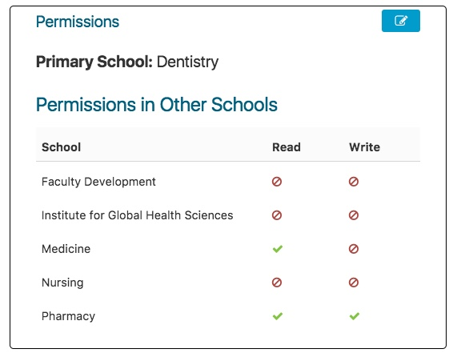

# School Permissions

Permission for Non-Student users of Ilios in any of the following user roles \(Instructor, Course Director, Developer\) to view schools in addition to their primary school is maintained here in the Admin Console.

This only really applies if your login has rights to assign permissions to schools other than your own primary school. In this example, the logged in user can assign permissions to all of the following schools...

* Dentistry \(the user selected in the Admin Console's primary school\)
* Faculty Development 
* Institute for Global Health Sciences 
* Medicine \(this is the logged in user's primary school\) 
* Nursing
* Pharmacy

In this example, we will add "Read" rights for the user to Medicine and the more powerful "Write" rights for the user to Pharmacy. Click the Edit icon to start this process and select as shown below.

After confirming by clicking the green confirmation action button, it becomes clear that the changes have been saved for the selected user's account.

**NOTE:** This is how to set permissions for non-student Ilios users. Permissions for students are set by adding them to Secondary Cohorts which may be in their current school or in a different school. There is no need to use this for students.

