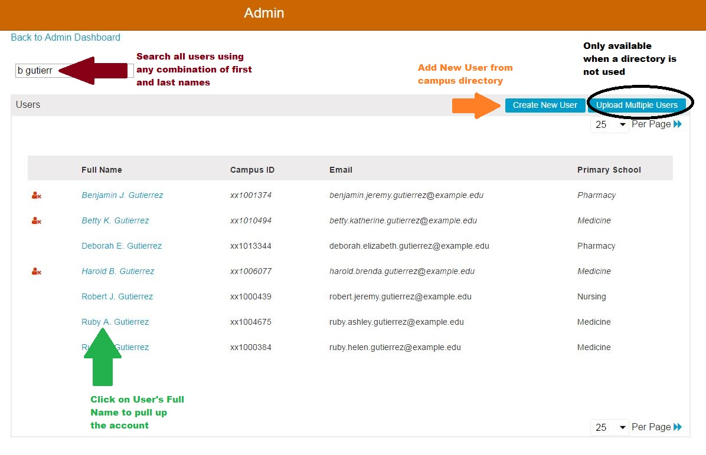
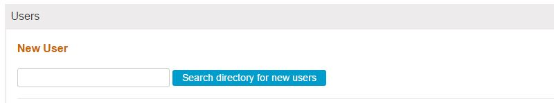
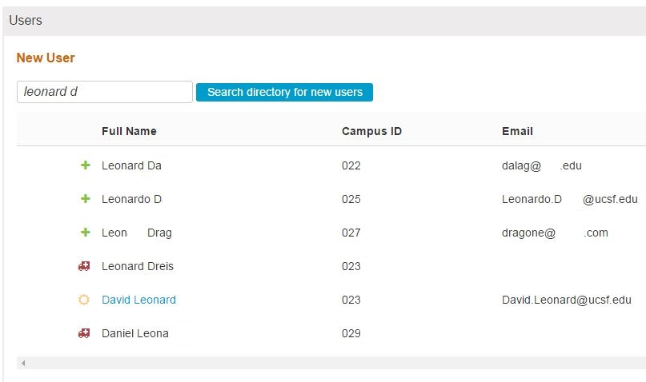
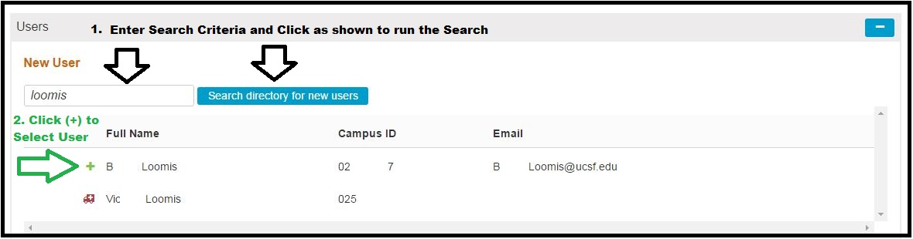
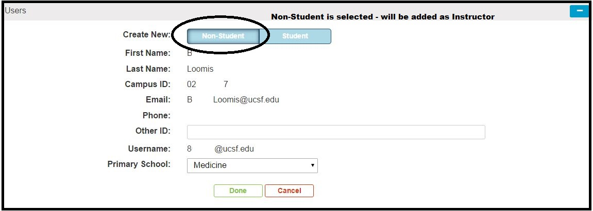
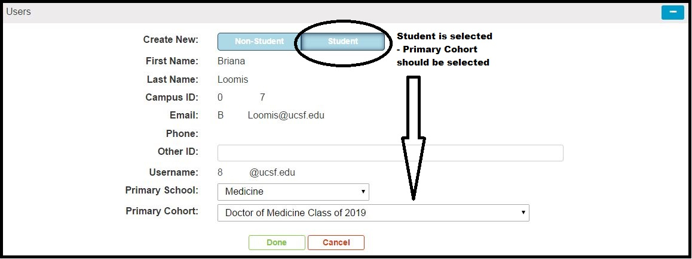

# View All

Clicking the "View All" link brings up an interface where All Ilios User records can be searched and maintained.

= Accounts that are currently not enabled

## Create New User:

Click this to either add a new user from the Campus Directory or to add a new user manually if a directory is not used. This depends on how your school is configured to handle user authentication.

Using the Campus Directory method, the following screen shows the area where the search criteria can be entered in order to retrieve the account to be added. It is done one at a time.

 Enter search criteria and click "Search directory for new users". In the example below, a search for "Leonard D" was performed. The results are shown below with identifying data scrubbed since this is from the actual UCSF Campus Directory.

**Icons Explained**

- Ready and able to add to Ilios

 - Something is wrong or missing. User cannot be added to Ilios at this time.

 - Already in Ilios. User can only be added once.

## Add New User From Directory Search

A Search was performed for "Loomis".

After clicking the \(+\) button as shown below, it is not necessary to select whether this new user is to be added as a Non-Student \(Instructor\) or Student. Roles can be added and updated later but it is helpful and powerful to make this initial distinction at this time. In both cases, Primary School should be selected now.

* **Add Non-Student \(Instructor\)**

* **Add Student**

When a Student is added, the Primary Cohort should be selected at this time \(as shown below\).

