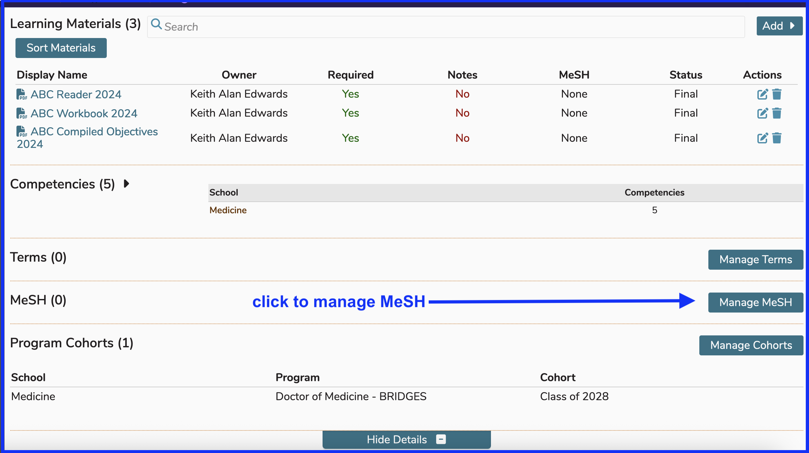
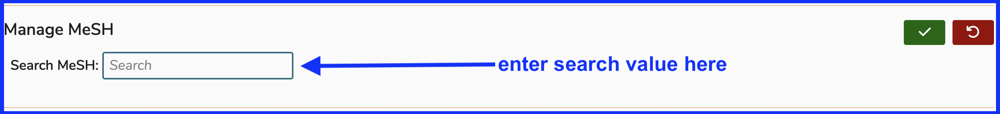
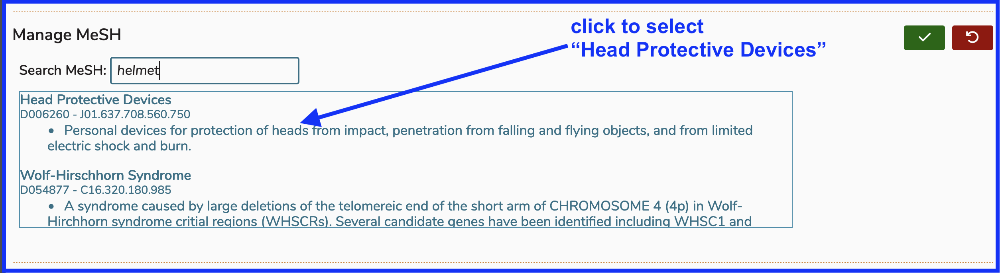
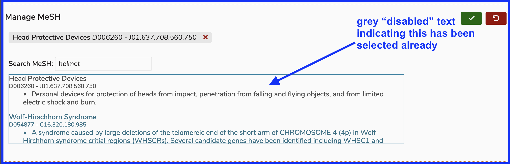
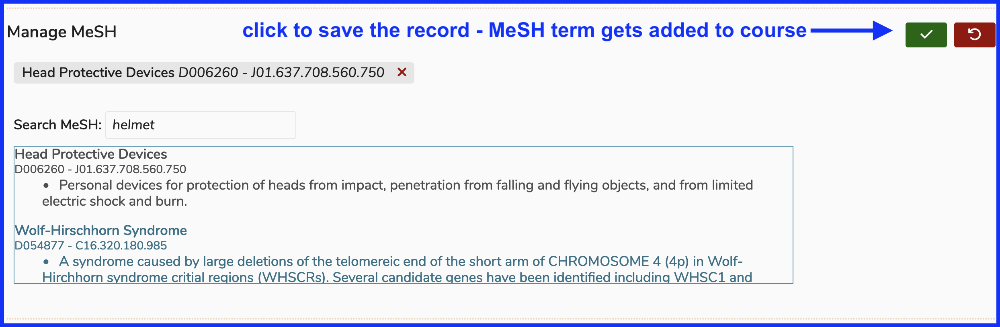
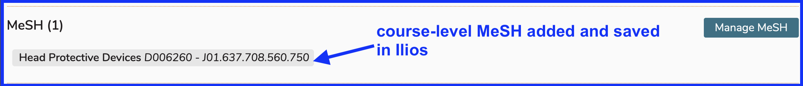
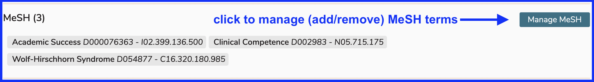

A quick reference to MeSH terms is located [here](https://iliosproject.gitbook.io/ilios-user-guide/additional-information/mesh).

For the sake of demonstration, the same course as earlier in this section will be used. We have selected the course "Airways, Blood and Circulation" from the academic year 2024-2025 to illustrate the process of associating MeSH terms directly to a course.

# Manage MeSH

## Click to Manage

The screen shot below indicates where to start this process. MeSH term maintenance is located below (vocabulary) term maintenance and above program cohort maintenance. 

## Search MeSH

After clicking as shown in the previous step, the screen becomes similar to what is shown below. Entering a text value to use for a search of the MeSH universe for matches is started, location-wise at least, as shown below.

## Select MeSH

Entering a search value (or string) such as "helmet" will perform a search into the MeSH universe, referred to as such because there are so many potential results (thousands).

Suggested value matches will appear as shown below. Click anywhere in the area to select the desired option, in this case "Head Protective Devices".

## MeSH Term Selected

After selecting "Head Protective Devices" in the previous step, the MeSH term has been added (but not saved yet) to the course. At this point, this association can be saved or discarded (canceled). The previously selected value is displayed above the search area and it can not be selected again.

## Save the Record

Using the green "save" button provided, the MeSH term added to this course can be saved as follows. 

## Remove MeSH

In the example shown below there are currently three MeSH terms attached to this Course. We would like to get rid of one of them. 

