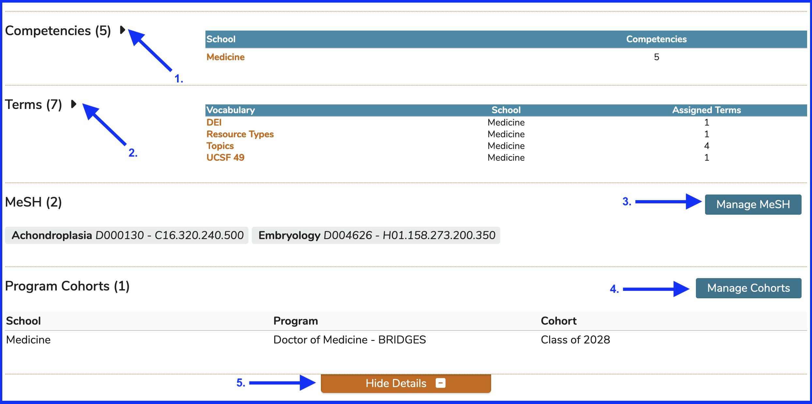
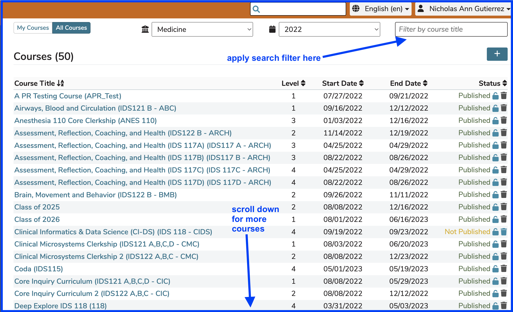
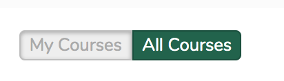
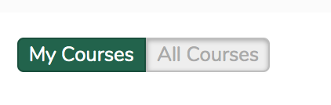
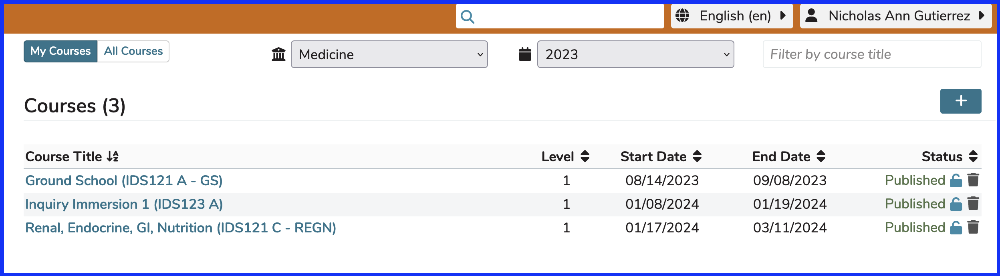

# Courses

A Course is a Curricular object that defines the content and structure of a specific instance of coursework available to the school or program.

## Course Attributes

* **Course Name:** Long title of the course, entered on course creation. 200 character max.
* **Course ID:** Field allowing any internal or external ID up to 18 characters to be entered.
* **Course Year:** Academic year during which instruction will take place. This is set at the creation of the Course. This field cannot be modified using the interface once it is saved.
* **Course Level:** The options for this are set at the [Program](https://iliosproject.gitbook.io/ilios-user-guide/programs#program-attributes) Level. The program duration can be anywhere between 1 and 10. The Course level identifies what point in the curriculum trajectory the course is meant to be addressed by learners, but is not a constraint.
* **Clerkship Type:** A course may be identified explicitly as a clerkship using this attribute. The available selections are Block clerkship, Integrated clerkship, or Longitudinal clerkship. These may be modified as necessary in the `"course_clerkship_type"` table. The default value for all courses on creation is “not a clerkship”.
* **Programs / Cohorts:** Selected from the list of available Cohorts and Programs already entered in the system. Only authorized users from a given program’s home school may edit that program cohort’s relationships to the course.
* **Start Date:** A calendar selection, which should be within the range of the Course’s academic year.
* **End Date:** A calendar selection, which should be within the range of the Course’s academic year and must fall after the Start Date.
* **Competencies**: Competencies listed for a course are a subset of the full set of competency domains for the program(s) associated to the course. When a course Objective is linked into the competency tree via its association to a program Objective, the competency domains to which those program level Objectives are assigned will be displayed and reported as the specific attributes of the course.
* **Objectives:** Free-text entry field. Each Objective entered at the course level may be associated to one or more Program-level Objectives for each program associated with the Course. It is a school-level configurable option to allow Course objectives to be associated with only one Program Year objective, or to allow them to be associated with multiple Program Year objectives. Only authorized users from a given program’s home school may edit the relationships of an Objective to that program’s cohorts. Course Objectives may also be assigned their own MeSH terms and Vocabulary Terms.
* **Course Director(s):** Selected from list of available names. The list is populated with users identified and tagged as having “Director” level permissions in the database.
* **Terms:** Selected from a school-specific, pre-defined list. These are grouped by Vocabularies, which are collections of Terms (school-specific categories of learning) that can be selected and attached (tagged) to many curricular objects within Ilios.
* **MeSH Terms:** Selected by searching the MeSH database.
* **Learning Materials:** Course level learning materials are available to all Sessions of a Course, and are entered using the Learning Materials search/upload tools.

## Screen Elements

This shows the Course detail screen (once a Course has been selected and Details have been expanded).

## Functionality and Links
### Upper part of screen

1. **Back to Courses List**: takes the user back to the list of Courses
2. **Language Switcher**: currently can be switched to French, Spanish, or English
3. **Profile Dropdown**: available here -- My Profile, Logout
4. **Edit Course Title**: The title can be edited by clicking as shown.
5. **Published Status**: The Course's publication status can be changed here.
6. **Course ID**: The Course ID field can be edited by clicking as shown.
7. **Clerkship Type**: edited here
8. **Start Date**: edited here
9. **Learning Materials Summary**: opens up Learning Materials summary
10. **Print Summary**: opens up the all-inclusive Print Summary
11. **Rollover Course**: starts the process of rolling this Course over
12. **Course Visualizations**: opens up Visualizations (Graphs) for this Course
13. **End Date**: edited as shown
14. **Level**: edited here
15. **Course Leadership**: expands to assign Course Directors and / or Administrators
16. **Course Objectives**: expands and opens up the Objective editor
17. **Search For Learning Material**: to find existing Learning Material
18. **Add Learning Material**: If Learning Material is not found, new ones can be uploaded
19. **Sort Materials**: to change the order in which Learning Materials are displayed to students
20. **Edit Learning Material**: allows for the changing of Learning Material attributes
21. **Delete Learning Material**: if available, allows for the deletion of Learning Material objects

### Lower part of screen

1. **Competencies**: opens up the list of Competencies associated with this Course
2. **Terms**: opens up Terms for this Course
3. **Manage MeSH**: opens up MeSH Manager for this Course
4. **Manage Cohorts**: to add or remove Cohorts from the Course
5. **Hide Details**: hides all Course Details with the exception of the [Course Summary Details](https://iliosproject.gitbook.io/ilios-user-guide/courses-and-sessions/courses/edit-course#course-summary-details)

## All Courses (default view)

When first visiting this screen during an Ilios session, the default view is **"ALL COURSES"**, which is shown below. You can limit the number of Courses displayed on the screen by filtering on Course Title.

This display can be sorted by the following fields in addition to being filtered by Course Title.

### Sort Options ...

* **Level**
* **Start Date**
* **End Date**
* **Status**

**TIP:** It can be helpful to sort by **"Status"** when you want to find out which Courses may not have been published yet. The Courses with the Status of "Not Published" will appear first in the list.

<figure>
  
    <figcaption>
      
Courses List (All Courses)

    </figcaption>
</figure>

## My Courses

By default, all courses for the selected school are displayed. There is a pair of buttons acting as a switch at the top left of the screen which will change into My Courses when clicked as shown below.

**Original appearance:**

**After clicking / toggling:**

The screen is then refreshed to display only the courses with which the logged in user is associated. In this example, the logged-in user is an instructor for one or more session offerings in the three coursed contained in the My Courses list.

The year drop-down menu does apply in this situation. The year selected is 2023 meaning these are the Courses in the selected year associated with the logged-in user.

