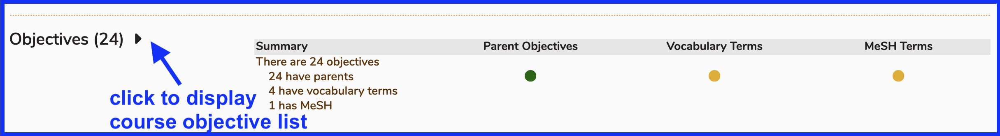
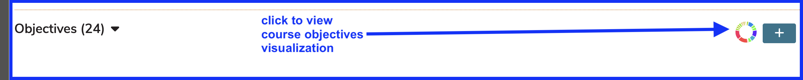

# Add New Objective

Objectives are the desired learning or teaching outcomes for a given curricular object. These may be Program Year Objectives (also referred to as graduation requirements), Course level learning Objectives, or Session level teaching Objectives. Objectives may be associated with Competencies, which are linked as parents to Program Year Objectives.

To enter a Course level Objective ...

## Select Course

* Select a Course and open up the details.

* Expand the Course Objectives list.

## Expand Objectives list

## Click to add Objective

## Add Details

Course Objectives are created at the top level of each course, and may be associated with any of the available Program Objectives from the Program(s) associated to that course.

Currently, Course Objectives may only be associated with a single Program Objective in a parent-child relationship. Session learning Objectives in turn may be linked to one or more of the Objectives in their parent Course, and in turn will inherit the linkage to any program Objectives and specific competency domains specified within the pool of eligible program competencies.

When used, the competency and Objective tracking system allows for a complete structured tree to be traced back from any specific unit of instruction to include (session)-specific learning Objectives, general course Objectives, the program Objectives toward which they are best directed, and the overarching domains of competency in which all these fall.

While all course level Objective information is directly associated with the course, in order to create a direct relationship between a course and a set of associated Competencies (and to have those competencies appear in the course information displayed to Ilios users), you must select a parent association from the available competency domains for one or more of your course Objectives.

## Objective count - updated

The newly added Course objective gets appended to the list and the Objectives counter gets incremented by one to reflect the fact that this new one has been added.

## Objective Visualization link

There is a quick link directly to the course objective visualization available here as shown below. This is identical to navigating to Visualizations and clicking on the Objectives graph - in other words, it's the same visualization provided here for convenience.

**NOTE:** The link displayed above only appears when there are sessions with offerings that have been linked to course objectives. Otherwise there is no data to report.