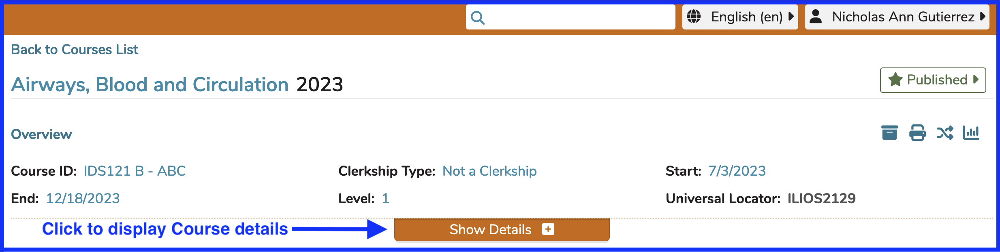

# Attach Parent Objective

As mentioned before, it is configurable to allow Course Objectives to have either allow for the addition of one Parent Objective, or to allow for multiple parents to be attached.

To associate one or more Parent Objectives (Program Year level) to a Course Objective ...

* Find and a Course from Courses and Sessions

* Click **Show Details (+)** to expand the Course and see the details
* Review the Course Details and expand the screen to display the full list of Course Objectives as shown below.

**1. Show Details**

**2. Expand Objectives**

Of the 24 course objectives ...
* 21 have associated program year objectives (orange color) 
* 4 have associated Vocabulary terms (also orange)
* 0 have associated MeSH terms (red x)

If any of these parent relationships had a value for each objective, the dot would be green rather than orange in color.

**3. Objective Review**

After clicking as shown above, it is evident there is at least one Course Objective that is missing its Parent (Program Year) Objective.

**4. Add Program Year Objective as a Parent to Course Objective**

Now that "Add New" has been clicked as shown above, the Program Year Objective can be selected as a Parent to the Course Objective.

**5. Review the Results**

## Course Competency Updates

This occurs when a Program Year Objective that gets selected as a Parent to a Course Objective has a Parent Competency that has not been selected yet.

Here are the Course Competencies before performing the steps shown above.

After performing steps 4 and 5, a Program Year Objective with a Competency of `Interprofessional Collaboration` is added as parent to one of the Course Objectives, thus adding a Competency to the Course.

Here are the Course Competencies after performing the steps above.

