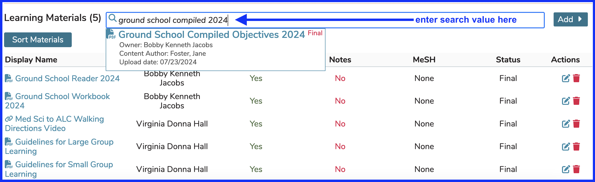
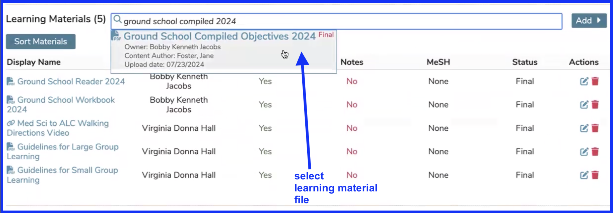
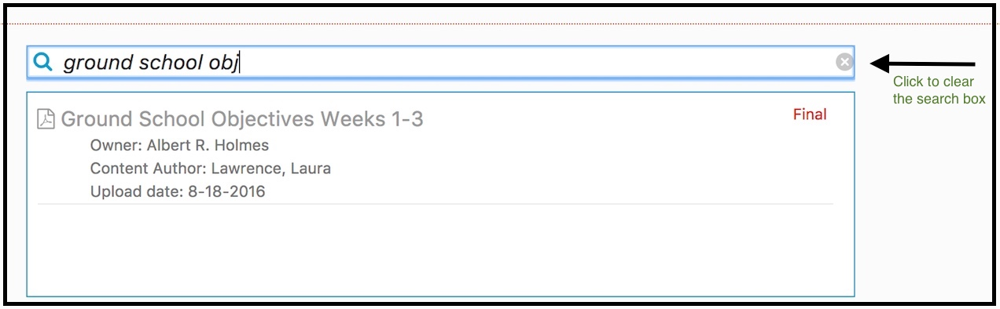
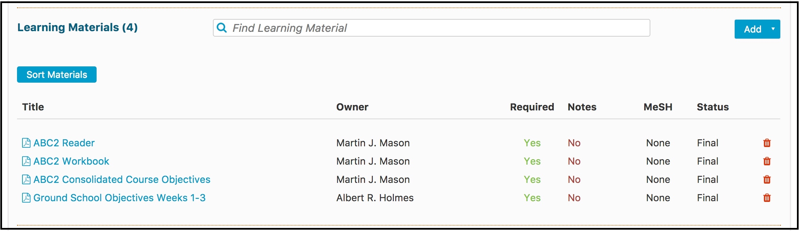
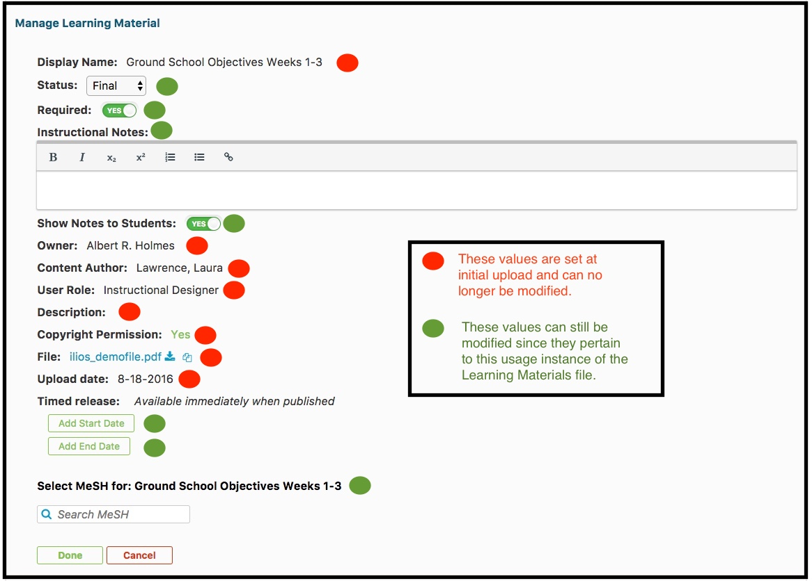
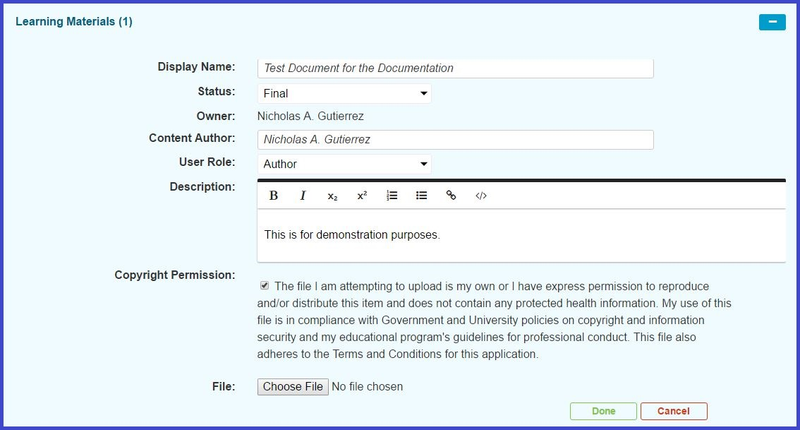

# Attach Existing Learning Material

The first step is to select a Course and also to click "Show Details" to reveal the Course Details - of which Learning Materials is one. These steps are covered in other parts of the guide and may be linked here soon as well.

Before accidentally uploading a potential duplicate Learning Material file, link, or citation, you should search to if it already exists in the system. The key thing to remember here is that with Learning Materials, the relationship between the Learning Material and the Course is what is being created here. The same Learning Material can be attached to any number of Courses or Sessions.

## Perform Search

The screen shot below shows the Learning Material section for a Course. A search was performed for the value 'ground school obj'. The course "Ground School" in the 2024 academic year has been selected and opened along with "Show Details" in order to get to Learning Material maintenance at the course level.

### Enter Search Criteria

Select one of the results to be attached to the Course. The process of attaching existing Learning Materials or uploading new Learning Materials at the Session level is very similar to doing this at the Course level.

## Attach Existing File

After performing the search as shown in the preceding section, click anywhere indicated by the shading to select the existing (already used or uploaded) learning material object to attach at the course level.

### Select File to Attach

**NOTE:** The above steps are for adding an existing (already uploaded or used) learning material object. There is no need to access the "Add >" drop-down. Use the "Add >" drop-down only when new (not uploaded or used yet) learning material objects needs to be attached to the course. 

## Update Meta-Data

**See Results of Action and Modify Available Meta-Data**

Dismiss the search window as shown below.

It is evident that the file has now been attached to the Course. It is the fourth item in the list.

Click on the Display Name to view more details and to modify some information about the attachment of this file to the Course. Many attributes of the file itself cannot be modified. The properties of these [field descriptions](https://iliosproject.gitbook.io/ilios-user-guide/courses-and-sessions/courses/attach-learning-materials#field-descriptions) are below.

## Field Descriptions

* **Display Name:**  Free-text entry field of up to 60 characters. This name is what will display for users of the system to identify the Learning Materials.
* **Status:** Defaults to Final so it will be displayed to Learners.  Other options are "Draft" or "Revised".  Select from Draft, Revised, or Final. Only learning material with Final status will appear to learners in the system.  Final is the default for this Status.
* **Required:** Indicates whether this Learning Material is required reading or viewing for any student enrolled.
* **Instructional Notes:** Notes regarding the introduction of this material into the classroom discussion or other items of notes about its usage. This is optional and may or may not be displayed to students.
* **Show Notes to Students:** This sets the Instructional Notes to be revealed (or not) to students.
* **Owner:** Defaults to the logged-in User. This is the user who has uploaded the Learning Materials. Non-editable. Provided by system.
* **Content Author:** The name of the person who created the content.  Free-text entry field of up to 80 characters to capture the actual author (if known) of the Learning Materials content.
* **User Role:** The role of the logged in user.  Defaults to Author - other options:  "Co-Author" or "Instructional Designer".
* **Description:** Free-text entry field to allow brief description of the Learning Material. For each unique use of a learning material, additional attributes may be added specific to that particular usage in the curriculum.
* **Copyright Permission:** Check that box after reading the description provided or write a rationale for using the file.  Checking of this box validates that you have permission to use the file being uploaded / attached to the Course.
* **Copyright Rationale:** If the Copyright Permission check box is not selected, this free text area is provided to add the logic behind the file's usage.
* **Choose File (or File):** Launches a common file dialog box to attach any file obtainable on the user's computer or displays the file name if it has already been selected and attached.
* **Upload date:** Non-editable. Provided by system.
* **Timed Release:** Allows for the specification of start and / or end dates for students to be able to view / download this Learning Material object. **Add Start Date** and **Add End Date** are used to set these values.
* **Select MeSH for:** Provides for the attachment of Medical Subject Headers to the Learning Material objects.
* **File/Web Link/Citation:** For files: the physical or actual name of the uploaded file; for web links, the literal URL; for citations, the specific cite content.
* **[file size]:** For uploaded files, the size in KB. Non-editable. Provided by system.
* **[file type]:** For uploaded files, the file mime-type / extension. Non-editable. Provided by system.  Allowed file types include:  aiff, avi, csv, doc, docx, gif, gz, html, jpeg, jpg, mov, mp3, mp4, mpg, pdf, png, ppt, pptx, rtf, swf, tar, tiff, txt, wav, word, wmv,  xls, xlsx, xml, zip.

Learning Materials are currently stored in an Ilios-specific file directory system. Items in the file directory may be attached to the curriculum directly by searching the repositories from the search interface for Learning Materials; if a desired item is not found, it may be uploaded directly to the server from the same interface.

**Protected information (eg. PII, ePHI etc.) should not be stored in Ilios.**

If there is a need to associate PHI with an Ilios session or course, it should be stored as a link to a secure location or citation, not added to the file system or entered directly.

Learning Materials may be physical objects (digital files) such as presentations, images, documents, video and sound recordings; they may be specific links to external data (websites, streaming media, or documents with a qualified URL); or they may be a citation for a 3rd party document, journal or reference.

Learning Materials may be given the status of “draft”, “final”, or “revised”. Only items stored with a status of “final” will be visible and accessible to learners; file owners may modify the status of their Learning Materials at any time. Only the owner of a file may modify its status.

Once Learning Materials are loaded to the system, their associated metadata attributes will be provided for review when they are selected.

In order to save a learning material in connection with a session or course, that session or course must first be saved to the database. Attempting to load learning materials to an unsaved session will generate an error alert.

**The current default size limit for learning material upload in Ilios is 100 MB.**

For lectures and other similar media, where the likely method of delivery is streaming/viewing from the server, rather than downloading, materials should be stored elsewhere, and the links to them should be the resources saved in Ilios.

## Additional Fields 

These are modified once the inital upload has been completed.

* **Status:** Options for this are Final (appears to students as long there is no start or end date), Revised (same as Final for display purposes), and Draft (will not be displayed to students even if the current date lies between the start and end date (if it exists)).
* **Required:** Identifies required vs. recommended materials in the context of use. Requirement is unique to a given instance of use for any Learning Materials.
* **Instructional Notes:** Free-text entry field to allow commentary and instruction for the Learning Materials. Notes may be set to be visible to all users, or set as visible only to instructional faculty/staff. Notes provided are unique to a given instance of use for any Learning Materials.
* **Show Notes to Students:** Indicates whether or not the optional notes entered in the Instructional Notes field (described above) are displayed to students or not.
* **Timed Release** This allows for Learning Materials to be displayed to students for a specified range of dates. This can be either Start Date or End Date or both. The Learning Materials must be in a Final or Revised state to be displayed.
* **MeSH Terms (Select MeSH for:):** Selected by searching the MeSH database. MeSH terms selected are unique to a given instance of use for any Learning Materials.
