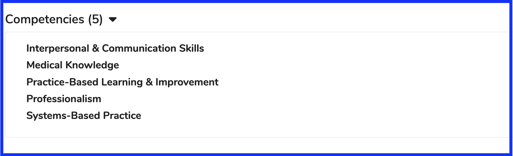

Competencies are configured at the School level in Ilios but assigned at the Program Year level. They are in read-only mode at the Course level. 

Setting up compentencies at the school level for use in Ilios is covered [here](https://iliosproject.gitbook.io/ilios-user-guide/schools/competencies).

## Course Competencies Displayed

Program year objectives are mapped to these school-level commpetenciesThe list at the course level displays all of those competencies that have been mapped via `course objective >> program year objective (competency)` mapping. The course's parent objectives (program year objectives) have been mapped to school competencies. Competencies will not appear here if attached program year objectives are not mapped to school competencies.