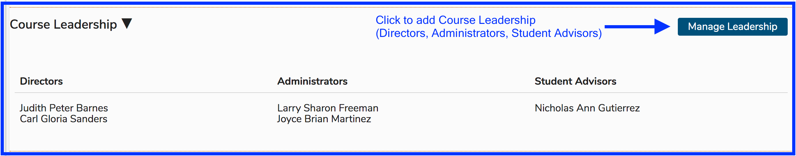
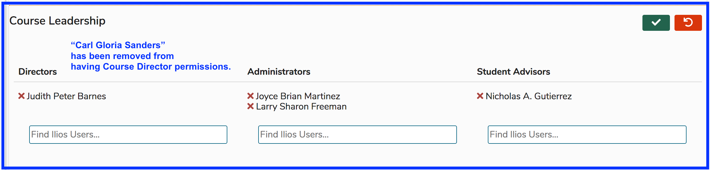
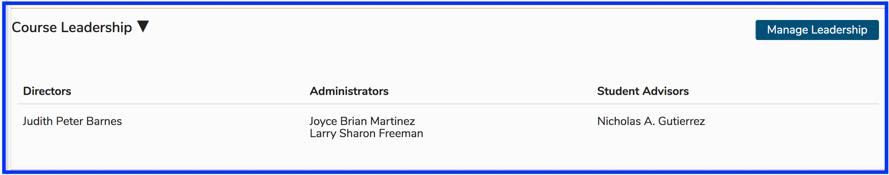
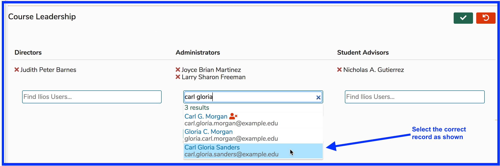
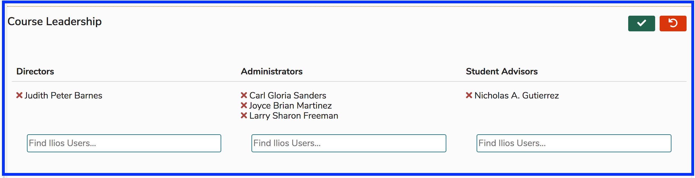
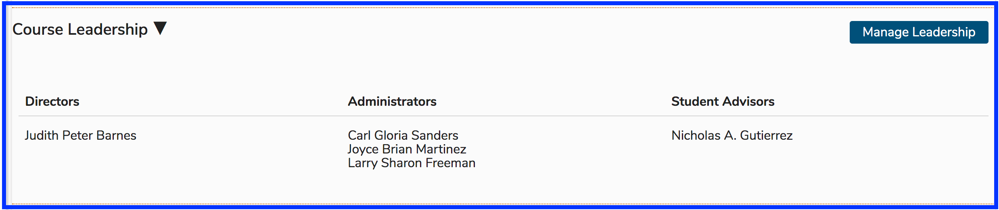
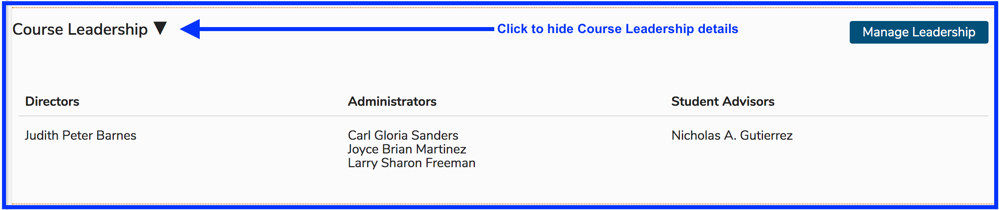
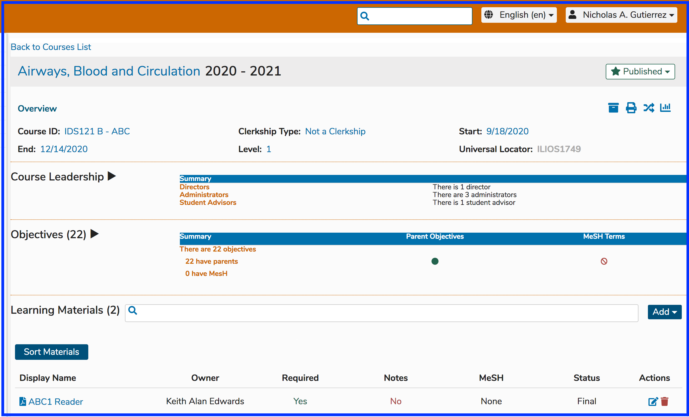

# Course Leadership

### Course Leadership

Course Leadership is part of the new permissions model. Course Directors, Course Administrators, and Student Advisors are added here. Course **Directors** and **Administrators**  have similar rights - to maintain any and all aspects of this Course. It is a matter of specifying whether the user is an administrative user using Ilios to maintain the Course or if the user is actually a Director. 

**Student Advisors** are able to download any and all Learning Materials from a Course to which they have been given this role. They will need to navigate the Calendar in order to access these resources. In other words, their Week at a Glance, Activities, and calendar feed will NOT contain all of the learning events of their assigned Courses; but the Learning Materials will be available for them to review to assist other students.

Refer to the [permissions matrix](https://www.dropbox.com/s/431sdj2bfoi3v1f/Ilios%20New%20Default%20Permissions%20Matrix.pdf?dl=0) for more information on these updated permissions. After exposing the Course Details, Course Leadership is the next functional area below the Course Summary Details section.

Clicking on Course Leadership opens up the details for this Course and allows modification of this leadership. As shown below, click **Manage Leadership** to add or remove Course Leadership - Directors, Administrators, and / or Student Advisors.

To remove Course Directors, Administrators, or Student Advisors, simply click the red "X" to remove the users from the list and then save using the green Save button in the upper right corner \(or Cancel\).

For the sake of demonstration, I will remove "Carl Gloria Sanders" and put that user in their correct categorization as a Course Administrator and not as a Course Director. He will have the same rights as a Director but for reporting and analytical purposes, his role is more administrative in nature so this designation is more accurate.

**Steps taken** **...**

* Removed "Carl Gloria Sanders" from the "Directors" area.

**Before Saving ...**

**After Saving ...**

* Click "Manage Leadership" to perform the action required.
* Perform a search on the right side text box for "Carl Gloria".
* Select the correct user.

The pre-save screen appears as shown below. The user "Carl Gloria Sanders" has been placed into the correct user role \(Course Administrator\).

After processing the Save event as shown above, the changes are correctly reflected in the Course Leadership detail. The Course Leadership details are still expanded.

**Expanded \(after save\)**

**After hiding the list ...**

This displays the contracted Course Leadership area in the context of the larger Course Details reflecting the updated counts but hiding the details.

## 

