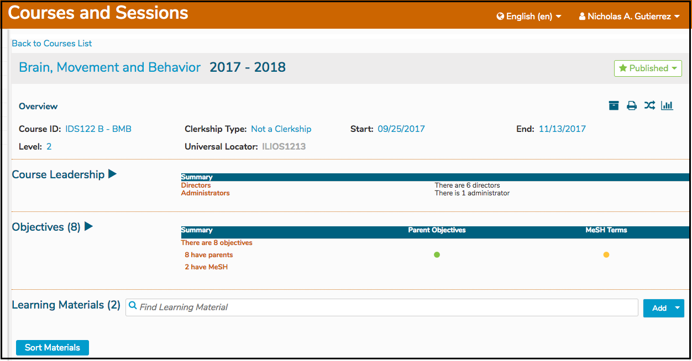

# Course Leadership

### Course Leadership

Course Leadership is part of the new permissions model. Course Directors and Course Administrators are added here. Both of these user roles have the same rights - to maintain any and all aspects of this Course. It is a matter of specifying whether the user is an administrative user using Ilios to maintain the Course or if the user is actually a Director. 

Refer to the [permissions matrix](https://www.dropbox.com/s/431sdj2bfoi3v1f/Ilios%20New%20Default%20Permissions%20Matrix.pdf?dl=0) for more information on these updated permissions. After exposing the Course Details, Course Leadership is the next functional area below the Course Summary Details section.

Clicking on Course Leadership opens up the details for this Course and allows modification of this leadership. As shown below, click **Manage Leadership** to add or remove Course Leadership - Directors and/or Administrators.

For the sake of demonstration, I will remove "Juan B. Bowman" and put him in his correct categorization as a Course Administrator and not as a Course Director. He will have the same rights as a Director but for reporting and analytical purposes, his role is more administrative in nature so this designation is more accurate.

**Steps taken** **...**

* Removed "Juan B. Bowman" by clicking as shown above.
* Performed a search on the right side text box for "Juan".
* Select the correct user.

The pre-save screen appears as shown below.

After processing the Save event as shown above, the changes are correctly reflected in the Course Leadership counts and detail.

**Expanded \(after save\)**

**After hiding the list ...**

This displays the contracted Course Leadership area in the context of the larger Course Details reflecting the updated counts but hiding the details.

## 

