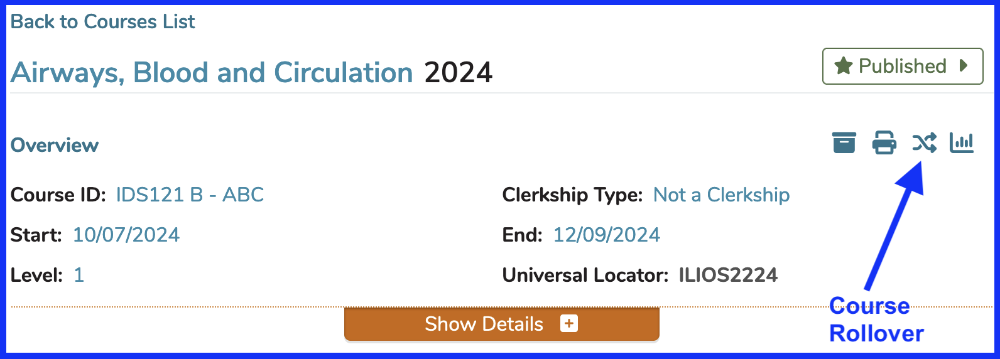
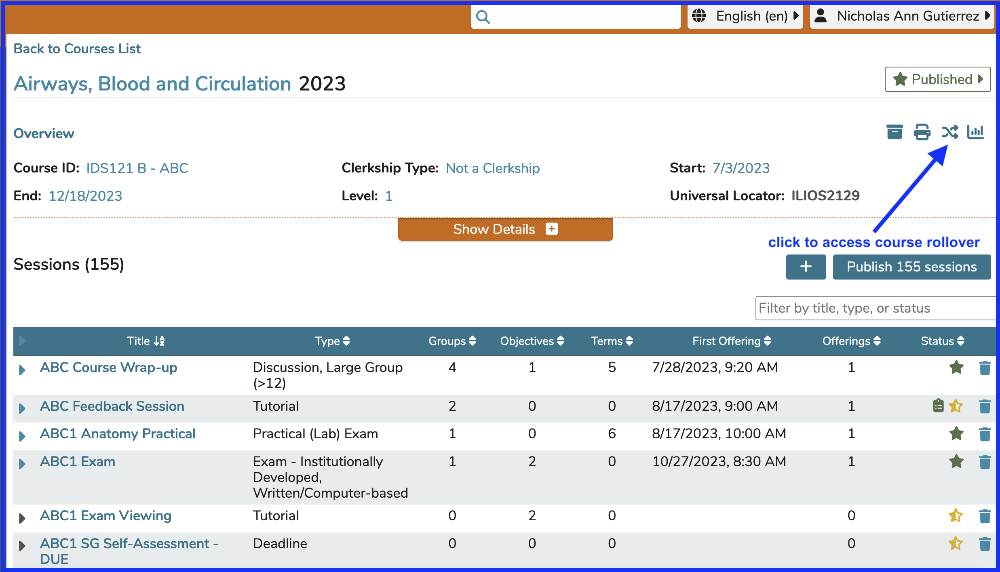
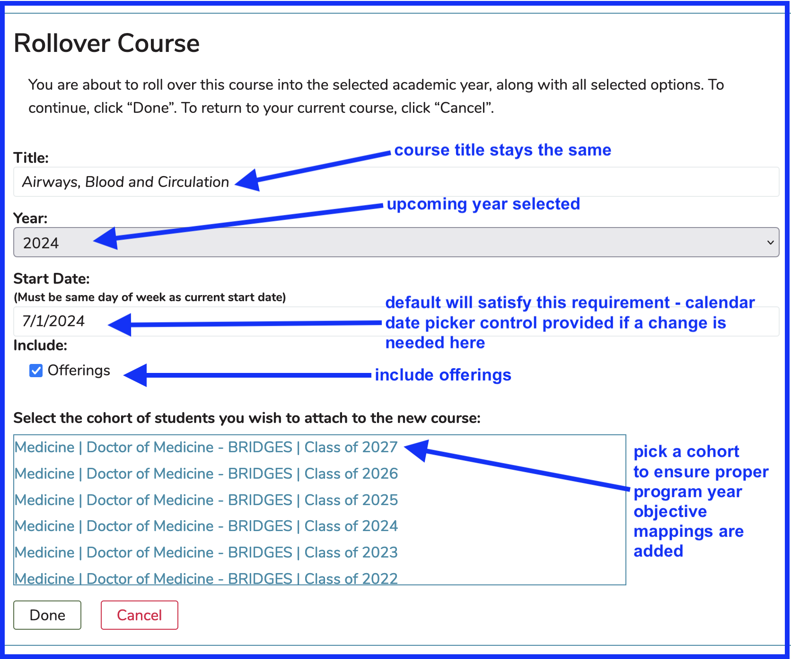
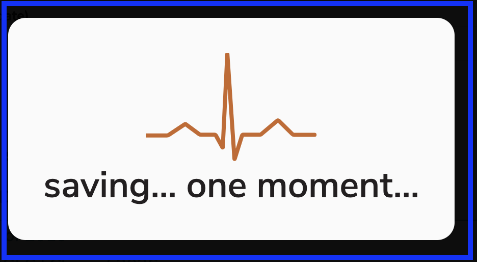
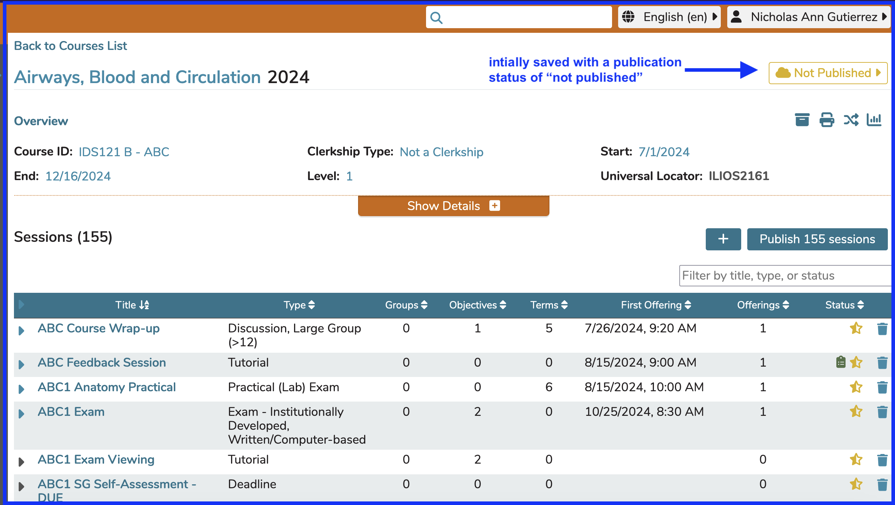
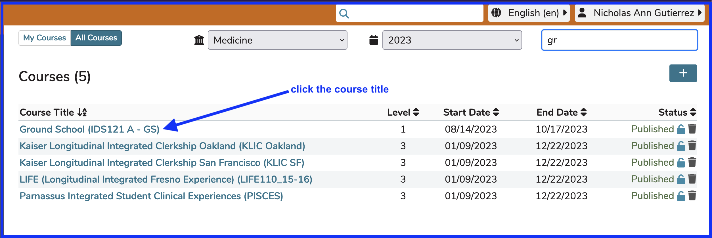
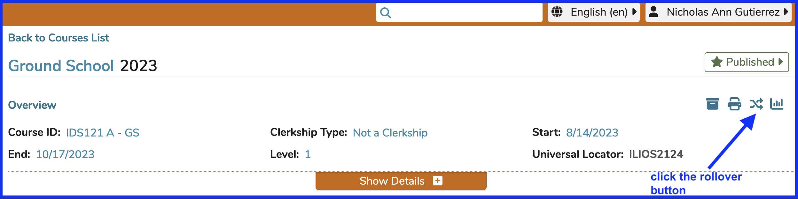
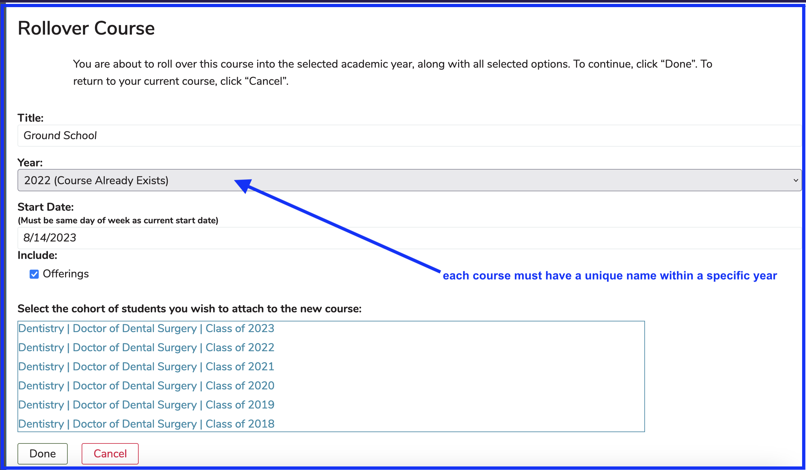
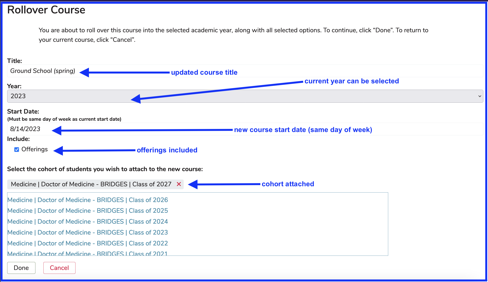
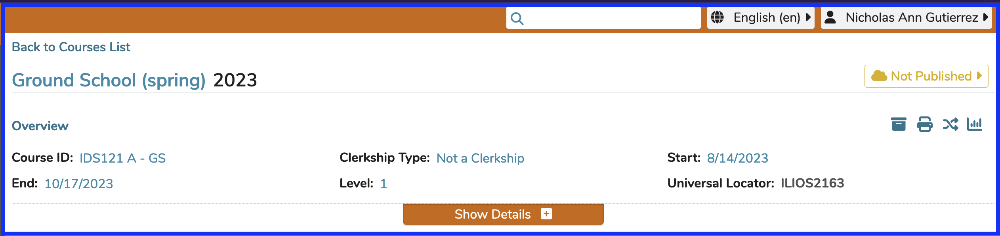

Courses can be "rolled over" into a different (future) academic year, into the same academic year, or even into the previous academic year (one year back only). An example of rolling a course over into the same year could be if a Course is offered in the Fall and then again in the Spring.

The concept of "rolling" a Course over is basically making a copy of it with the intent of re-using the structure (with or without offerings). This eliminates the need to enter all of this information another time, saving time and effort.

All course-level attributes including, but not limited to, Vocabulary Terms, MeSH Terms, Leadership, Objectives, Learning Materials, and Competencies are copied over to the new course which gets created during the rollover process.

All courses in Ilios, except for those that have been locked, have the Course Rollover icon displayed. The location and appearance of this is shown below.

There is no need to activate or configure anything to perform Course rollovers. If you have proper permissions, the rollover button will be enabled and available for your use. All courses are eligible for rollover. 

A course will carry along with it all the basic course data: sessions and their objectives and attributes, including links to course objectives, the course definition and its attributes, all learning materials, assigned vocaulbary terms and MeSH terms, etc. A user has the option of replicating all the scheduled offerings from the original course, and placing them on the calendar for the new course. This is the default option; you may also choose to create the new course without scheduled offerings, retaining only the course and session curricular data. Course Rollover includes the option of the assignment of a new cohort, and along with it the inclusion of all links to program year objectives and competencies. 

An example of a Course that can be rolled over is shown below. Course rollover functionality is contained within the Course Overview area.

# Rollover Options

The most common rationale for rolling a course over is to make a copy of the current year's course and use it for the upcoming academic year. This "future year" rollover is covered below.

## Future Year

To roll a Course over, click the Course Rollover icon as shown below.

Once the rollover button icon has been clicked as shown above, the screen changes to the following with several options, which are described below.

Once the Course has been rolled over, you can go and fix up the newly created Course. You will be taken to the new Course automatically. 

The following screen will appear to let you know the rollover is being processed. 

Clicking the "Done" button shown in the screen shot above will create the new course, add the cohort to it, add the offerings with estimated start dates (same day of week), and map the program year objectives to this new course.

A green header up at the top of the screen will be displayed for a few seconds once the rollover has been completed. 

Here is the newly created Course.

## Current Year

A Course may be easily rolled over into the current year. There is one simple caveat. Two Courses cannot exist in the same year with the exact same title so it is necessary to change the name of the Course in order to roll it over into the same (current) year.

To do this ...

* Select a Course that needs to be rolled over into the current year.

* Click on the Rollover icon to start the process.

* Notice that the drop-down selector indicates "Course Already Exists"

* Change the Title of the Course being created by the Rollover as shown below.

* Select the date for the new course to start.  The choices in the date picker are automatically limited to the same day of the week as the current course start date.  This is to ensure offerings are scheduled during the same days of the week as the offerings of the previous course.

* Click Done and that's it.  Review the results and make modifications to the newly created Course as needed.

You will be routed automatically to the new Course.

## Previous Year

It is possible to roll a course "over" back into the previous academic year. The process is the same as depicted in the above sections. The name must be unique to the year. You will notice the previous year (one year only) is available in the year selector drop-down. This is based on the current academic year. One year previous to the current academic year is available in the drop-down and for course rollover.

