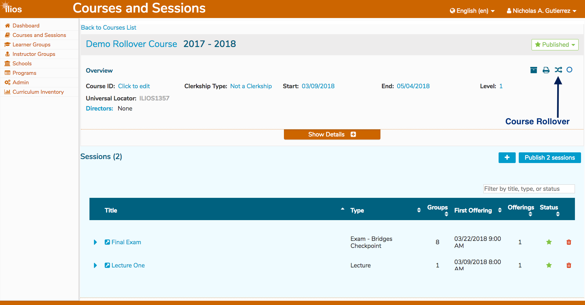
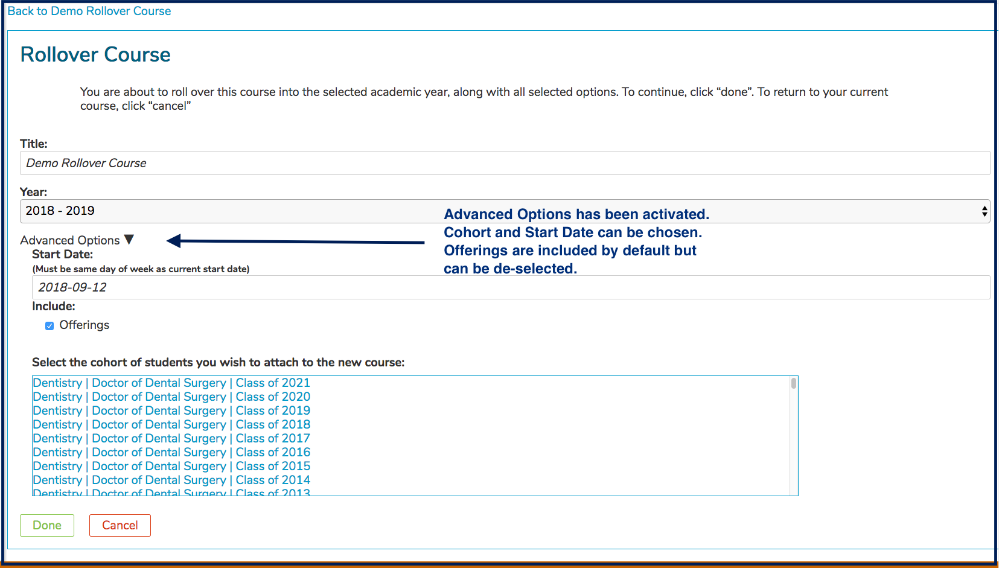
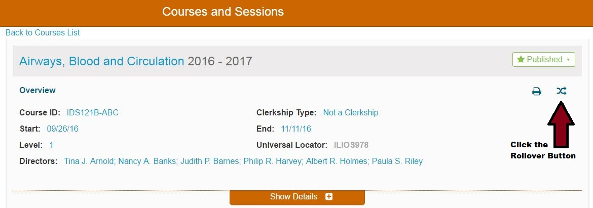

# Course Rollover

The process of rolling over a course \(essentially copying as many attributes as possible\) into a newly created course is greatly simplified with the advent of Ilios 3.x.

Courses can be "rolled over" into a different \(future\) academic year or they can be rolled over into the current academic year. This could be if a Course is offered in the Fall and then again in the Spring for example. Courses can never be rolled over into a past year.

A Course that can be rolled over in Ilios will have the Course Rollover icon displayed. There is no need to activate or configure anything to perform Course rollovers. If you have proper permissions, and a Course is eligible for rollover \(basically, it has sessions and offerings\), the rollover button will be enabled and available for your use.

A course will carry along with it all the basic course data: sessions and their objectives and attributes, including links to course objectives, the course definition and its attributes, all learning materials, assigned topics and MeSH terms, etc. A user has the option of replicating all the scheduled offerings from the original course, and placing them on the calendar for the new course. This is the default option; you may also choose to create the new course without scheduled offerings, retaining only the course and session curricular data. You also have the option of assigning a Cohort to the new Course. Course Rollover now includes the assignment of a new cohort, and along with it the inclusion of all links to objectives and competencies. There is no more need to re-link your Program Year objectives.

An example of a Course that can be rolled over is shown below.

## Roll Course Over Into Future Year

To roll a Course over, click the Course Rollover icon as shown below.

Once the button icon has been clicked in the previous step, the screen changes to the following with two options ...

1. Accept the Defaults: This will copy the Sessions and Offerings but since the Cohort has not been selected, the Program Year parent objectives will not be mapped to the Course Objectives. If the Cohort is selected later, the mapping of the Course Objectives to the Program Year Objectives will have to be done manually.
2. Customize the Rollover: Using this technique, you can selected the Cohort to be assigned to the newly being created Course. This will ensure that the mapping of the Course Objectives to the Program Year Objectives is retained and won't required re-attachment.

These options are described in the screen shot below.

Once the Course has been rolled over, you can go and fix up the newly created Course. You will be taken to the new Course automatically. In this example, Option \#1 \(the default\) was performed along with the selection of the Cohort to be assigned to the newly created Course.

Here is the newly created Course.

## Roll Course Over Into Current \(Same\) Year

A Course may be easily rolled over into the current year. There is one simple caveat. Two Courses cannot exist in the same year with the exact same Title so ...

\*\*It is necessary to change the name of the Course in order to roll it over into the same \(current\) year.

**NOTE:** Courses can never be rolled over into previous years.

To do this ...

* Select a Course that needs to be rolled over into the Current year.

* Click on the Rollover Icon to start the process.

* Notice that the drop-down selector indicates "Course Already Exists"

* Change the Title of the Course being created by the Rollover as shown below.

* Click Advanced Options and select the Date the new Course is set to start.  The choices in the date picker are automatically limited to the same day of the week as the current Course Start Date.  This is to ensure Offerings are scheduled during the same days of the week as the Offerings of the previous Course.

* Click Done and that's it.  Review the results and make modifications to the newly created Course as needed.

You will be routed automatically to the new Course.

