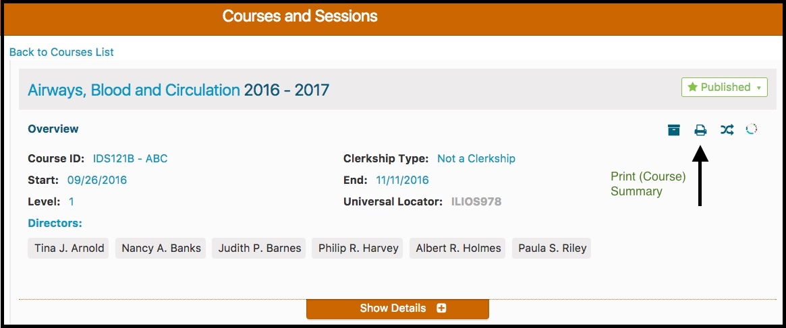
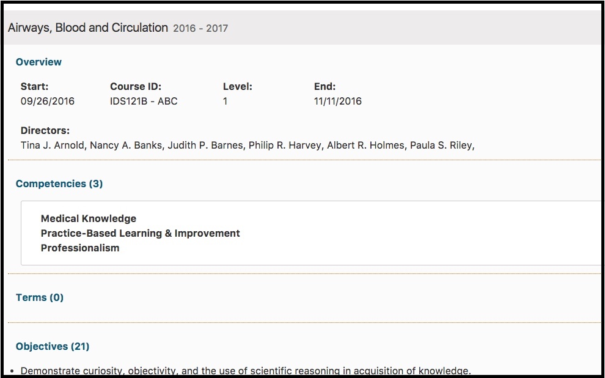

# Course Summary

The Print Summary provides a complete view of a Course: all details for all sessions. It is available via the “Print Summary” link in the details panel for any course displayed in Courses and Sessions. The course summary loads a view of the entire course in a web page.

The top-most portion of the Print Summary is displayed below. All Sessions and all of the associated data can be found by scrolling down.

