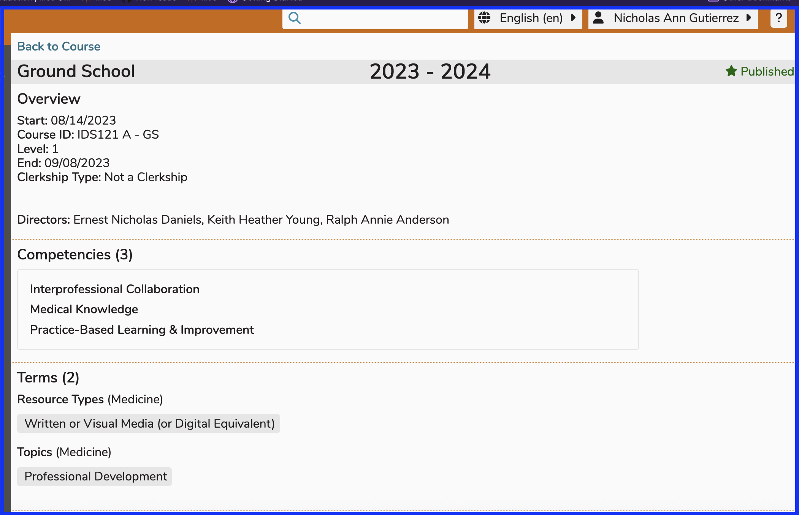

# Course Print Summary

The Course Print Summary provides a complete view of a Course: all details for all sessions. It is available via the “Print Course Summary” link in the details panel for any course displayed in Courses and Sessions. The course print summary loads a view of the entire course in a web page.

The top-most portion of the Print Summary is displayed below. All Sessions and all of the associated data can be found by scrolling down.

After generating the printable course summary for any course, it can be saved as .html using "Save As". Alternatively, you can choose "Print" and point it to save and download as .pdf. These controls may be in different places depending on the browser used; but in Chrome, these instructions apply. These documents that have been saved or downloaded can be searched outside of Ilios itself but only contain information that pertains to the course selected.

