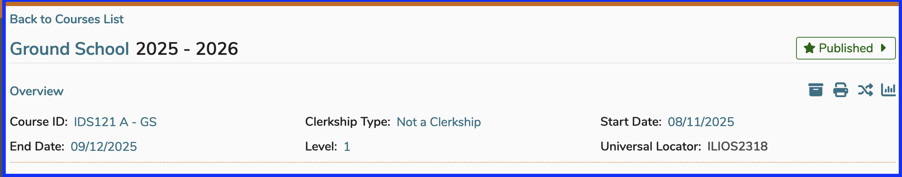

Course overview refers to the top part of the screen where course-level attributes are maintained. 

## Course Overview

The course overview is the lower part of the image shown below.

## Summary Details

Please refer to [Course Summary Details](https://iliosproject.gitbook.io/ilios-user-guide/courses-and-sessions/courses/course_actions/edit-course#course-summary-details) for details on fields involved with the course overview and other related course-level edits that can be made here.

