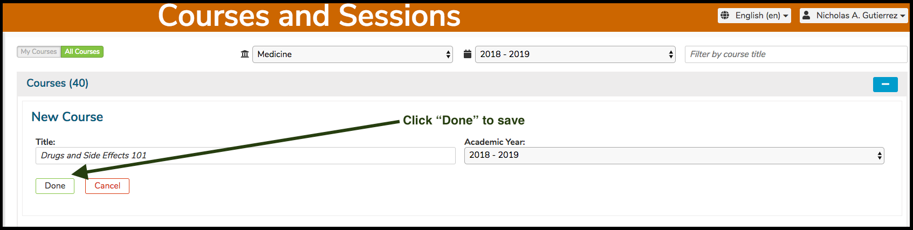
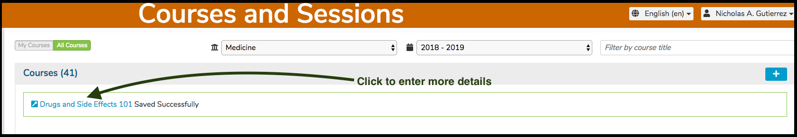
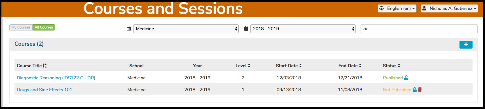

# Create New Course

Courses are unique to the academic year in which they are taught. To create a new course, click the **Add New** button, and provide a course name and select the appropriate year of instruction.

After clicking **Done** as shown in the example shown above, the remaining details of the new Course can now be added.

After clicking the link as shown above, the screen appears as follows with the New Course being appropriately titled **Drugs And Side Effects 101**. The Course is initially saved with a state of **Not Published** since it has no Sessions or Offerings at this point. Since the act of publishing is essentially the equivalent of populating student calendars with their corresponding offerings, there is nothing to publish at this time.

After clicking the **Back to Courses List** link, the full list of Courses appears as shown below. It has been filtered by "dr" to limit the results to show the Course we just created. This filtering functionality is covered in greater detail in the next section, [Edit Course](https://iliosproject.gitbook.io/ilios-user-guide/courses-and-sessions/courses/edit-course).

