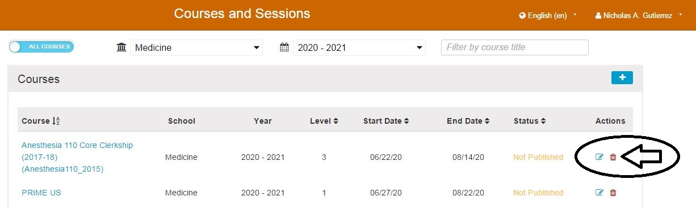
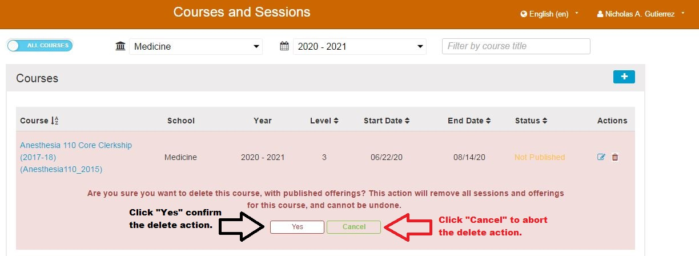

# Delete Course

If you have advanced permissions in Ilios, it is possible to completely remove / delete a Course in the Ilios application.

The standard trash can icon is used when this functionality is available. This is shown below.

After clicking the trash can, you will be presented with a warning message as shown below. It is necessary to confirm that the delete action is what is actually wanted since it cannot be undone.

**NOTE:** It is never possible to delete a Course that has been rolled over into more recent courses. These "ancestor" Courses cannot be removed using the interface.

