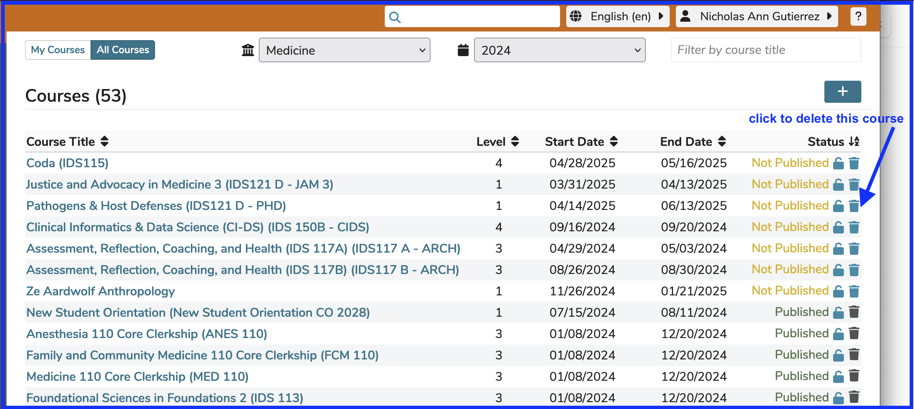
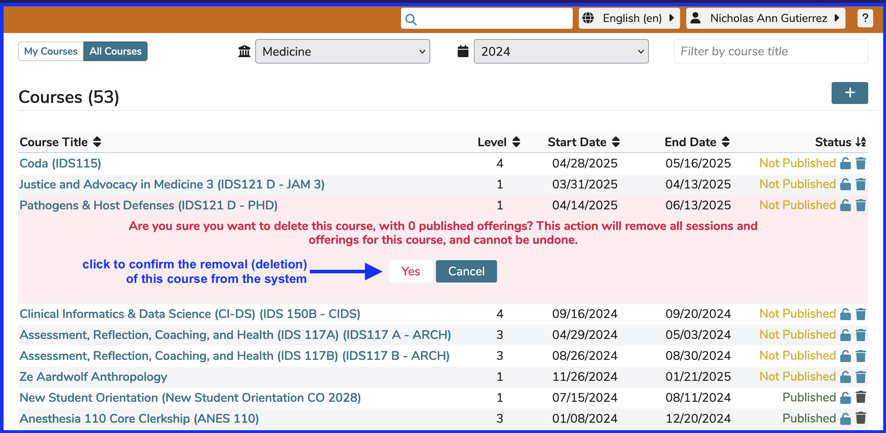
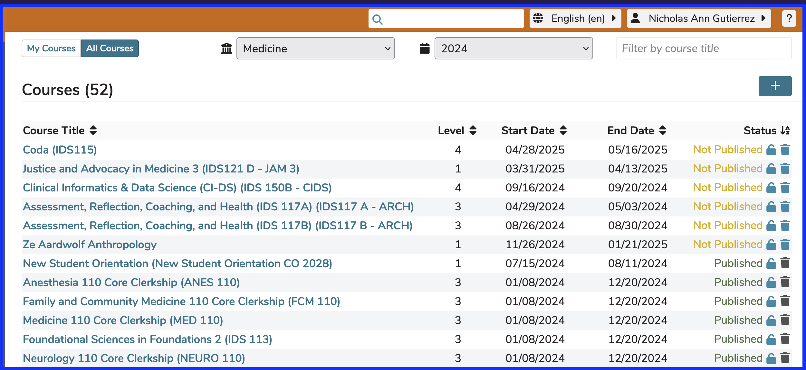

# Delete Course

If you have advanced permissions in Ilios, it is possible to completely remove / delete a Course in the Ilios application. Only Courses that are with the status "Not Published" can be deleted.

The standard trash can icon is used when this functionality is available. This is shown below.

In this case, A to Z sort order was applied to the "Status" column, bringing the courses with a publication status of "Not Published" to the top of the screen since "N" falls before "P" alphabetically.

After clicking the trash can, you will be presented with a warning message as shown below. It is necessary to confirm that the delete action is what is actually wanted since it cannot be undone. A "Cancel" button is also provided to back out of this operation. It is strongly advised to be certain before performing this operation.

**NOTE:** It is never possible to delete a Course that has been rolled over. These "ancestor" Courses cannot be removed using the interface.

As shown below, the "Pathogens & Host Defenses" course is no longer included in the Courses and Sessions list (sort by "Status" ascending). The Course count has been updated to reflect the current count (52). It has been completely removed from the system.

