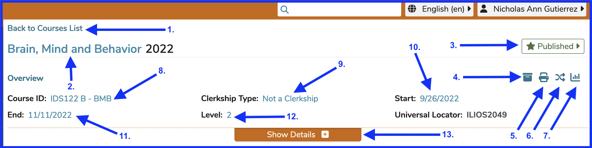
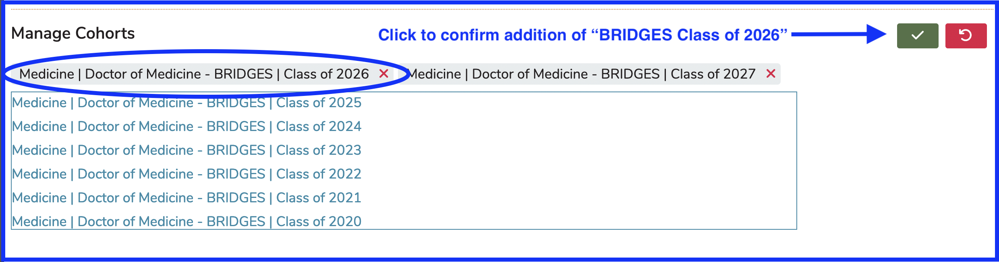

# Edit Course

### Find Course By Filter

To manage an existing course, enter part of the course’s title into the **"Filter by course title”** text field located above the **“Add New”** button. The result will automatically return a course list which applies the critieria entered. You can also just scroll through the list and find the Course without filtering at all.

**Courses Pre-filter**

**Courses Post-Filter**

In this second screen shot, a search string of “brai” has been entered and as a result, only one course gets returned.

## Course Summary Details

Once the Course has been selected as shown above, the following Course-level attributes are available for modification. The screen is shown below. Universal Locator is a helpful tracking field used for support issues that is not customizable; but the rest of the fields that can be modified are shown with arrows.

**NOTE**: Course Summary Details refers to the higher level details above the "Show Details" button. Refer to **[Course Details]**(https://iliosproject.gitbook.io/ilios-user-guide/courses-and-sessions/courses#screen-elements) for the lower level details that do require the click of "Show Details" to be shown.

### Links and Functionality By The Numbers ...

1. **Back to Courses List**: takes the user back to the list of Courses
2. **Edit Course Title**: The title can be edited by clicking as shown.
3. [**Publication Status**](../publishing.md): The Course's publication status can be changed here.
4. **Learning Materials Summary**: opens up [**Learning Materials Summary**](https://iliosproject.gitbook.io/ilios-user-guide/courses-and-sessions/courses/learning-materials-summary)
5. **Course Summary**: opens up the all-inclusive [**Course Summary**](https://iliosproject.gitbook.io/ilios-user-guide/courses-and-sessions/courses/course-summary)
6. **Rollover Course**: starts the process of rolling this Course over
7. **Course Visualizations**: opens up Visualizations (Graphs) for this Course
8. **Course ID**: The Course ID field can be edited by clicking as shown.
9. **Clerkship Type**: edited here
10. **Start Date**: edited here
11. **End Date**: edited as shown
12. **Level**: edited here
13. **Show Details**: opens up the rest of the Course Details.

## [Course Details](https://iliosproject.gitbook.io/ilios-user-guide/courses-and-sessions/courses#screen-elements)

These are the lower level details of a Course that are displayed and can be modified once the "Show Details" tab button has been clicked. These are those items ...

* [Course Leadership](https://iliosproject.gitbook.io/ilios-user-guide/courses-and-sessions/courses/course-leadership) - add/remove Course Directors, Course Administrators, and Student Advisors
* Course Objectives (and associated Parent Objectives, Vocabulary Terms, and MeSH Terms)
* Course Learning Materials
* [Competencies](https://iliosproject.gitbook.io/ilios-user-guide/schools/competencies) - set at School level
* Terms (which can include various Vocabularies)
* Course MeSH Terms
* [Program Cohorts](https://iliosproject.gitbook.io/ilios-user-guide/courses-and-sessions/courses/edit-course#program-cohorts)

### Course Objectives

Follow the links below for more specific information related to Course Objective activities. Adding MeSH Term(s) to Course Objectives is covered in the "Edit Course Objective" page linked below.

* [Add Course Objective](https://iliosproject.gitbook.io/ilios-user-guide/courses-and-sessions/courses/add-objective)
* [Edit Course Objective](https://iliosproject.gitbook.io/ilios-user-guide/courses-and-sessions/courses/edit-objective)
* [Add Parent Objective](https://iliosproject.gitbook.io/ilios-user-guide/courses-and-sessions/courses/add-parent-objective)
* [Edit Parent Objective](https://iliosproject.gitbook.io/ilios-user-guide/courses-and-sessions/courses/edit-parent-objective)

### Program Cohorts

For courses which are given more than once in an academic year, the course name or Course ID should identify this: for example Intersession 1 (2011-12), Intersession 2 (2011-12), Intersession 3 (2011-12), IDS 33A, IDS 33B, etc. Creating multiple instances of a course within an academic year is handled using the [Course Rollover](https://iliosproject.gitbook.io/ilios-user-guide/courses-and-sessions/courses/course-rollover) feature. For courses that are given more than once in an academic year, the listings are in chronological order according to start date.

In order to populate courses with learner groups, the course must first be associated with the desired Program(s), as well as the desired learner cohorts within that program. Cohorts are listed by graduation year. If you select the program Doctor of Medicine - BRIDGES, and its cohort Class of 2027, then the course will now be eligible for population with any learner or learner group from that program / cohort. A course may be associated with any number of programs and cohorts, allowing for interdisciplinary courses as well as mixed level courses. In the example below, Doctor of Medicine >> Class of 2027 has been added to the course.

#### **Selection Screen (Program Cohort)**

To add or remove Cohorts from a Course, click the Manage Cohorts button as shown below. This appears at the bottom of the **Course Details** section.

In this case, we want to add the Doctor of Medicine - BRIDGES Class of 2026 to this Course. Click on its label as shown below.

**Courses and Sessions (after Cohort Selected)**

Now that the action detailed above has taken place, the School of Medicine - BRIDGES - Class of 2026 has been successfully attached to the Course as shown below.

#### Remove Cohort from Course

Cohorts can also be removed from a Course in a similar manner. The steps are documented below.

<figure>
  
    <figcaption>
Go to Cohort Manager

    </figcaption>
</figure>

<figure>
  
    <figcaption>
      
Remove Cohort - Step 1

    </figcaption>
</figure>

After performing the action shown above, we need to complete the process by clicking the green Save/Done button.

<figure>
  
    <figcaption>
      
Remove Cohort - Step 2

    </figcaption>
</figure>

<figure>
  
    <figcaption>
      
Remove Cohort - completed

    </figcaption>
</figure>

**IMPORTANT NOTE**: If a Program Cohort is removed from a Course, any offerings associated with Learner Groups from the removed Cohort are **NOT** removed from the system. Learner Groups from the removed Cohort will simply no longer be available for selection in Offerings in this Course.

