The text value (description) of a Course Objective can be easily edited here on the Course page, along with relationships to parent objectives, vocabulary terms, and MeSH terms.

# Edit Objective - Steps

## Select a Course

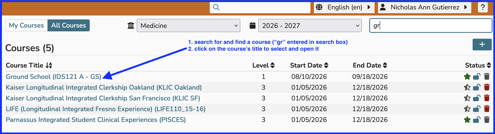

## Expand Course Details

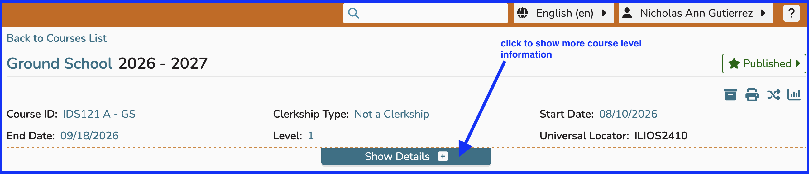

## View the Objective List

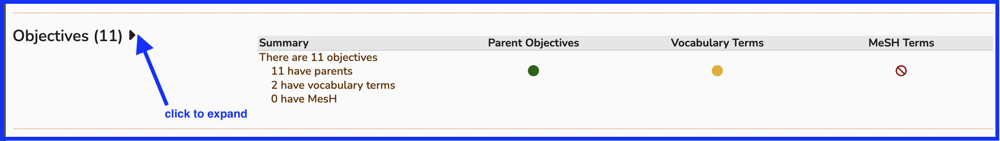

To edit a Course Objective, its description is what gets edited. Click on the hyperlinked text description and you can edit it from there.

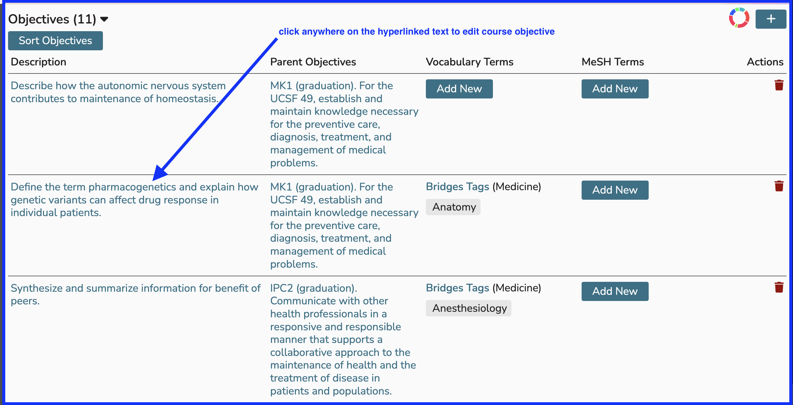

## Edit Objective

This is done in an inline editing style so you don't have to leave the page or lose the continuity of your work. This type of functionality is used in Ilios as much as possible for a more seamless interface experience.

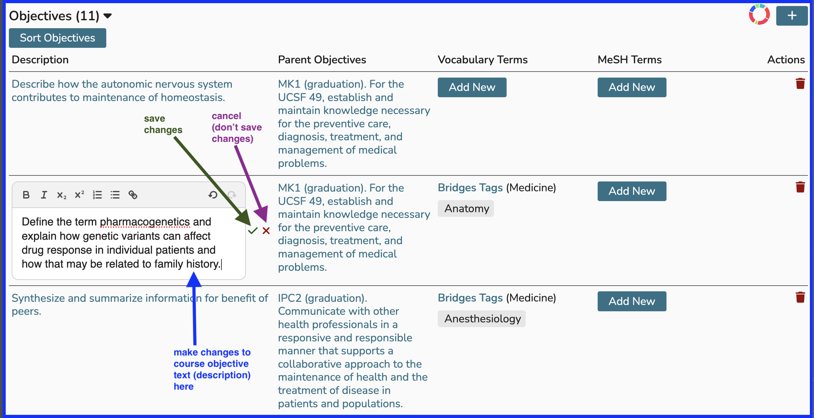

* To maintain MeSH Term(s) and / or Vocabulary Terms associated with the Course Objective, follow the actions outlined in the screen shot series and steps detailed below in the two upcoming sections.

# Add Vocabulary Term(s) 

Vocabulary terms can be easily attached to course objectives. This process is started as shown below.

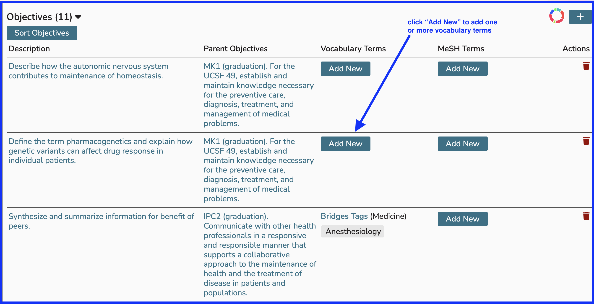

## Select Vocabulary

For this example, we would like to choose from the Vocabulary "Bridges Tags". 

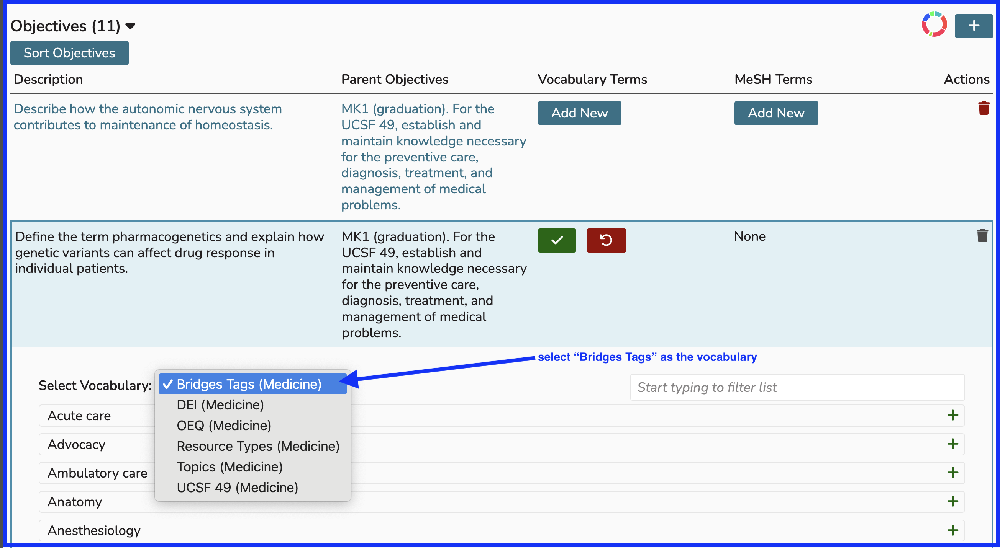

The screen now refreshes with the Terms in the Vocabulary set "Bridges Tags" displayed and ready for selection and review. The value in parentheses brackets (Medicine) simply indicates the school to which this vocabulary pertains.

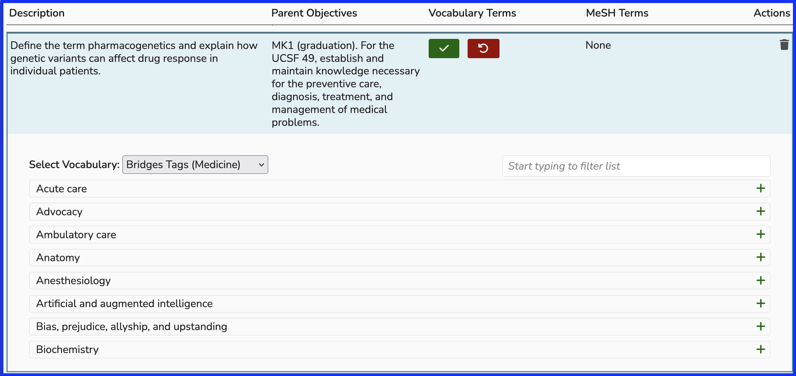

The list of Terms available for selection can be filtered by entering a text value as shown below. Entering the search / filter criteria of "health c" yields the results shown below.

Select "Anatomy" by clicking on the "+" icon button or anywhere in the highlighted row. 

## Add Term to Course Objective 

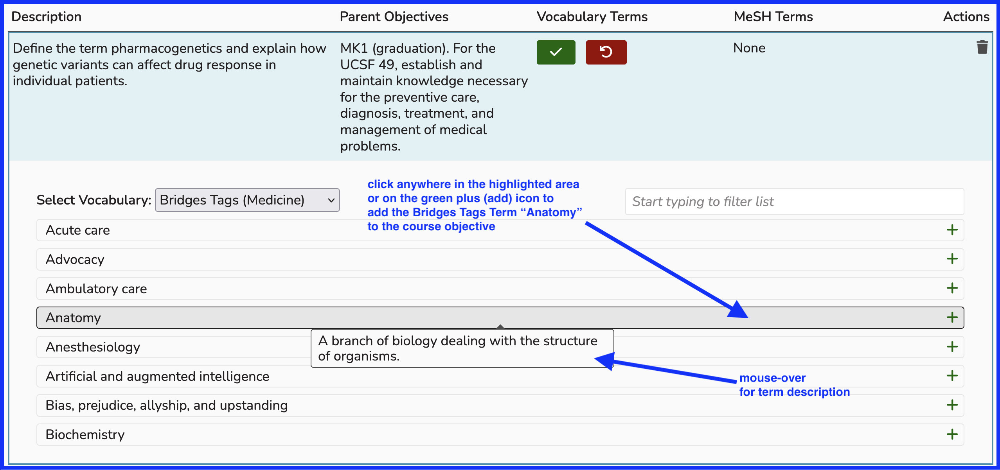

The screen adjusts to reflect this recent action. The newly added term can be removed by clicking on the red "X" button on the label. The changes can be confirmed or rejected using the standard Save or Cancel buttons. There is no need to remove it if you plan on canceling the operation anyway.

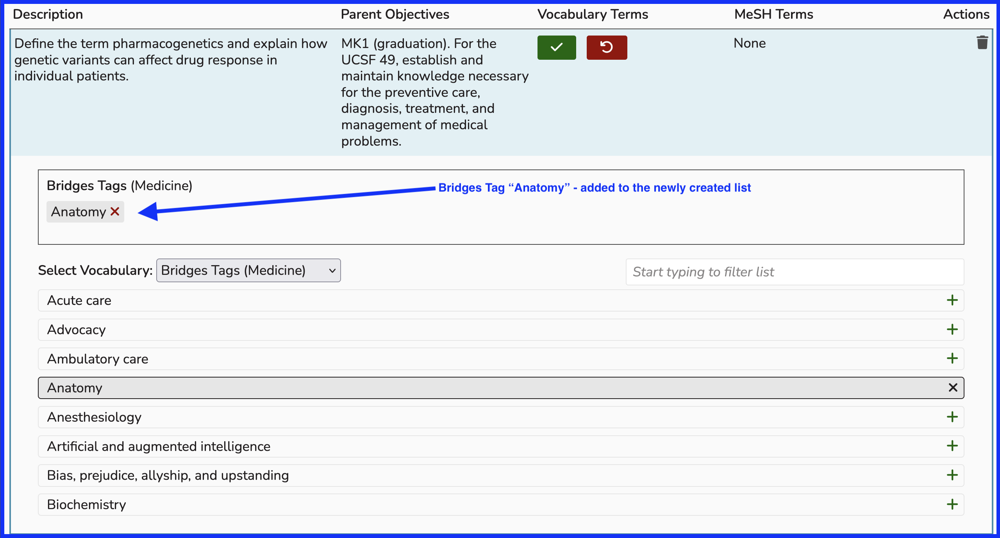

# Attach MeSH Term(s)

Once the Objectives link has been opened, the full list of Objectives associated with this Course is displayed. Click "Add New" to add one or more MeSH Terms to the Course Objective listed in the Description field.

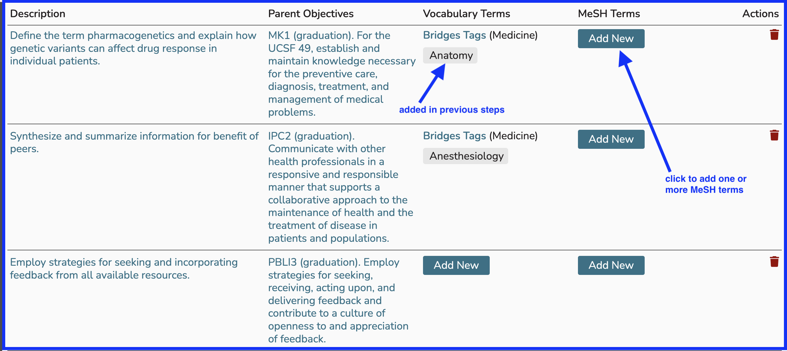

 After "Add New" has been clicked (as shown above), enter search criteria for MeSH and choose from the result set.

 ## Search for MeSH

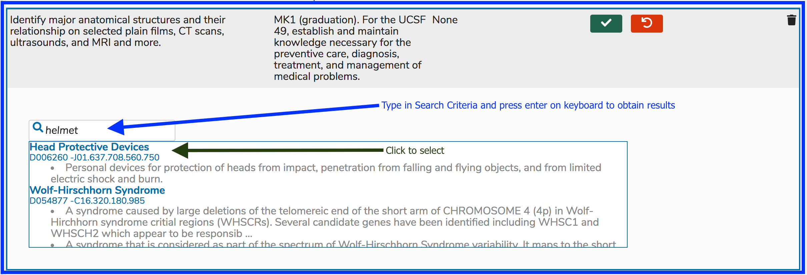

 Now that "Head Protective Devices" has been chosen, the screen appears as follows with the selected item being moved above the results grid in a badge-type display. Clicking the green "Save" button will complete the process.

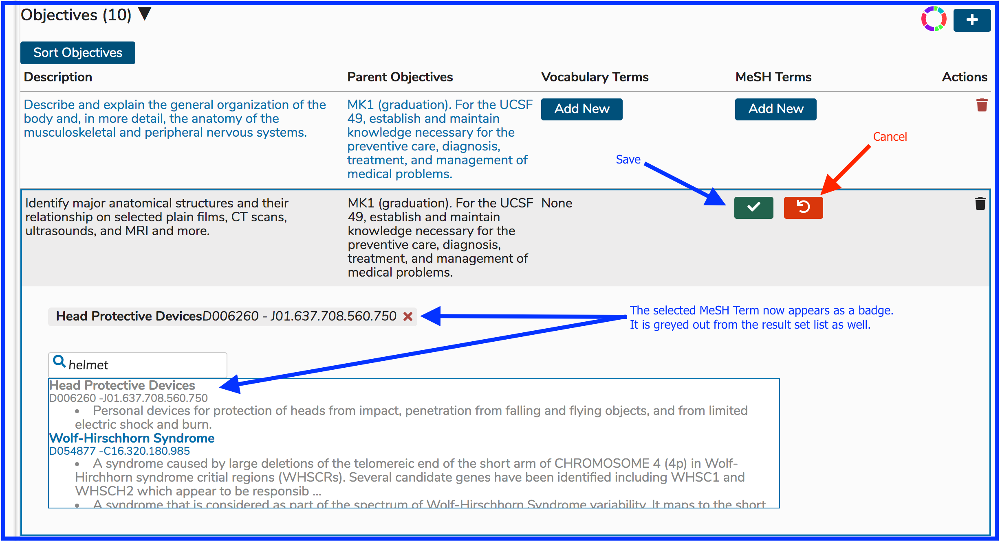

Once the Save action is completed, the screen refreshes to show the MeSH term now associated with the Course Objective.

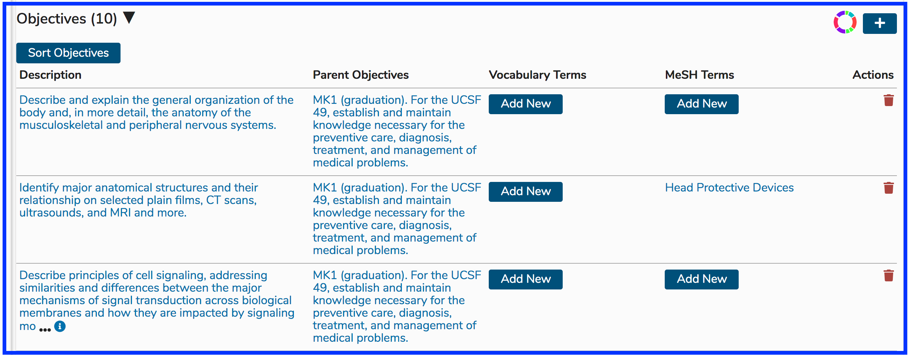

## Review Recent Updates

After confirming the addition of the MeSH term selected, both the vocabulary term added in the previous section and the MeSH term recently added appear as shown below.

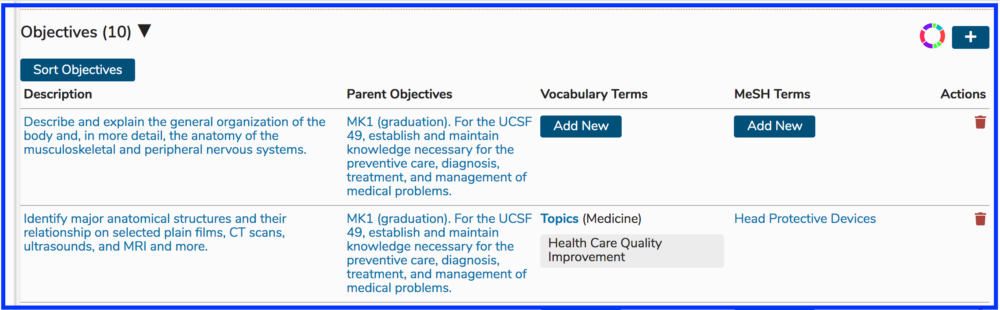

