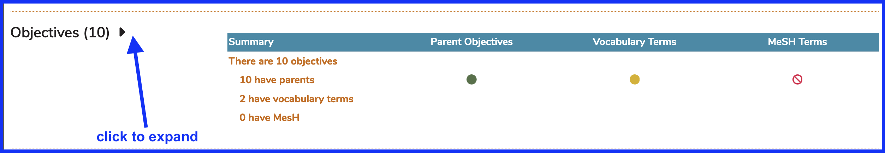

# Edit Objective

The complete set of steps to edit a Course Objective are listed below.

* Select a Course

* Expand the Course Details

* Expand the Objective List

* To edit a Course Objective's Description, click on the Description and you can edit it from there.

## Edit Description

This is done in an inline editing style so you don't have to leave the page or lose the continuity of your work. This type of functionality is used in Ilios as much as possible for a more seamless interface experience.

* To maintain MeSH Term\(s\) and / or Vocabulary Terms associated with the Course Objective, follow the actions outlined in the screen shot series and steps detailed in the two upcoming sections below.

## Attach one or more MeSH Terms

Once the Objectives link has been opened, the full list of Objectives associated with this Course is displayed. Click "Add New" to add one or more MeSH Terms to the Course Objective listed in the Description field.

 After "Add New" has been clicked \(as shown above\), enter search criteria for MeSH and choose from the result set.

 Now that "Head Protective Devices" has been chosen, the screen appears as follows with the selected item being moved above the results grid in a badge-type display. Clicking the green Save button will complete the process.

Once the Save action is completed, the screen refreshes to show the MeSH Term now associated with the Course Objective.

## Add Vocabulary Terms 

This process is similar to the one detailed above attaching MeSH Terms to Course Objectives. Using the same Course Objective as in the previous section, this process is started as shown below.

#### Select Vocabulary

For this example, we would like to choose from the Vocabulary set "Topics". 

The screen now refreshes with the Terms in the Vocabulary set "Topics" displayed and ready for selection and review.

The list of Terms available for selection can be filtered by entering a text value as shown below. Entering the search / filter criteria of "health c" yields the results shown below.

Select "Health Care Quality Improvement" by clicking on the "+" icon button as shown below.

The screen adjusts to reflect this recent action. The newly added Term can be removed by clicking on the red "X" button on the label. The changes can be confirmed or rejected using the standard Save or Cancel buttons.

After confirming the addition of the Term selected, both the MeSH Term added in the previous section and the Vocabulary Term recently added appear as shown below.

