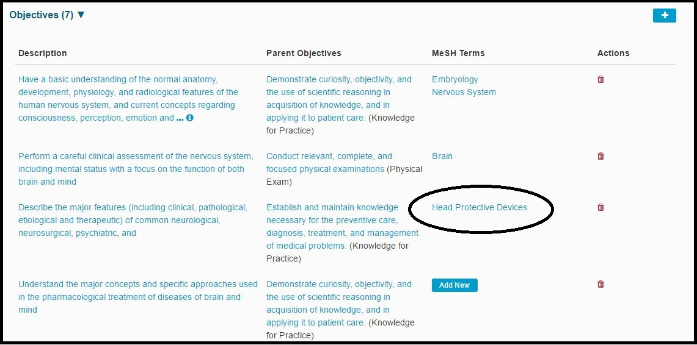

# Edit Objective

The complete set of steps to edit a Session Objective are listed below.

* Select a Course

* Expand the Course Details

* Expand the Objective List

* To edit a Course Objective's Description, click on the Description and you can edit it from there.

## Edit Description

This is done in an inline editing style so you don't have to leave the page or lose the continuity of your work. This type of functionality is used in Ilios 3.x as much as possible for a more seamless interface experience.

* To maintain MeSH Term\(s\) associated with the Course Objective, follow the actions outlined in the screen shot series and steps detailed below.

  

## Add MeSH Term\(s\)

Once the Objectives link has been opened, the full list of Objectives associated with this Course is displayed. CLick "Add New" to add one or more MeSH Terms to the Course Objective listed in the Description field.

 After "Add New" has been clicked \(as shown above\), enter search criteria for MeSH and choose from the result set.

 Now that "Head Protective Devices" has been chosen, the screen appears as follows with the selected item being moved above the results grid in a badge-type display. Clicking the green Save button will complete the process.

Once the Save action is completed, the screen refreshes to show the MeSH Term now associated with the Course Objective.

