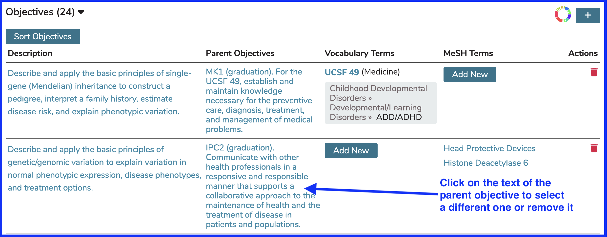
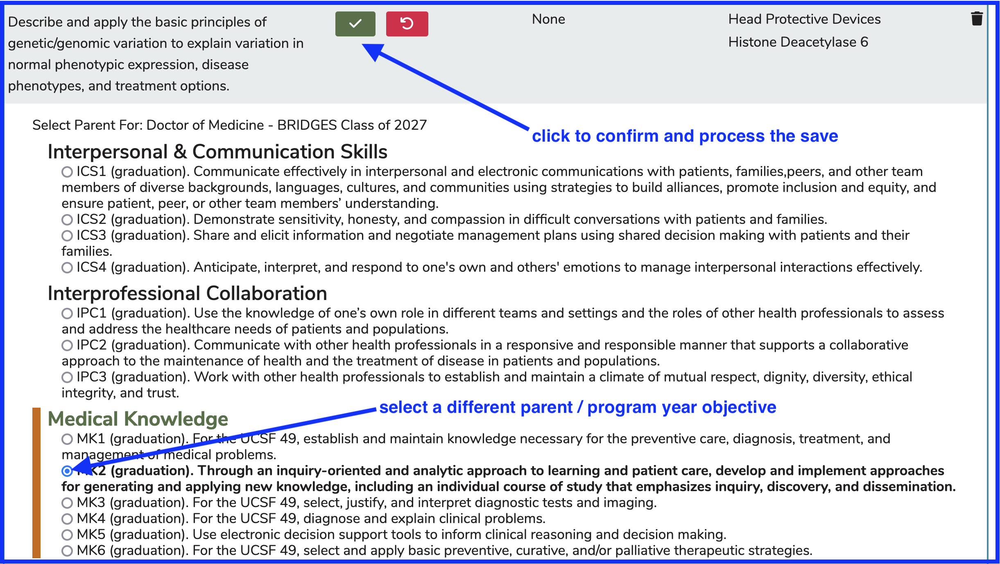
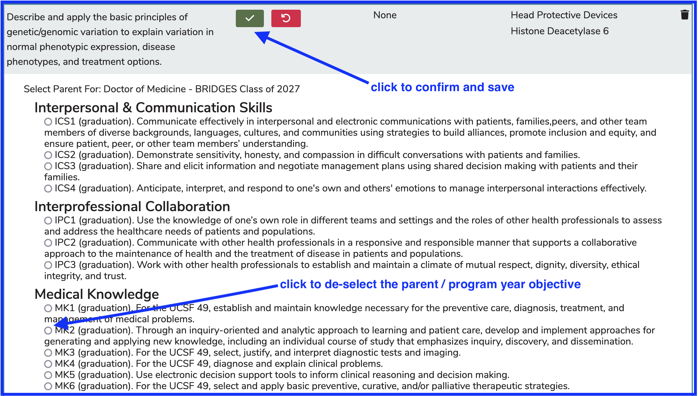

# Update Parent Objective

Course objectives can have one or more associations with parent (program year) objectives. This is configurable at the school level whether to allow multiple or just one to be attached.

## Parent Objective Updates

* Select an Objective to change its association to its Parent Objective

* Once the Course Objective is selected, you can ...
  * **Change** the Parent Objective
  * **Remove** the Parent Objective - unlink it.

### Change Parent Objective

To **Change** the Parent Objective ...

### Remove Parent Objective 

To **Remove** the Parent Objective association ...

After processing the save, the list will refresh with the changes made. The Parent Objective will be updated or removed (**Add New** button appears instead when removed).
