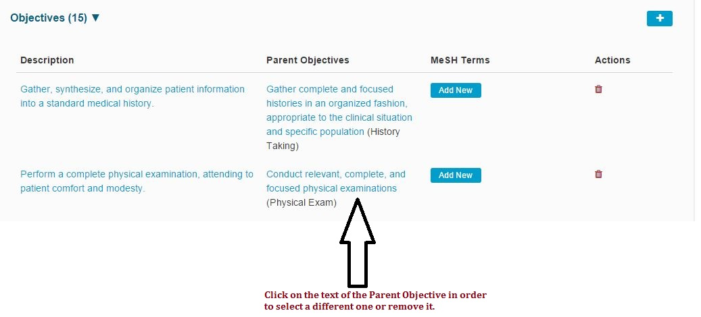
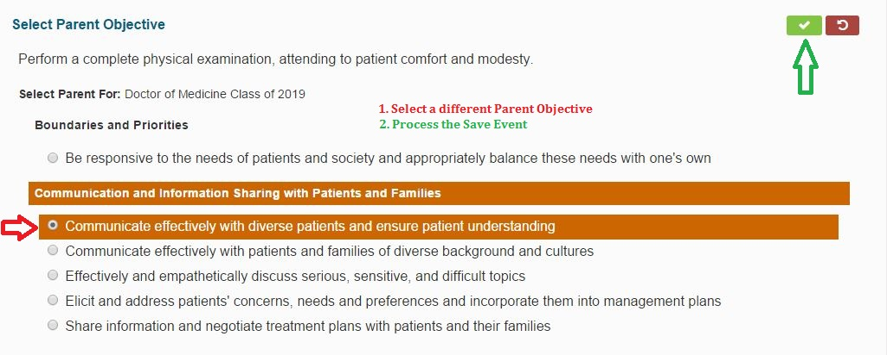
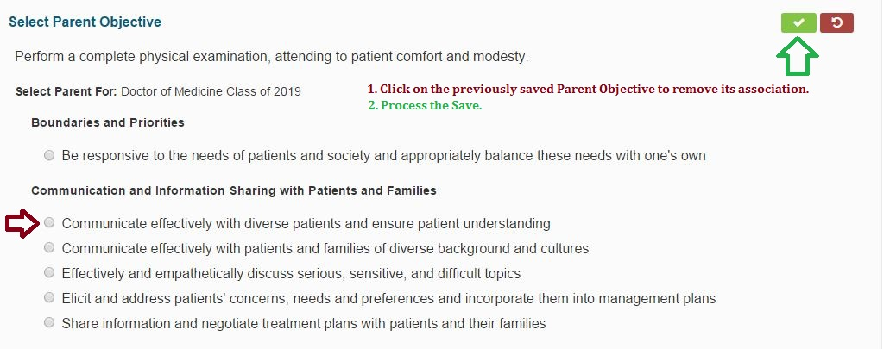

# Update Parent Objective

* Select an Objective to change its association to its Parent Objective

* Once the Course Objective is selected, you can ...
  * _**Change**_ the Parent Objective
  * _**Remove**_ the Parent Objective

To _**Change**_ the Parent Objective ...

To _**Remove**_ the Parent Objective association ...

After processing the save, the list will refresh with the changes made. The Parent Objective will be updated or removed \(_**Add New**_ button appears instead when removed\).

