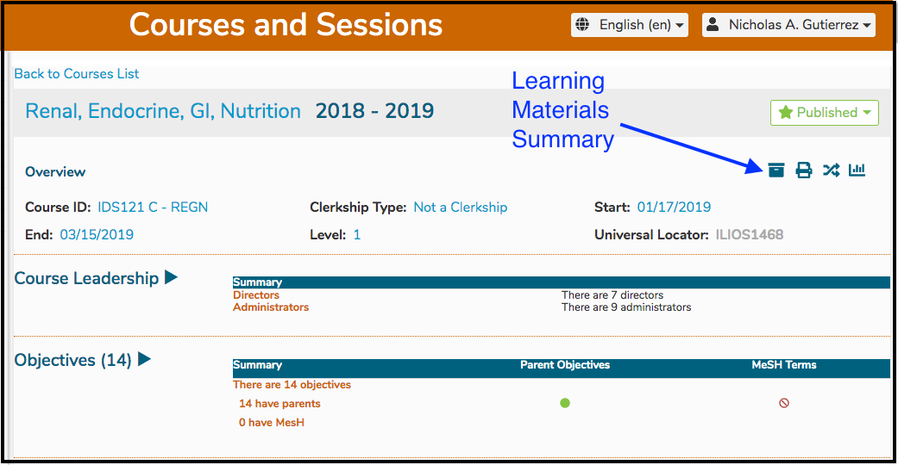
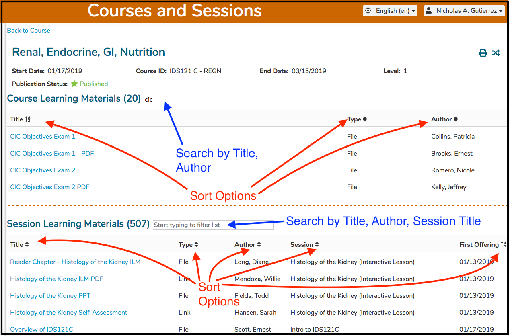
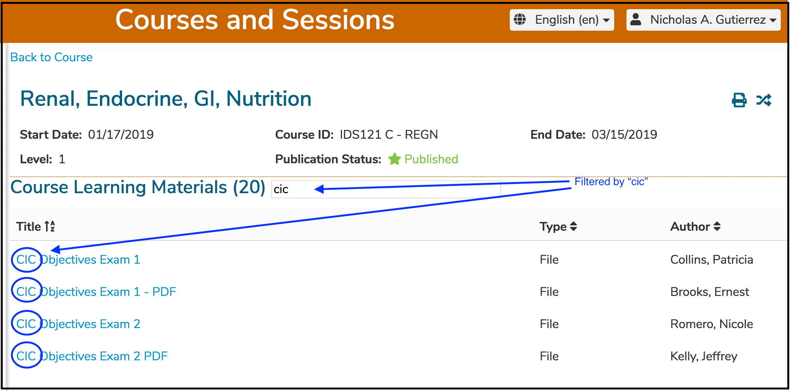
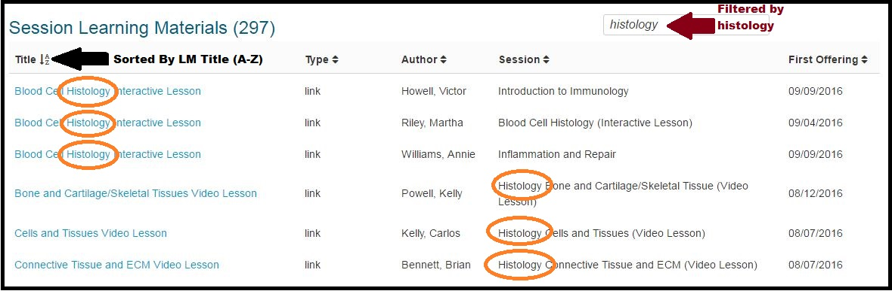

# Learning Materials Summary

A recent new feature of Ilios is the Learning Materials Summary, which for the Course selected, contains links to all of the Learning Materials associated with that Course as well as all of the Sessions in that Course. It is a one stop place to obtain all of the Learning Materials for the Course.

To go to the Learning Materials Summary, pull up a Course and click the correct icon as shown below.

The available sorting and filtering options are shown below.

**Filters and Sorting Demonstrated:**

A **Course** level search is performed below with the matches circled. 

A **Session** level search is shown below.

In the example shown below, a Session level search was performed for "histology" \(case-insensitive\) and sorting was performed on the Learning Material Title in ascending alphabetic order.

The search results for "histology" are outlined in orange oval outlining.

Any of the Learning Materials can be accessed by clicking on the URL link located under the "Title" header.

