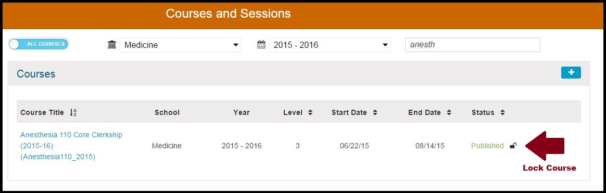
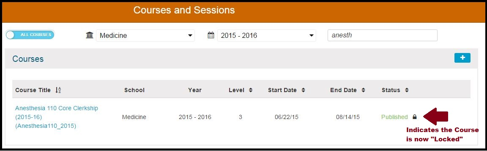

# Lock Course

When an Academic Year is over and a Course should no longer be modified, it is advisable to lock these Courses. No changes can be made to a Course that has been locked.

### Course \(pre-lock\)

This is a very straightforward process. All that you need to do is to click the Lock icon as shown above. Then, as you see below the Course has been locked.

### Course \(post-lock\)

## IMPORTANT NOTE:  Locked Courses can still be rolled over.

