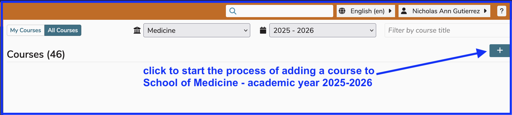
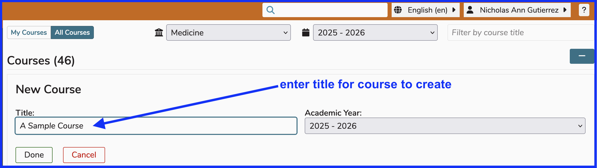
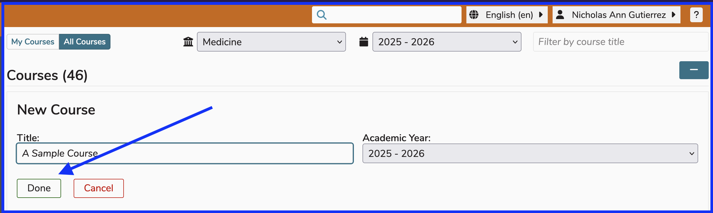
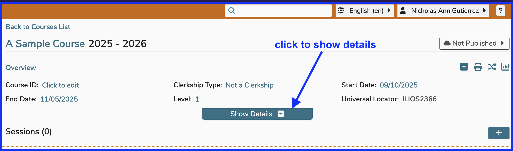
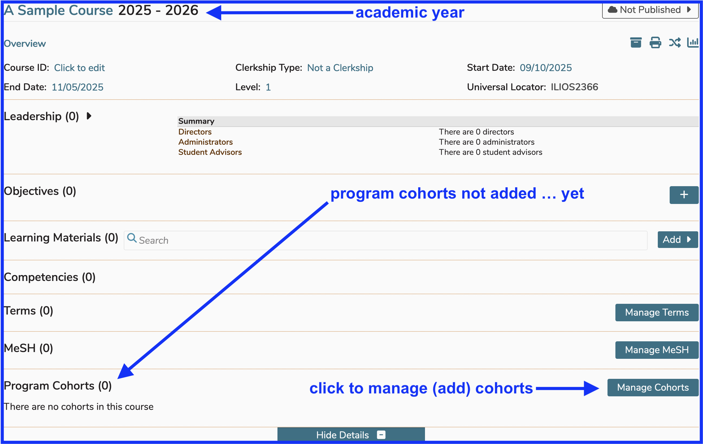
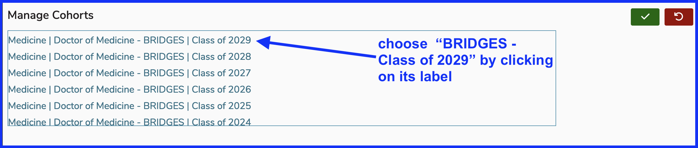
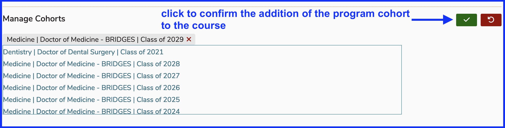
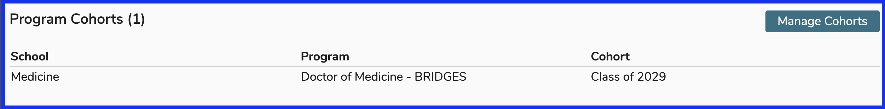

The concept of program cohorts, described as "cohorts" is defined [here](https://iliosproject.gitbook.io/ilios-user-guide/glossary#cohort).

It is necessary to add at least one program cohort to any and all courses in order to select learner groups for offerings and ILM's along with mapping session and course objectives to graduation requirements (program year objectives / competencies).

# Add Cohort

If you have a new course that does not have any cohort attached at all. Usually rolled-over courses will already have a cohort attached as a part of the rollover process. Newly created courses will have a program year associated with them during the creation process; however, the program cohort must still be associated with / attached to the course.

This process is shown below on a newly created course. 

## Create New Course 

## Enter Course Title

## Click to Save

## Show Details

In the newly saved course record, it is necessary to click "Show Details" in order to reveal the rest of the courses's attributes - including Program Cohorts.

### New Course Details Displayed

Below is a screen shot of the newly created course with all of the available maintenance areas displayed along with the initial step involved with adding a program cohort to the course.

## Select Program Cohort

The program cohort is displayed below. For this course, we need to add the cohorty shown in the image. 

The cohort "Class of 2029" has been added to the course. The end of this process is accomplished by clicking to save the record.

## Confirm Addition of Cohort

## Cohort Added 

The cohort has now added successfully and attached to this course. The entire process can be repeated if another cohort should be added or removed.

