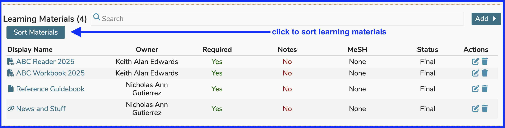
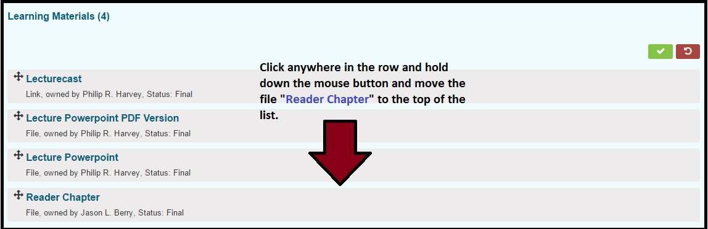
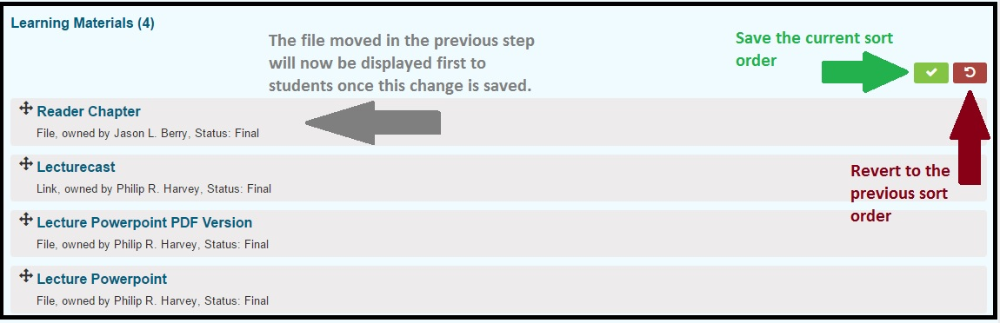
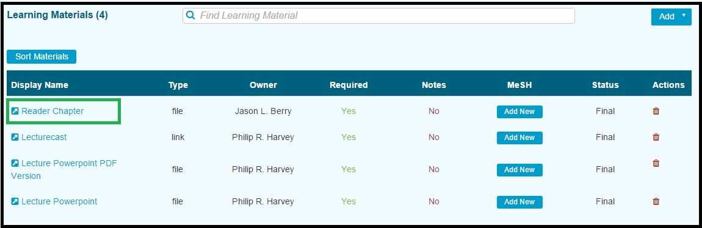

# Sort Learning Materials

Once Learning Materials have been associated with a Course (or a Session), they can be sorted to specify the order in which they will be presented to students.

The process starts as follows.

* Select a course or a session with Learning Materials attached or add them.  Either way, as long as the Learning Materials are attached, this will work.

The Course shown in the screen shot below already has four Learning Materials (LM's) attached. The `Sort Materials` button is clearly indicated in the screen shot.

After the `Sort Materials` button has been clicked, the screen changes and the ordering of LM's is now possible.

After moving the file `Reader Chapter` to the top so that it is the first LM to appear, the screen appears as shown below.

**NOTE:** It is still necessary to confirm the re-ordering of the Learning Materials by clicking the green confirmation button or you can revert back to the state the list was in before dragging and dropping the file.

Once the save has been processed, the new order is reflected in the Course detail. This is the order it will appear for students however they choose to view their calendars.

