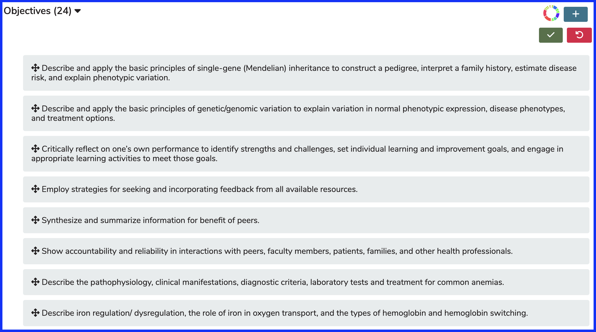
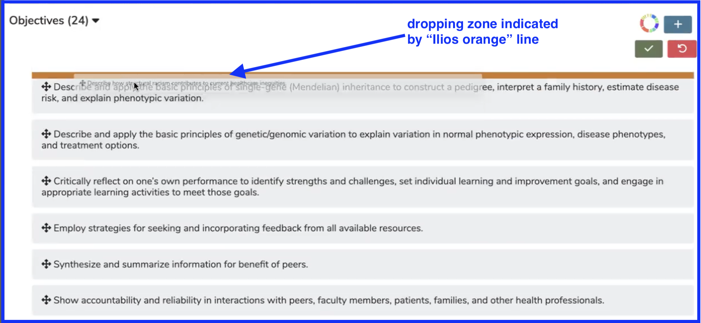
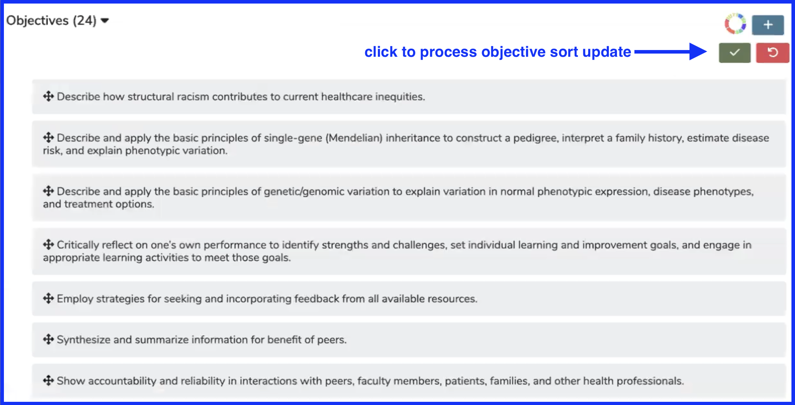
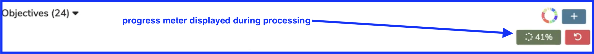
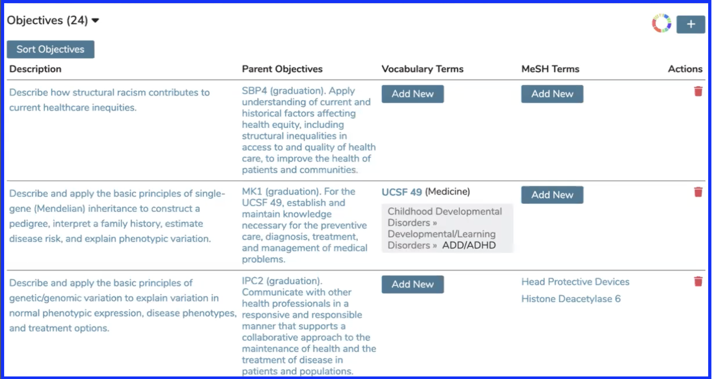

# Sort Objectives

## Setting up the Sort Order

To do this, pull up a Course that already has Objectives ready to be sorted. Click `Show Details` to review the Course Details.

### Show Details

* Click `Objectives(x)` to expand the Objectives as shown below.

### Expand Objective View

* Now that the Objectives have been expanded, they can be dragged and dropped into the correct location. This location will determine the order in which they are presented to Students wherever Students access this information.

### Set New Sort Order

There is not enough room to show all 24 course objectives in this case. The top part of the screen is shown. For the sake of demonstration, it is desired that the final Course Objective displayed be moved up into the first position so that it becomes the first Course Objective displayed to Students.

To do this, select the final Objective and drag it up to the first position. The Objective will appear ghosted out along with its destination. Let go of the mouse button when the Objective being moved (re-prioritized) is in position as shown below.

After dropping the Objective, the list is re-sorted as shown below. Click `"Save"` to complete this process. `"Cancel"` is available like always should you wish to not process this update.

After click the green Save button, a progress update displays briefly as shown below.

### Updated Sort Order 

The objective moved from the bottom up to the top of the list now appears first in the list and will appear first to students or any Ilios user accessing the Course detail listing of Objectives.

