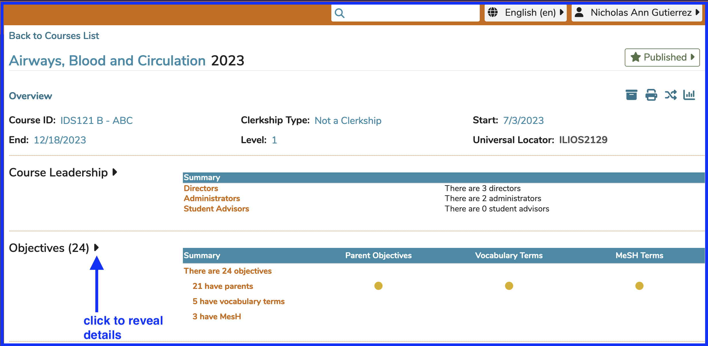
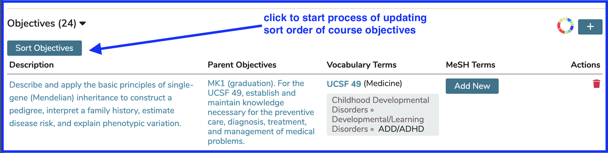
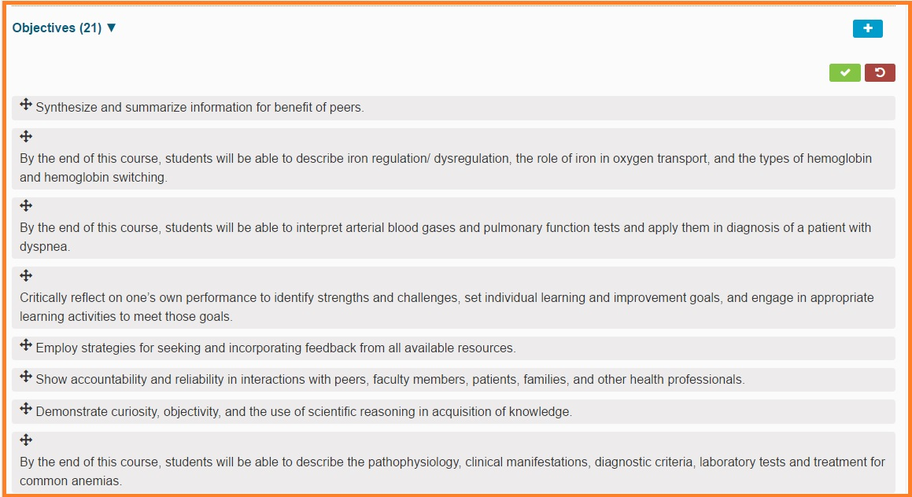
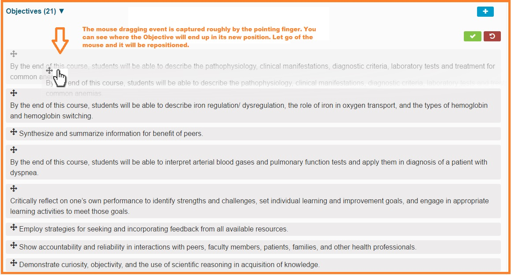
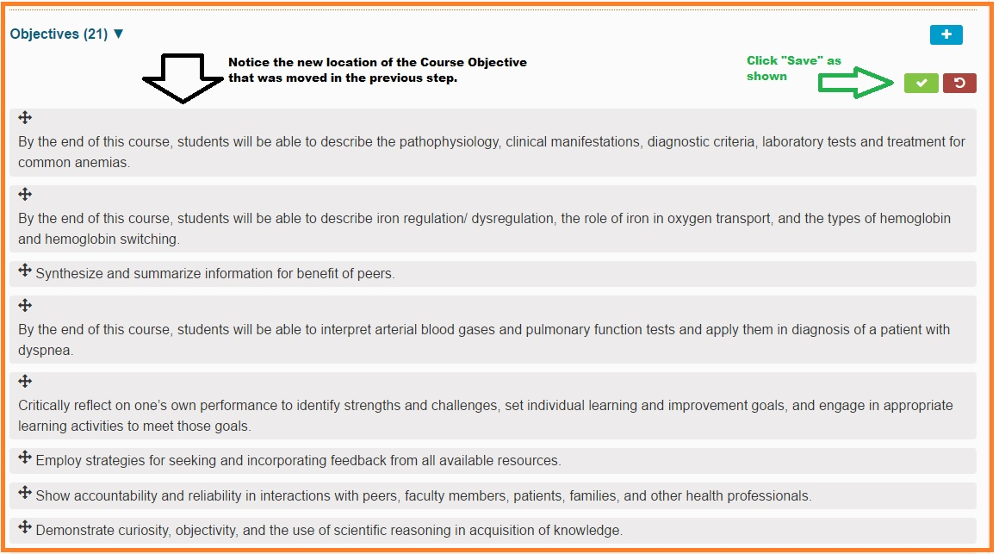
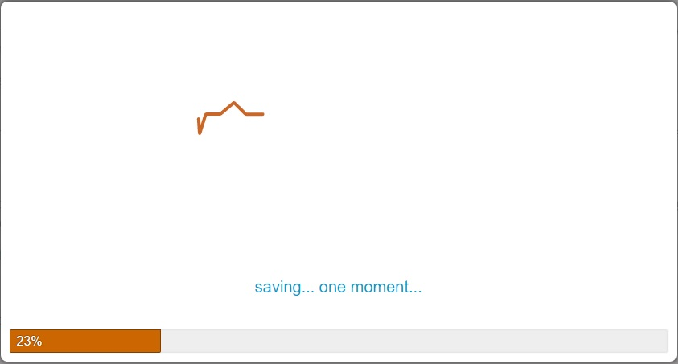
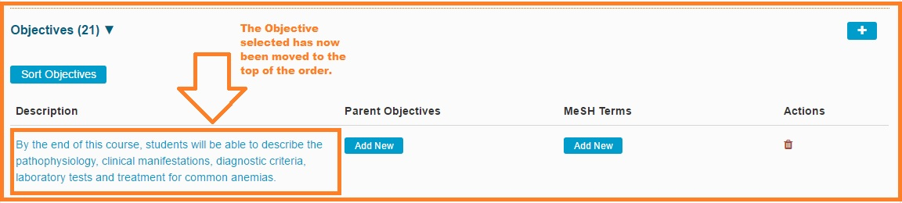

# Sort Objectives

This is now accomplished in a similar manner to the sorting of Learning Materials, as well as Program Year Objectives and Session Objectives. This allows instructional designers to determine a priority ranking of Objectives to be presented to students.

To do this, pull up a Course that already has Objectives ready to be sorted. Click `Show Details` to review the Course Details.

* Click `Objectives(x)` to expand the Objectives as shown below.

* Now that the Objectives have been expanded, they can be dragged and dropped into the correct location. This location will determine the order in which they are presented to Students wherever Students access this information.

There is not enough room to show all 21 Objectives in this case. For the sake of demonstration, it is desired that the final Course Objective displayed be moved up into the first position so that it becomes the first Course Objective displayed to Students.

To do this, select the final Objective and drag it up to the first position. The Objective will appear ghosted out along with its destination. Let go of the mouse button when the Objective being moved (re-prioritized) is in position as shown below.

After dropping the Objective, the list is re-sorted as shown below. Click `"Save"` to complete this process or `"Cancel"` to abort.

After click the green Save button, a splash screen like the following appears briefly. After it disappears the screen will revert to its original expanded appearance.

