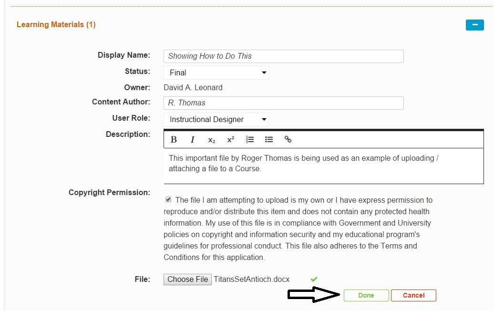

# Upload New Learning Material

If you are certain that a Learning Material object does not exist in the repository, Ilios allows simple and easy uploading of new Learning Material\(s\). To upload a new Learning Material object to a Session or Course, the following steps should prove to be helpful.

## Select a Course

## Show Course Details

If a Course is not already in the expanded view, click "Show Details" to expand the Course's details \(Learning Materials is one of these details\).

Scroll down to the Learning Materials section of the page. Click the Add button to select which type of Learning Material will be attached to the Course.

After selecting the Learning Material type, when "File" is selected, the screen appears as follows allowing the user to enter and or select some initial data attributes about the file being selected.

## Enter Learning Material Meta-Data

After the fields have all been filled in and the file has been selected from your computer, click the Done button to process the save event.

## Enter Additional Details

To enter additional details about the Learning Material object, select it from the list of existing Learning Materials that are attached to the Course.

Fields that can be modified in this second step.

* Status
* Required \(Toggle between Yes and No\)
* Instructional Notes
* Show Notes to Students \(Toggle between Yes and No\) -- this refers to the notes entered optionally in the previous step.

_**IMPORTANT:**_ All of the fields entered initially can no longer be modified. At as of this writing, it is necessary to re-upload the file to change these attributes.

## Other Learning Material types

For associating a Web Link or Citation to a Course or Session, the process is similar but actually a bit more simple since Copyright Permission and Copyright Rationale do not apply in these cases.

### Associating MeSH Terms with a Learning Material Object

MeSH Terms can be associated with Learning Material Objects. To do this ...

* Click Add MeSH

* Do a search and hit Enter on the keyboard.
* Select one or more MeSH Terms from the result set by clicking on them with your mouse.
* When finished, click the green arrow Save button or the red Undo button if you change your mind about adding MeSH Term(s).

