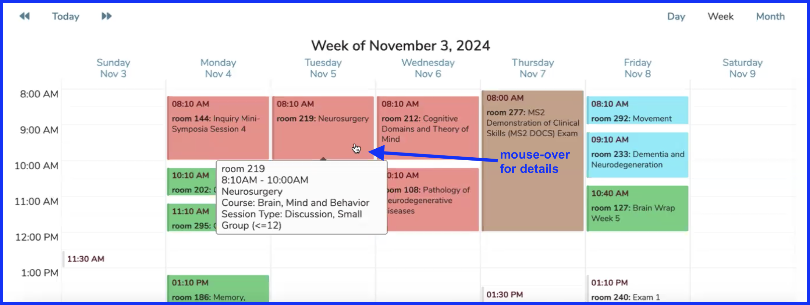
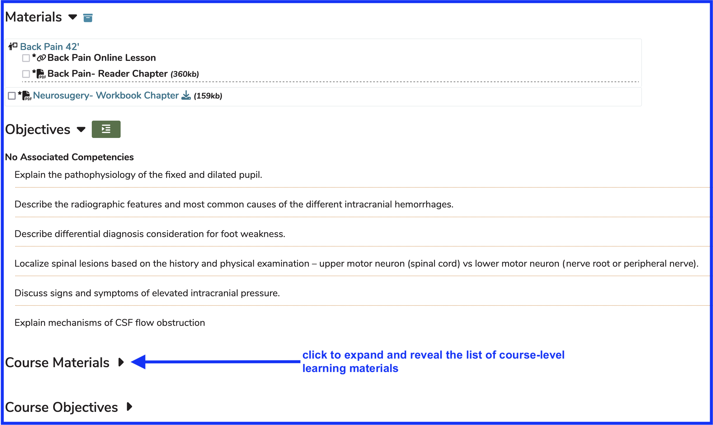
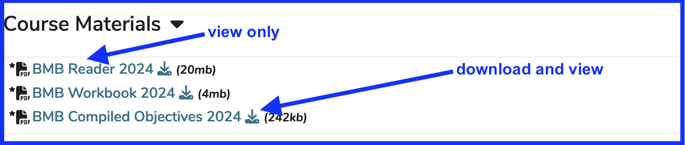
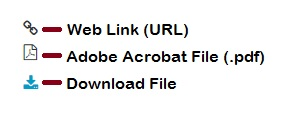
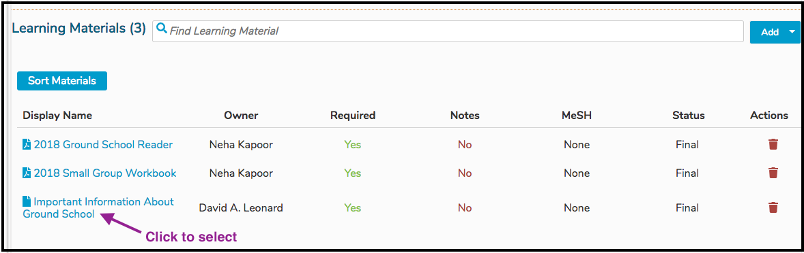
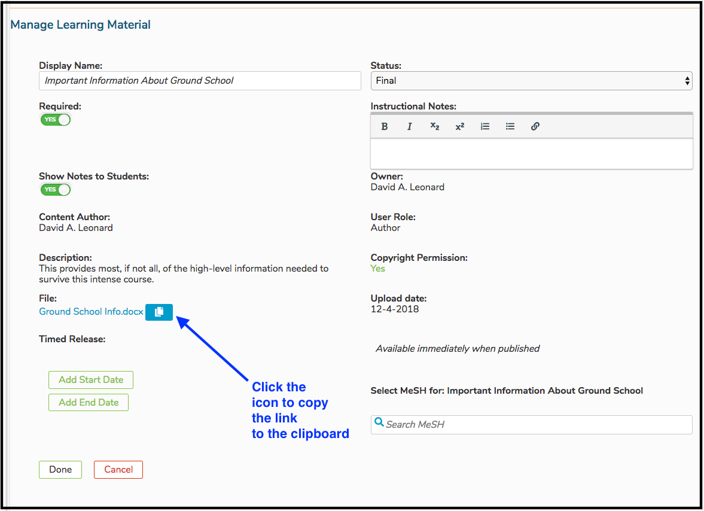

# View Learning Materials

There are three options available when viewing a Learning Material in Ilios. These instructions also apply to Session Learning Materials. These rules also apply to accessing the Learning Materials using the calendar feed (.ics), on a smart phone, computer, or tablet.

## View Inline (.pdf files, web links, and citations)

Web links can be followed with a click of the mouse. Citations can be viewed right on the screen in Ilios. However Adobe Acrobat .pdf files can be viewed right in the browser, not requiring a download. Online .pdf files have this option at this time. This is shown using the Calendar below.

* Click on the calendared event as shown below to go to Event Detail. The mouse-over is shown below revealing details about the session offering in the callout.

### Course Materials

After clicking on the event, the following appears. The learning materials for the session are initially expanded and labeled as "Materials". Scroll to expand course materials as shown. This full screen view is shown below.

### Materials View - expanded

An expanded view of the course learning materials is shown below. This sample contains .pdf files only.

### Icons Explained

## Download File (available for any file)

Any file can be downloaded as shown above by the orange arrow. 

It is worth noting that .pdf files have been configured so they can be viewed in an "inline" manner without requiring the file to be downloaded. One thing to consider doing this is that if the window gets closed after viewing and not downloading a .pdf file, you will have to log back in to Ilios as this action closes the application. Use the back button on the broswer to return to the previous location in Ilios after viewing, but not downloading, a file.

## Copy Link (available for any Learning Material)

This is only for users with advanced permissions over the Course or Session associated with this Learning Material object. The link to any Learning Material (file or not) can be copied to the user's clipboard and used elsewhere. Please refer to the [Permissions Matrix](https://www.dropbox.com/s/431sdj2bfoi3v1f/Ilios%20New%20Default%20Permissions%20Matrix.pdf?dl=0) for more information on user roles.

The link is now available to be pasted either by menu item (where available) or keyboard command (ctrl-C / cmd-C).

When pasted anywhere, including into a browser address bar or other application, it will appear something similar to what is pasted below. It is a long URL string pointing to the storage location of the file (or the link itself).

`https://ilios3-stage.ucsf.edu/lm/5a8cef36175a2dec3a66908672562237780c9f55ee4422ea4c3f6df23b82baa7`

The default behavior will still apply to Learning Material types as specified below.

**.pdf** - can be viewed inline or downloaded **file (other than .pdf)** - will be downloaded **web link (URL)** - user will be routed to indicated web address **citation** - user will view the citation in its entirety
