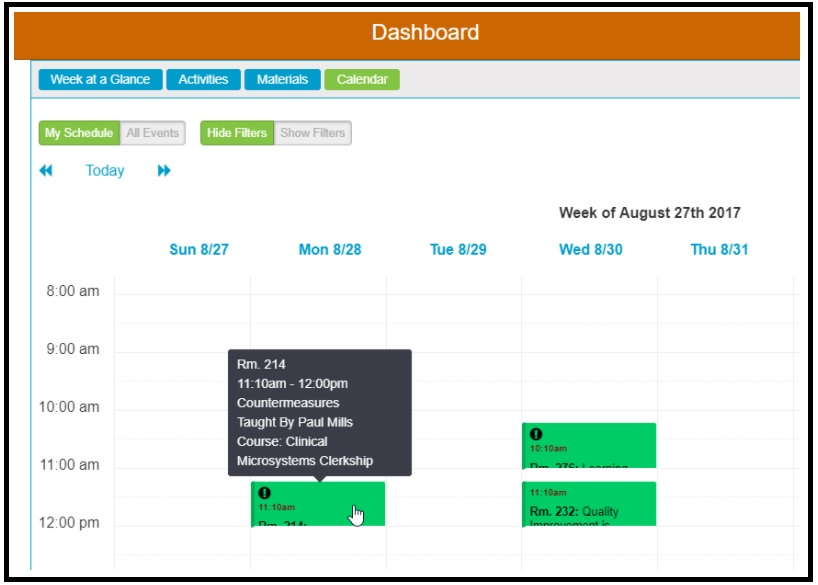
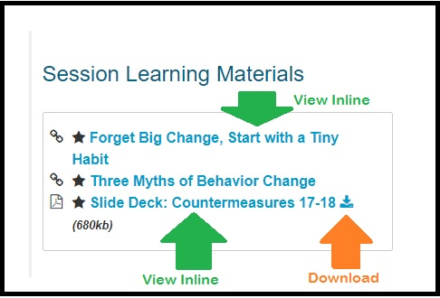
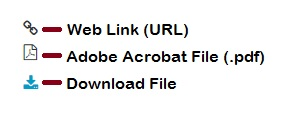
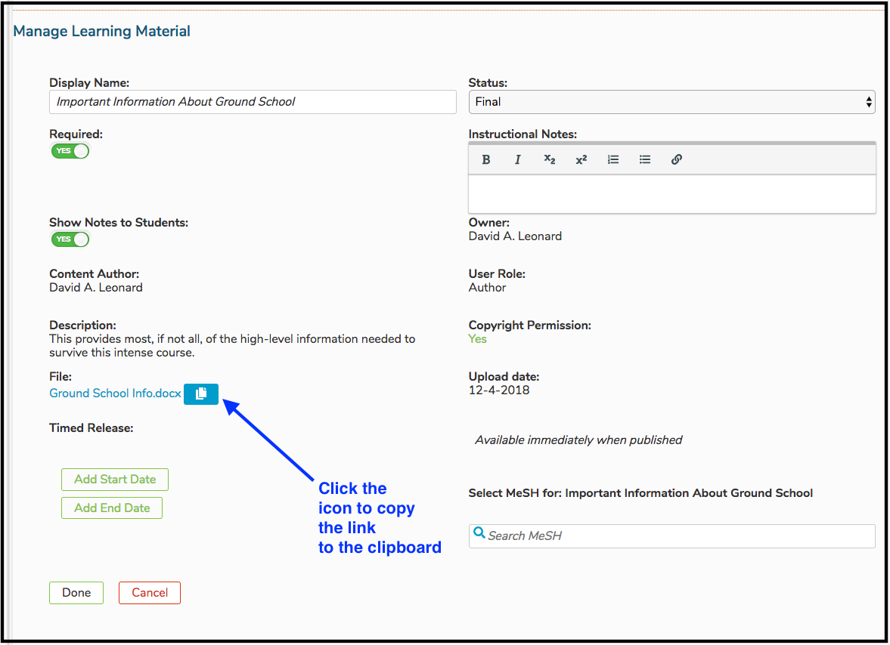

# View Learning Materials

There are three options available when viewing a Learning Material in Ilios. These instructions also apply to Session Learning Materials. These rules also apply to accessing the Learning Materials using the calendar feed \(.ics\), on a smart phone, computer, or tablet.

## 1. View Inline \(available for .pdf files, web links, and citations only\)

Web links can be followed with a click of the mouse. Citations can be viewed right on the screen in Ilios. However Adobe Acrobat .pdf files can be viewed right in the browser, not requiring a download. Online .pdf files have this option at this time. This is shown using the Calendar below.

* Click on the Calendared event as shown below to go to Event Detail.

* The options for two different LM types is shown below. The .pdf file can be downloaded or viewed inline; whereas the Web Link can only be followed and viewed in the browser.

**Icons Explained**

## 2. Download File \(available for any file\)

In the past, this was the default behavior for all files. Now .pdf files have been configured so they can be viewed in an "inline" manner without requiring the file to be downloaded. Any file can be downloaded as shown above by the orange arrow.

## 3. Copy Link \(available for any Learning Material\)

This is only for users with advanced permissions over the Course or Session associated with this Learning Material object. The link to any Learning Material \(file or not\) can be copied to the user's clipboard and used elsewhere. Please refer to the [Permissions Matrix ](https://docs.google.com/spreadsheets/d/1FbR53C2clvNoWZHMElQRfuJ4jHbZtr5pFl11et0zszY/edit?ts=5ad90141#gid=0)for more information on user roles.

The link is now available to be pasted either by menu item \(where available\) or keyboard command \(ctrl-C / cmd-C\).

When pasted anywhere, including into a browser address bar or other application, it will appear something similar to what is pasted below. It is a long URL string pointing to the storage location of the file \(or the link itself\).

`https://ilios3-stage.ucsf.edu/lm/5a8cef36175a2dec3a66908672562237780c9f55ee4422ea4c3f6df23b82baa7`

The default behavior will still apply to Learning Material types as specified below.

**.pdf** - can be viewed inline or downloaded **file \(other than .pdf\)** - will be downloaded **web link \(URL\)** - user will be routed to indicated web address **citation** - user will view the citation in its entirety

