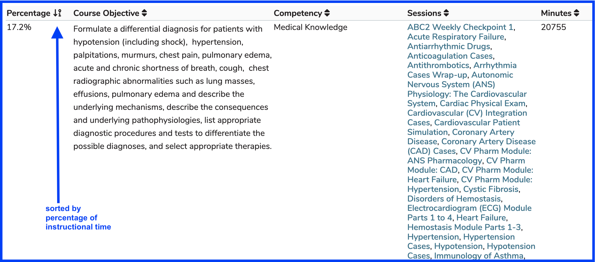
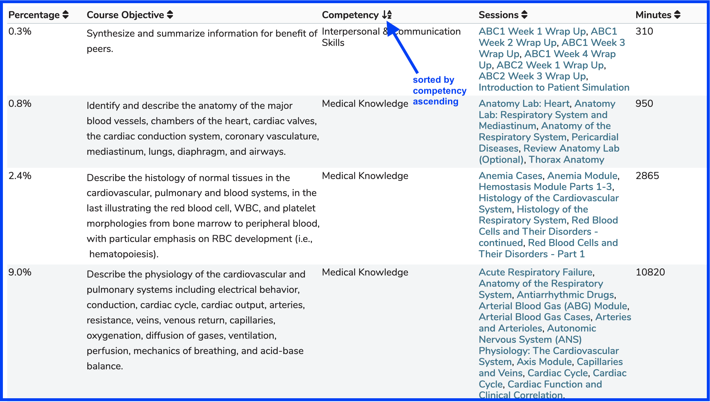
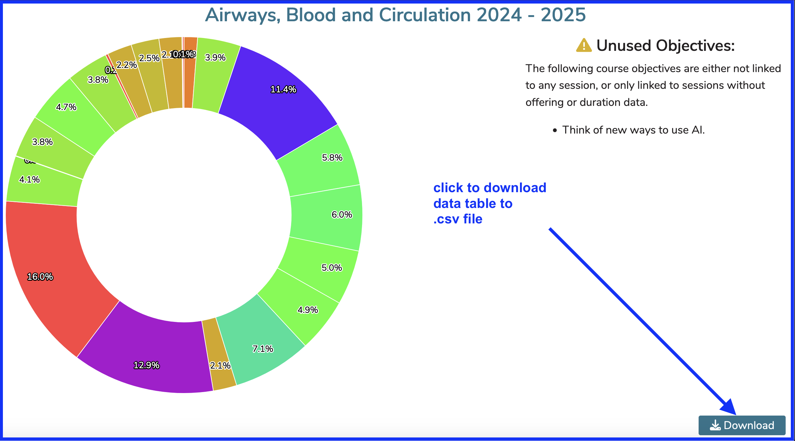
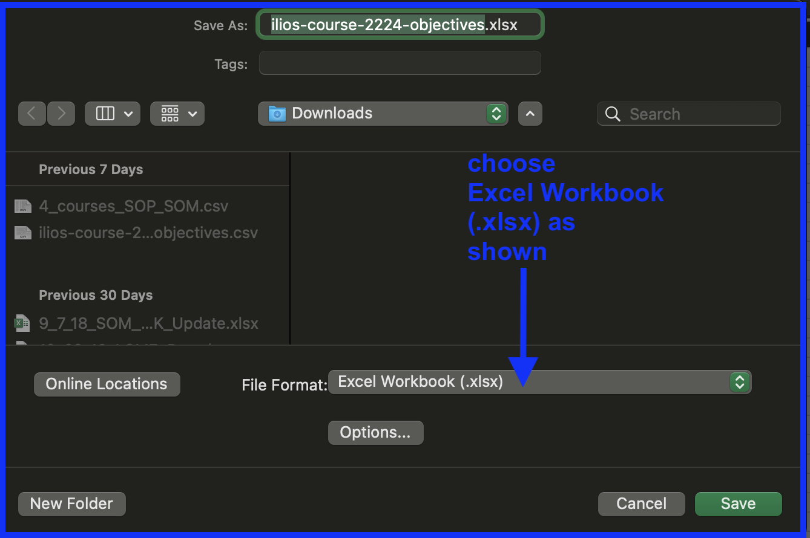
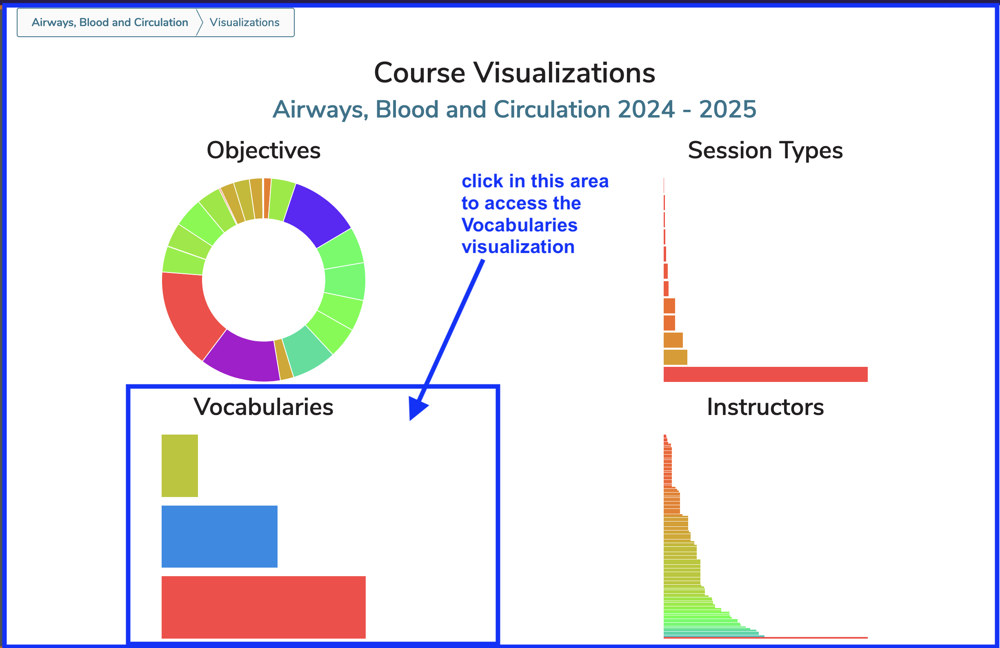
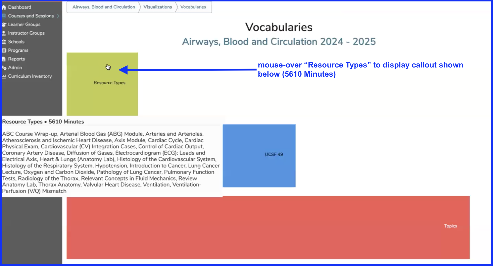
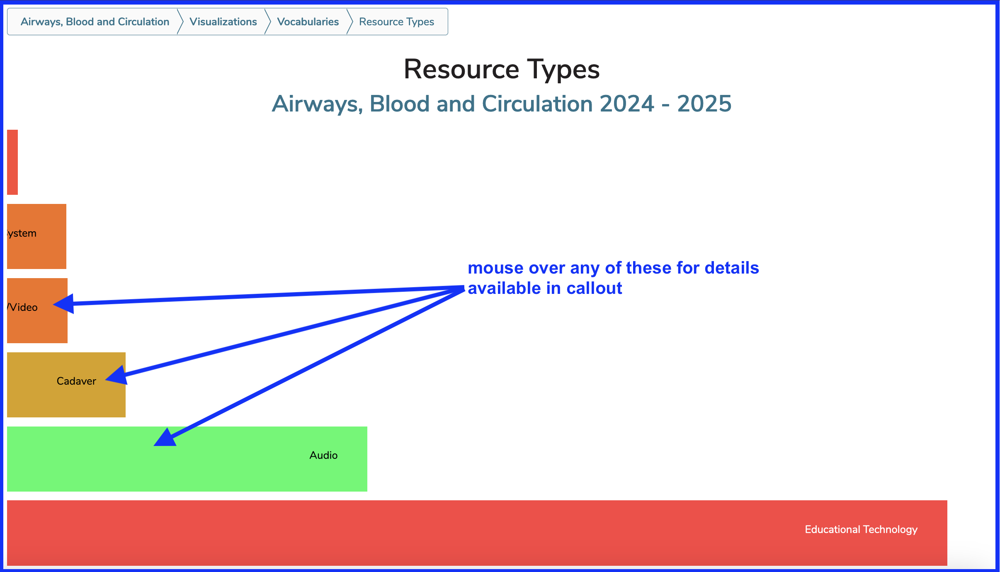
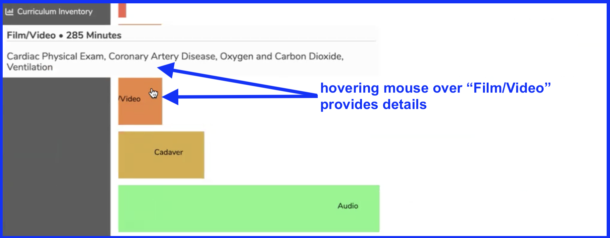
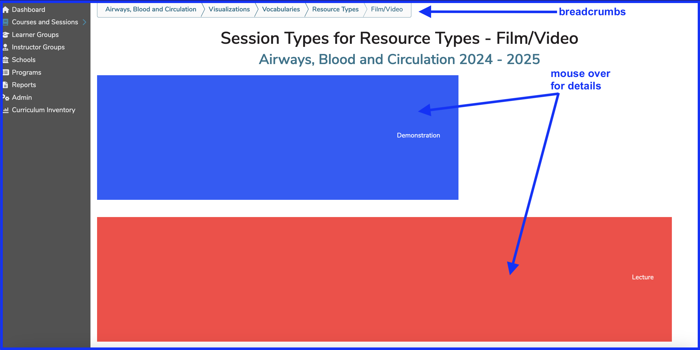

Visualization are graphs and charted information intended to help make informed decisions about how Ilios is being used, especially as far as tagging of curricular objects is concerned, and how this use could be improved.

After clicking on the graph icon as shown above, you will see a screen similar to the following with (at the time of update) four different visualizations available to review.

Each visualization currently available is displayed at this level in a donut or pie shaped graph. Clicking on any of the four will result in seeing the data in greater detail.

Course Visualizations available ...

* **[**Objectives**](https://iliosproject.gitbook.io/ilios-user-guide/courses-and-sessions/courses/visualizations#objectives)**
* **[**Session Types**](https://iliosproject.gitbook.io/ilios-user-guide/courses-and-sessions/courses/visualizations#session-types)**
* **[**Vocabularies**](https://iliosproject.gitbook.io/ilios-user-guide/courses-and-sessions/courses/visualizations#vocabularies)**
* **[**Instructors**](https://iliosproject.gitbook.io/ilios-user-guide/courses-and-sessions/courses/visualizations#instructors)**

# Objectives

One of the available charts displays the usage of Objectives and how frequently they are utilized in a Course by having been mapped/linked to session objectives. It is also important (and displayed here) to know when course objectives have not been mapped to session objectives.

The example below is from a user clicking on the **Objectives** visualization (the one in the upper left corner). It is displayed below.

Mousing over any of the Objectives will display the full text of the Objective as well as the names of the Sessions to which it has been attached. Unused Objectives are simply listed for reference and are not included in the chart.

## Data Table - view

The Objectives visualization includes a data table to review the information presented in graphical format as a table. This can be quite a long table given how many sessions can exist in a large course. The top portion of the data table for the selected course is shown below using two different sort orders. The data can be sorted by any of the output columns (ascending or descending).

**Sort Order One - Percentage (Descending)**

**Sort Order Two - Competency (Ascending)**

## Data Table - download 

Downloading the raw data (to .csv file) is easily accomplished using the button indicated in the screen shot below.

After clicking as shown above, on a Mac at least, you will see a confirmation message similar to the one shown below. The .csv file is automatically named and added to the user's default download folder. If a file is downloaded more than one time, and the previous downloads have not been renamed, the file name will include a numberical reference to this duplicate such as (in the example used) `"ilios-course-2224-objectives(x).csv"` where "x" represents the updated number of times this file has been downloaded. Your author recommends renaming the file to avoid these incremental file names, which can lead to more confusion. Moving it to a folder of your choice so it can be manipulated using Excel and saved as a ".xlsx" type is recommended by me.

The following fields are included in the output ...

* Percentage (of total instructional time)
* Course Objective (text value of course objective)
* Competencies (domains - left blank if not mapped)
* Sessions (list of all sessions mapped to the course objective listed)
* Minutes (of total instructional time)

After locating the file in the download location on your computer, it is recommended to "Open with" and then choose "Excel" if that is not already your default. There will be a message indicating possible data loss. Simply perform a "save as" and select ".xlsx". This is shown as it appears on a Mac in the screen shot below.

# Session Types

The Session Types visualization is laid out horizontally rather than in a pie chart like the Objectives visualization in the section above. In the example below, I am hovering over a specific Session Type to review the usage specific of that session type in this particular course.

Clicking the "Discussion, Small Group (<=12)" link on the horizontal bar chart will guide you into additional details regarding those sessions. You can review Vocabulary Terms associated with the specified Session Type.

# Vocabularies

The Vocabularies visualization shows how the Vocabularies set up for your school have been used in tagging sessions with the selected course.

Initially the visualization displays all of the used Vocabulary libraries for this course. To get to the details, it is necessary to click on the Vocabulary to be reviewed.

The location of the visualization showing the detailed usage of vocabularies at the course level is shown below.

After clicking on "Resource Types", which is one of UCSF SOM school-specific Vocabularies, you can drill down into the results.

As shown above, mousing over any of the Resource Types listed will display the total educational time devoted to sessions that have been utilized that specific resource type (Cadaver, Audio, Video etc.), along with the duration of these offerings and the listing of the associated Sessions. Clicking into any of the resource types listed will display the total educational time of the session types associated with that resource type along with session names (available on mouse-over and data table).

An example of putting the mouse over one of display elements of the bar chart is shown below. 

## Mouse-over for Information

In the situation shown above, the bar in the chart which contains the data for the "Resource Type" of "Film/Video" can be clicked on for even more detail.

## Click for More Details

This data (even as a sub-set) can be downloaded as well. The display is shown below.

**top part of screen**

# Instructors

The Instructors visualization functions in a similar manner to Vocabularies. You do get a bit more information at the higher level though - a percentage of the total. After clicking on the Instructor's name, it takes you down into a view showing the Vocabulary Terms tagged on this Instructor's sessions along with another graph showing Session Types for this instructor's offerings. Another thing it offers, because it needs to in a complicated course, is the option to filter on the lower level (horizontal bar chart).

Here is the top level view of the Instructors Visualization in a course that has completed. You can see how many instructors are going to be included in the horizontal bar chart.

After clicking the donut chart above, the bar chart appears as shown below. In this example, the user is hovering over the data for "Julie Christina Lewis", however the bar representing the data pertaining to her teaching activity would be very hard to find given how many instructors performed instructional duties in this course.

**Use the Filter**

Using the example presented above, we will filter to focus in on the results of the instructor whose teaching details we wish to view.

Following the steps outlined above, we now see the details of the teaching activities for the selected instructor. We can also review the type of sessions as well as the Vocabulary Terms associated with those sessions for which Julie Christina Lewis was the instructor. Also there is a breakdown of Total Instructional Time along with the total for asynchronous learning (ILM instruction).

