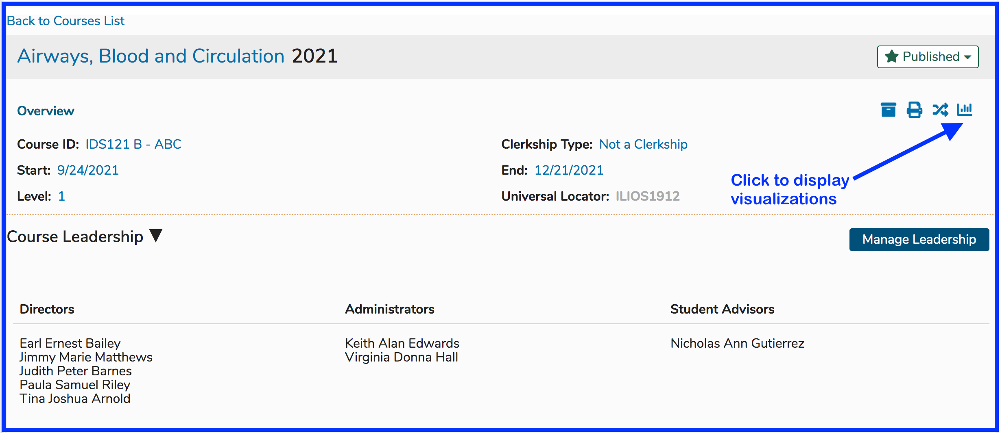
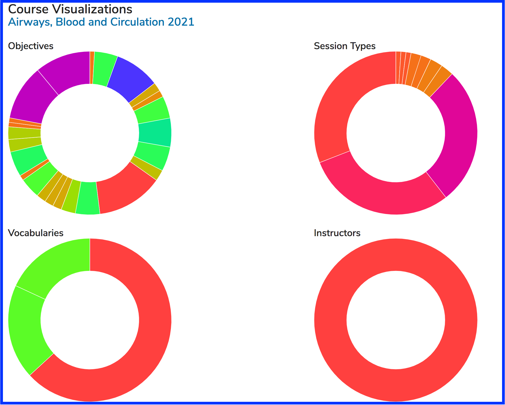
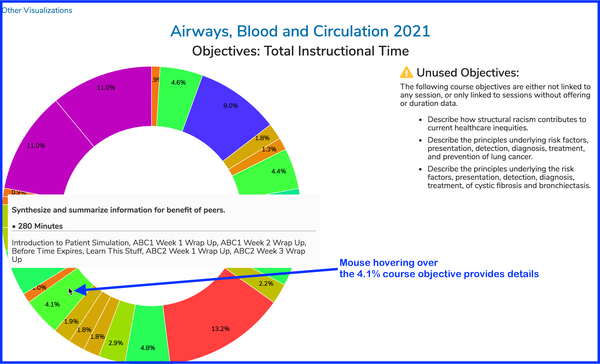
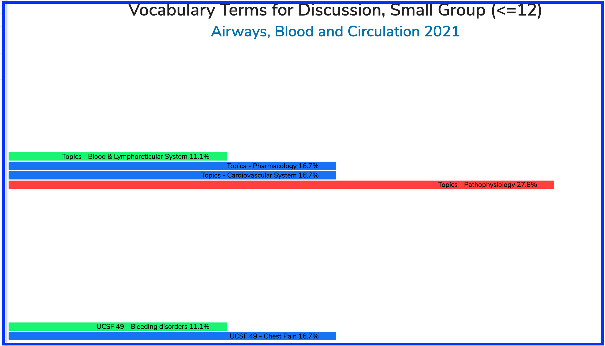
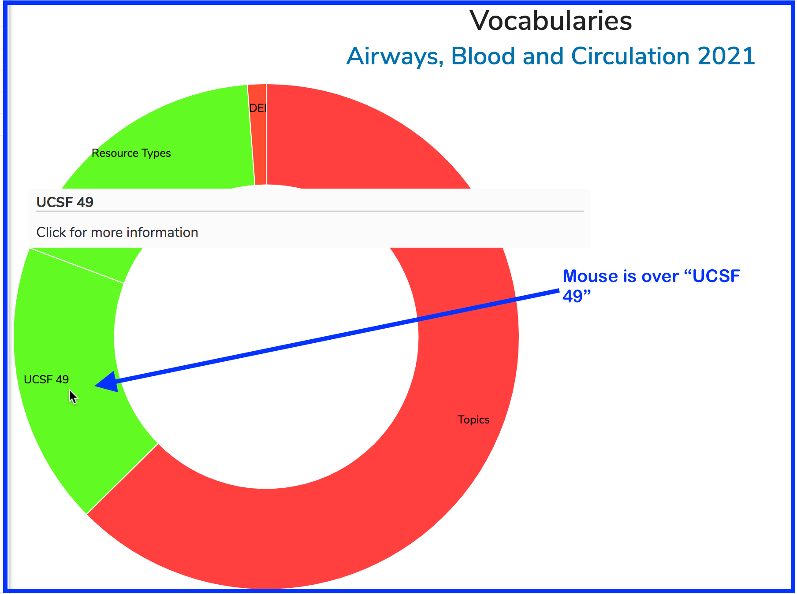
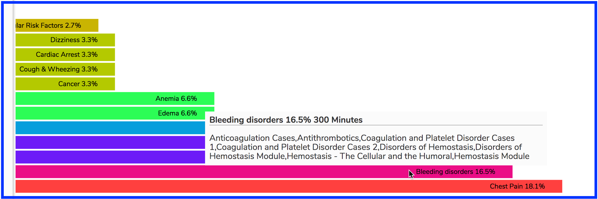

# Visualizations

Visualization are graphs and charted information intended to help make informed decisions about how Ilios is being used and how this use could be improved.

One of the available charts displays the usage of Objectives and how frequently they are utilized in a Course ... or more importantly let you know when they are not being used.

After clicking on the graph icon as shown above, you will see a screen similar to the following with \(at the time of update\) four different visualizations available to review.

#### Course Visualizations

Each visualization currently available is displayed at this level in a donut or pie shaped graph. Clicking on any of the four will result in seeing the data in greater detail.

Course Visualizations available ...

* **Objectives**
* **Session Types**
* **Vocabularies**
* **Instructors**

#### Objectives

The example below is from a user clicking on the **Objectives** visualization \(the one in the upper left corner\). It is displayed as shown below.

Mousing over any of the Objectives will display the full text of the Objective as well as the names of the Sessions to which it has been attached. Unused Objectives are simply listed for reference and are not included in the chart.

#### Session Types

The Session Types visualization is laid out horizontally rather than in a pie chart like the Objectives visualization in the section above. In the example below, I am hovering over a specific Session Type to review the usage specific of that session type in this particular course. 

Clicking the "Discussion, Small Group \(&lt;=12\)" link on the horizontal bar chart will guide you into additional details regarding those sessions. You can review Vocabulary Terms associated with the specified Session Type.

#### Vocabularies

The Vocabularies visualization shows how the Vocabularies set up for your school have been using in tagging sessions with this selected Course.

Initially the visualization displays all of the used Vocabulary libraries for this course. To get to the details, it is necessary to click on the Vocabulary to be reviewed.

After clicking on "UCSF 49", which is one of UCSF SOM school-specific Vocabularies, you can drill down into the results.

In the example presented above, the mouse is hovering over one of the UCSF 49 Vocabulary terms \(Bleeding Disorders\). Displayed is the percentage of the total instructional time of the sessions that were tagged with UCSF 49 Vocabulary terms that were tagged with "Bleeding Disorders", along with the duration of these offerings and the listing of the associated Sessions.

#### Instructors

More details will be coming regarding the Instructors visualization. It functions in a similar manner to Vocabularies. You do get a bit more information at the higher level though - a percentage of the total. After clicking on the Instructor's name, it takes you down into a view showing the Vocabulary Terms tagged on this Instructor's sessions along with another graph showing Session Types for this instructor's offerings.

